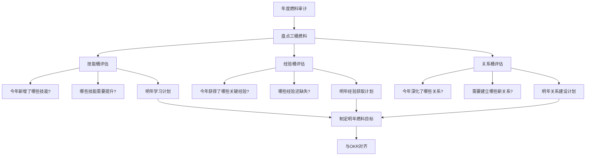
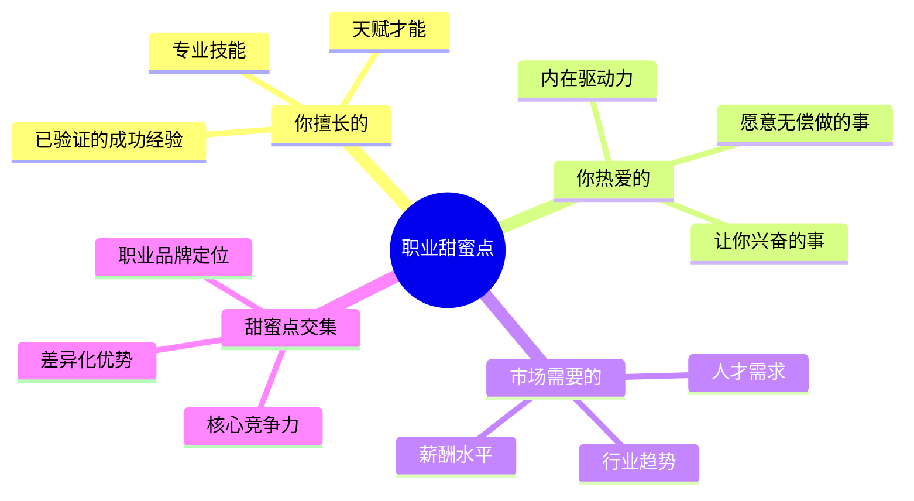

# ◇ 04 核心内容C：职业规划的综合框架与跨书连接 ◆

本节将职业规划的各个维度整合为可操作的综合框架，并建立与系列中其他书籍的连接。

---

## 01 年度燃料审计框架

每年底做一次燃料审计，确保你的职业发展始终在正确的轨道上。

---

## 02 甜蜜点定位工具

甜蜜点是你最应该聚焦的领域。它是三个圆的交集。

### ◆ 甜蜜点三圆模型

### ◆ 自我评估问题

**你擅长的**：过去一年里，哪些工作你做起来比别人轻松、效果更好？别人经常因为什么事情夸奖你？

**你热爱的**：如果不考虑收入，你最想做什么工作？周末你自发学习和研究的是什么？

**市场需要的**：市场上哪些技能的需求在增长？你的行业未来5年的趋势是什么？

---

## 03 与系列其他书籍的连接

### ◆ 与《金字塔原理》的连接

用金字塔原理来做职业规划：塔尖是"我想成为什么样的人"，支撑论点是"我需要积累的燃料"，底层证据是"具体的行动计划"。

在做年度燃料审计时，用MECE原则确保技能、经验、人脉三个维度都被覆盖、不重叠。

### ◆ 与《高效演讲》的连接

你的职业品牌需要通过演讲和表达来传递。无论是面试、汇报还是行业分享，高效演讲的技巧都直接影响你的职业燃料积累。

### ◆ 与《OKR工作法》的连接

你的年度燃料审计就是个人的OKR。O是"在XX方向上建立核心优势"，KRs是具体的燃料积累指标。

### ◆ 与《逆商》的连接

职业发展不可能一帆风顺。在遇到职业低谷时，逆商决定了你能否快速恢复并继续积累燃料。攀登者会把挫折视为新的燃料来源。

---

## 04 职业决策矩阵

当面临职业选择时，用以下矩阵评估每个选项：

| 评估维度 | 选项A | 选项B |
|---------|------|------|
| 对可迁移技能的提升 | 高/中/低 | 高/中/低 |
| 对经验积累的价值 | 高/中/低 | 高/中/低 |
| 对关系建设的机会 | 高/中/低 | 高/中/低 |
| 当前阶段的匹配度 | 高/中/低 | 高/中/低 |
| 长期燃料ROI | 高/中/低 | 高/中/低 |

选择燃料ROI最高的选项，而不是短期利益最大的选项。

---

## 05 实战练习

选择一个你正在考虑的职业机会（新工作、新项目、新岗位），用以下方法评估：

第一步：列出这个机会能给你的三桶燃料各增加什么。

第二步：评估这个机会是否与你当前阶段的策略一致。

第三步：用职业决策矩阵打分。

第四步：做出决定，并记录下来你的推理过程。一年后回顾，看看当时的判断是否正确。

---

下一节：◆ 05 结尾与30天挑战计划
