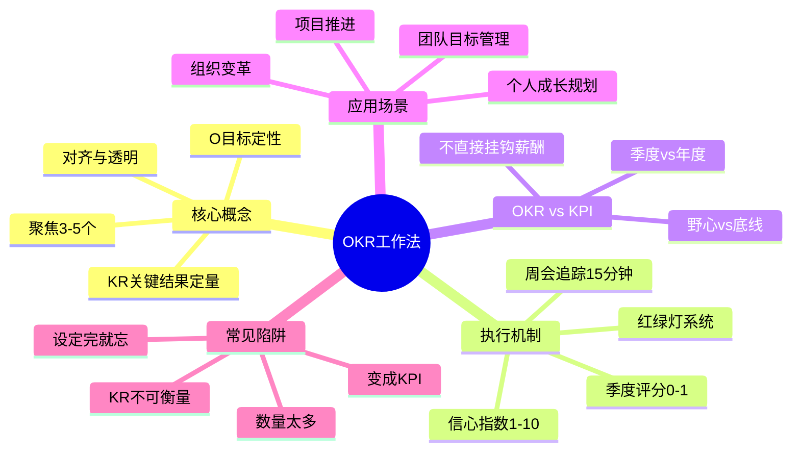
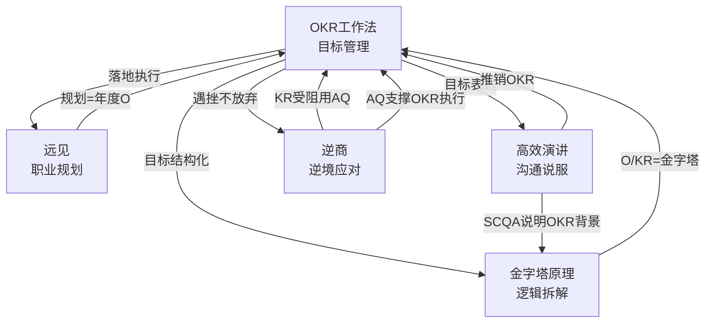
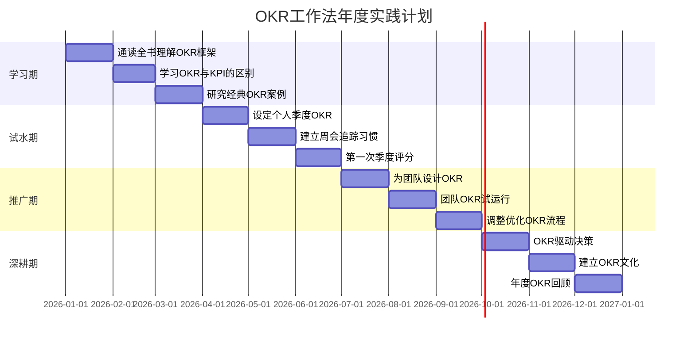

# ◇ 系列视觉指南：《OKR工作法》阅读地图 ◆

本节提供《OKR工作法》的完整视觉化学习路径，帮助读者快速把握全书脉络，并与其他书籍建立连接。

---

## 01 全书知识结构思维导图

---

## 02 OKR能力成长路径

### ◆ 各阶段学习重点

| 阶段 | 学习重点 | 核心练习 | 时间投入 |
|------|---------|---------|---------|
| Level 0→1 | 理解OKR基本格式 | 用OKR格式重写个人目标 | 30天 |
| Level 1→2 | 建立周会追踪习惯 | 每周15分钟OKR检查 | 90天 |
| Level 2→3 | OKR驱动优先级决策 | 每个决策对照OKR | 180天 |
| Level 3→4 | 团队OKR文化建设 | 培养团队成员的OKR思维 | 1年+ |

---

## 03 与系列其他书籍的关系图

---

## 04 12个月阅读与实践时间线

---

## 05 阅读顺序建议

### ◆ 推荐阅读流程

**第一遍：快速通读（1-2天）**——这本书以故事形式呈现，读起来很轻松。重点理解OKR的基本框架和周会追踪机制。

**第二遍：精读实操章节（1周）**——重点掌握OKR的设定公式和周会流程。边读边为你的团队或个人设计第一个OKR。

**第三遍：持续实践（长期）**——OKR是"做中学"的方法。设定、执行、评分、调整，每个周期都比上一个做得更好。

### ◆ 与系列其他书的阅读顺序

1. 先读《OKR工作法》建立目标管理能力（这是执行力的核心）
2. 用《金字塔原理》让你的OKR设定逻辑更严密
3. 用《高效演讲》把你的OKR推销给团队
4. 用《远见》设定你的年度和季度OKR（长期规划→短期目标）
5. OKR执行中遇到挫折时用《逆商》的心态来克服

---

◇ 关注"人类文明经典阅读计划"，每月共读一本好书 ◆
