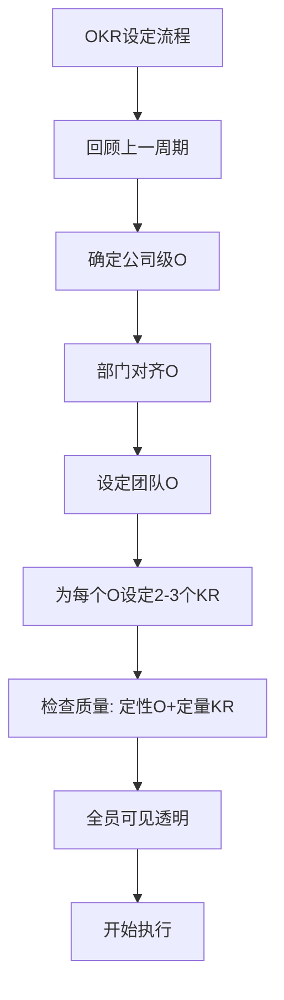
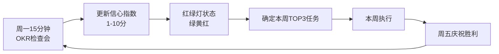

# ◇ 02 核心内容A：OKR的设定与执行 ◆

OKR的力量不在于设定，而在于持续追踪和调整。本节深入讲解OKR从设定到落地的完整流程。

---

## 01 OKR的设定原则

### ● 好O的标准

一个好的Objective（目标）应该满足以下标准：它是定性的而非定量的、它是鼓舞人心的而非冷冰冰的、它有明确的方向性、它让团队知道"什么是最重要的"。

好O的公式："动词+方向+价值"。例如："打造用户最喜爱的支付体验"、"建立行业领先的技术团队"、"让新客户在30秒内感受到产品价值"。

### ● 好KR的标准

一个好的Key Result（关键结果）必须是可衡量的。它应该回答"我们怎么知道目标达成了"这个问题。

好KR的公式："从X提升到Y"或"在截止日期前完成Z"。例如："NPS评分从30提升到50"、"月活用户从10万增长到15万"、"核心功能Bug数降低50%"。

---

## 02 OKR执行中的关键机制

### ◆ 周会追踪（CFR）

OKR不是设定完就丢在一边的。它需要每周追踪。推荐的周会流程：

**周一**：团队用15分钟回顾OKR进展。每个KR用红绿灯标注状态。讨论：这周最重要的3件事是什么？

**周五**：团队庆祝本周的胜利。即使是很小的进展也值得庆祝。这建立了持续前进的动力。

### ◆ 信心指数

每周对每个KR的信心进行评分（1-10分）。这个评分帮助团队在季度中就能看到哪些KR可能完不成，及时调整策略。

信心指数的变化比绝对值更重要。如果信心指数从7降到4，说明出了问题，需要立即讨论。

---

## 03 场景示例

**场景一：产品团队的季度OKR**

O：打造用户最喜爱的搜索体验

KR1：搜索结果的点击率从45%提升到60%
KR2：搜索无结果率从12%降低到5%
KR3：搜索功能NPS评分从25提升到40

**场景二：个人OKR**

O：成为团队中最擅长数据分析的人

KR1：完成3门数据分析课程（Coursera）
KR2：独立完成一份数据驱动的业务分析报告
KR3：在团队分享会上做一次数据分析主题演讲

---

## 04 行动清单

□ 用"动词+方向+价值"公式写出你的O

□ 为每个O设定2-3个KR，确保每个KR都是可量化的

□ 检查你的KR是否真的能衡量O的达成

□ 设定信心指数的基准线

□ 安排每周的OKR检查会（周一15分钟）

□ 确保所有人的OKR在同一个平台上可见

□ 设定季度评分的标准（0.6-0.7为理想）

---

下一节：◆ 03 核心内容B——OKR与KPI的对比及常见陷阱
