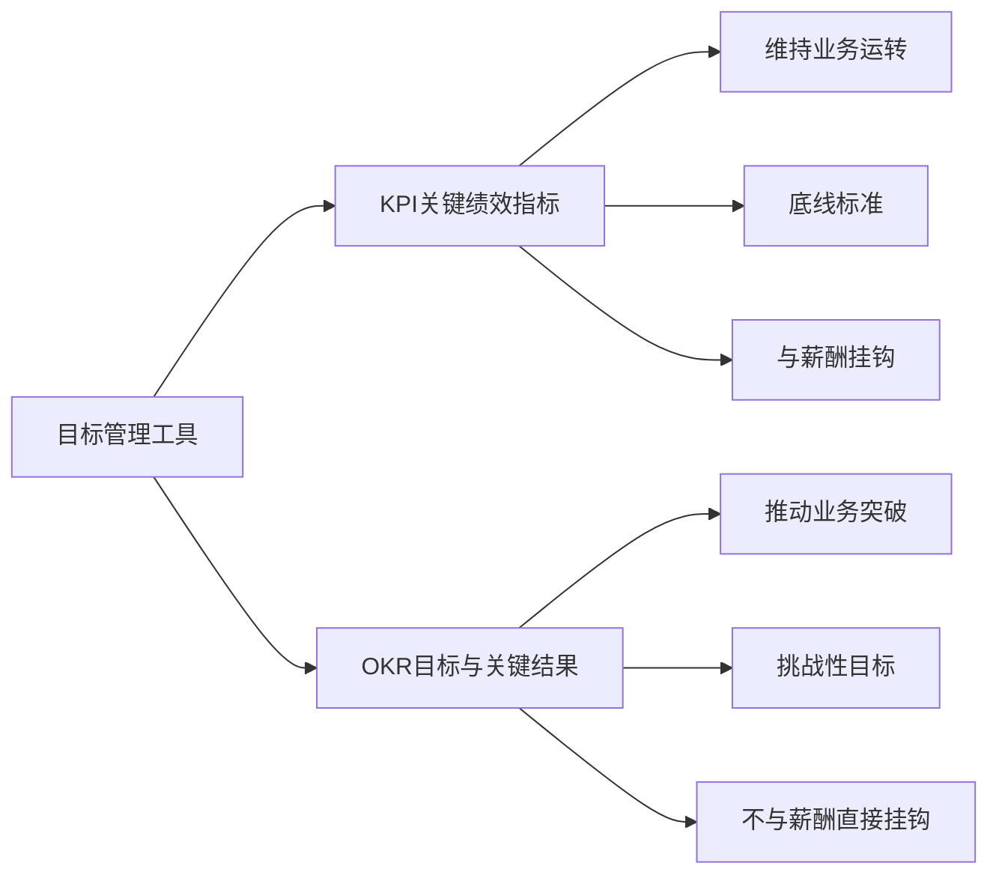
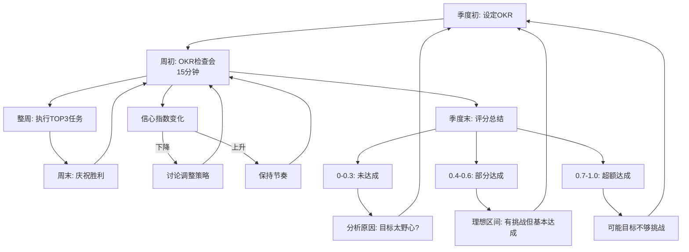

# ◇ 03 核心内容B：OKR与KPI的对比及常见陷阱 ◆

OKR不是KPI的替代品。理解两者的区别和联系，才能正确使用OKR。

---

## 01 OKR vs KPI

这是OKR初学者最容易混淆的概念。两者都是目标管理工具，但本质不同。

### ◆ 核心区别

KPI是"底线思维"——你必须达到这个标准，否则就不合格。它是维持业务运转的最低要求。

OKR是"野心思维"——你努力追求一个有挑战性的目标，即使只达到70%也是成功。它是推动业务突破的增长引擎。

### ◆ 对比表

| 维度 | KPI | OKR |
|------|-----|-----|
| 思维模式 | 底线思维 | 野心思维 |
| 达成率预期 | 100%必须达成 | 60-70%即可 |
| 与薪酬关系 | 直接挂钩 | 不建议挂钩 |
| 设定频率 | 年度 | 季度 |
| 更新频率 | 基本不变 | 每周追踪 |
| 透明度 | 通常不公开 | 全员可见 |
| 数量 | 通常较多 | 聚焦3-5个 |
| 主要用途 | 评估绩效 | 聚焦方向 |

### ◆ 两者的协同关系

KPI和OKR不是互斥的，而是互补的。KPI确保业务正常运转，OKR推动业务创新发展。

例如：客服团队的KPI是"客户满意度不低于85%"（底线），OKR是"将客户自助解决率从30%提升到60%"（突破）。

---

## 02 OKR从设定到落地的完整闭环

---

## 03 常见陷阱

### ◆ 陷阱一：OKR变成KPI

把OKR的达成率直接与奖金和晋升挂钩。这会让团队选择保守的、容易达成的目标，失去OKR的挑战精神。

### ◆ 陷阱二：OKR太多

一个周期设了10个O，每个O配5个KR。这不是OKR，这是待办事项清单。OKR的精髓是聚焦。

### ◆ 陷阱三：设定完就忘了

季度初设好OKR，然后三个月不看。到季度末才想起来评分。OKR需要每周追踪，否则就失去了它的核心价值。

### ◆ 陷阱四：KR不可衡量

KR写的是"提升用户体验"而不是"NPS评分从30提升到50"。不可衡量的KR无法判断是否达成。

### ◆ 陷阱五：只有自上而下

OKR完全由老板下发，团队没有参与感。OKR应该上下结合，团队有自己的输入和承诺。

---

## 04 OKR健康度自检

每季度末用以下指标评估你的OKR实施是否健康：

| 健康指标 | 健康状态 | 警示信号 |
|---------|---------|---------|
| O的数量 | 3-5个 | 超过7个 |
| 平均达成率 | 0.6-0.7 | 持续1.0或持续0.3以下 |
| 周会参与率 | 100% | 低于80% |
| 透明度 | 全员可见 | 部分人不可见 |
| 信心指数变化 | 每周有更新 | 从不更新 |

---

下一节：◆ 04 核心内容C——OKR的综合应用与跨书连接
