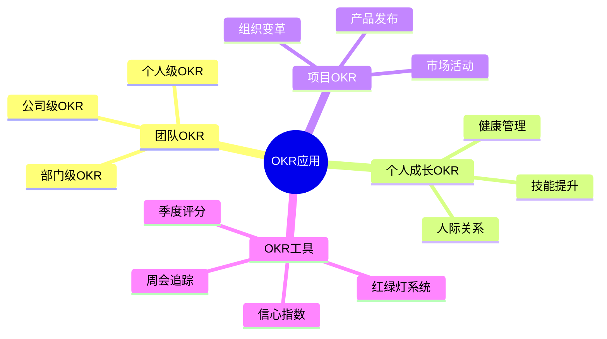
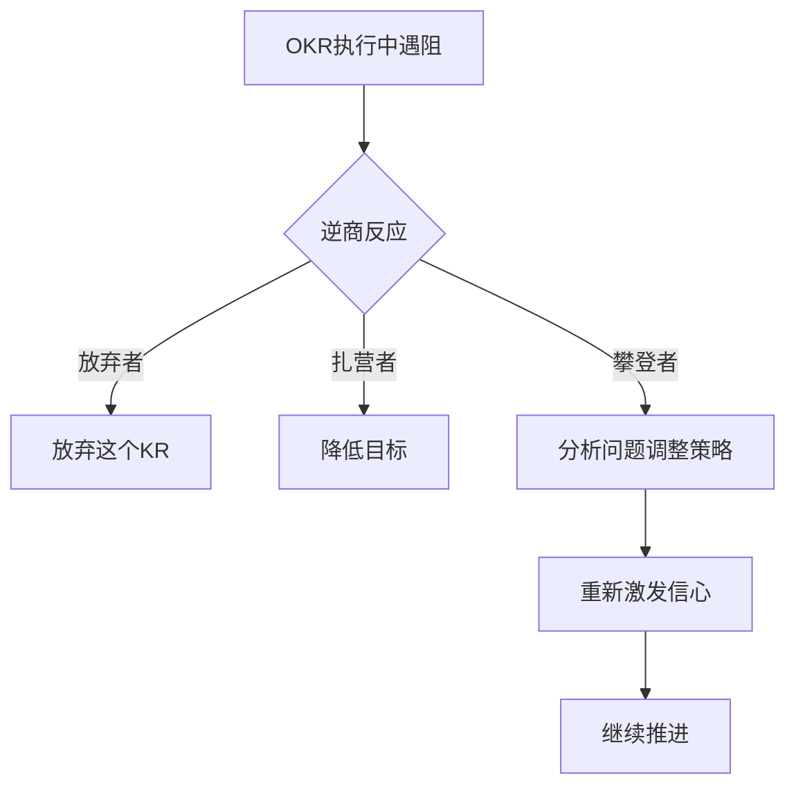
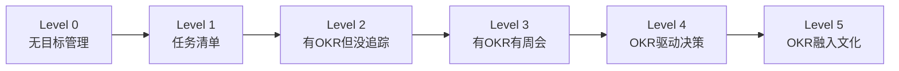

# ◇ 04 核心内容C：OKR的综合应用与跨书连接 ◆

本节将OKR方法论整合为可操作的综合框架，并建立与系列中其他书籍的连接。

---

## 01 OKR全场景应用框架

OKR不仅可以用于团队目标管理，也可以用于个人成长、项目管理、甚至家庭规划。

### ◆ 个人OKR示例

O：在三个月内养成每周运动3次的习惯

KR1：每周完成3次30分钟以上的运动（跑步/游泳/健身）
KR2：体脂率从25%降低到22%
KR3：连续8周不中断（信心指数保持在7以上）

---

## 02 与系列其他书籍的连接

### ◆ 与《金字塔原理》的连接

OKR本身就是一个金字塔结构：O是塔尖，KRs是支撑论点。用金字塔原理写OKR，可以确保逻辑严密。

设定OKR时，用SCQA框架说明背景："目前我们的用户留存率只有40%（S），但竞品已经达到65%（C），我们如何在下一季度缩小差距（Q）？答案是将留存率提升到55%（A=O）"。

### ◆ 与《高效演讲》的连接

OKR的设定过程需要强大的沟通能力。你需要向团队"推销"你的O，让他们从内心认同并愿意为之努力。这就是高效演讲的应用场景。

### ◆ 与《远见》的连接

OKR是"远见"的落地工具。《远见》告诉你45年职业规划的方向，OKR帮你把大方向拆解为季度可执行的目标。

年度燃料增长目标 = 年度O，季度燃料盘点 = 季度KR评分。

### ◆ 与《逆商》的连接

OKR的达成不可能一帆风顺。当KR进展不顺利、信心指数持续下降时，你需要逆商来调整心态、找到突破口。

---

## 03 OKR成熟度模型

| 等级 | 特征 | 典型表现 |
|------|------|---------|
| Level 0 | 无目标管理 | 每天忙于应付，没有方向感 |
| Level 1 | 任务清单 | 有很多待办事项，但没有优先级 |
| Level 2 | 有OKR但没追踪 | 季度初设了OKR，但从不回顾 |
| Level 3 | 有OKR有周会 | 每周检查进展，及时调整 |
| Level 4 | OKR驱动决策 | 每个决策都对照OKR判断优先级 |
| Level 5 | OKR融入文化 | 团队自发用OKR思维思考和行动 |

---

## 04 实战：从0到1搭建团队OKR

第一步：和团队一起回顾过去一个季度的工作，找出最大的成就和最大的遗憾。

第二步：基于回顾结果，讨论"下个季度如果我们只做一件最重要的事，应该是什么"——这就是你的O。

第三步：问团队"我们怎么知道这件事做成了"——这就是你的KRs。

第四步：用SMART原则检查每个KR：Specific（具体）、Measurable（可衡量）、Achievable（可实现）、Relevant（相关）、Time-bound（有时限）。

第五步：设定周会时间和追踪方式。推荐用共享文档或OKR工具。

第六步：季度末评分，回顾整个周期的学习，进入下一轮。

---

下一节：◆ 05 结尾与30天挑战计划
