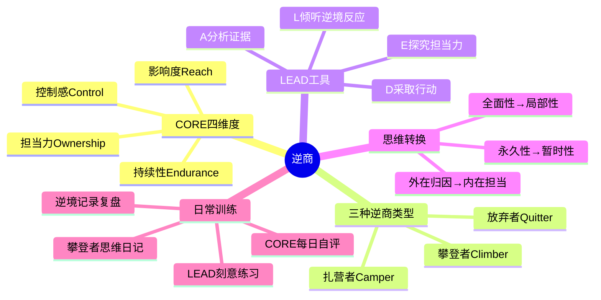
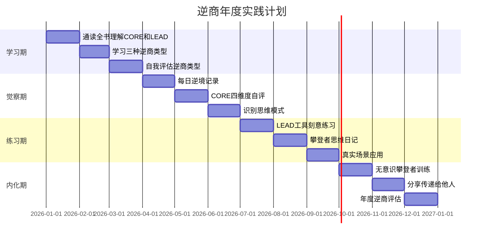

# ◇ 系列视觉指南：《逆商》阅读地图 ◆

本节提供《逆商》的完整视觉化学习路径，帮助读者快速把握全书脉络，并与其他书籍建立连接。

---

## 01 全书知识结构思维导图



---

## 02 逆商能力成长路径


### ◆ 各阶段学习重点

| 阶段 | 学习重点 | 核心练习 | 时间投入 |
|------|---------|---------|---------|
| 无意识→有意识 | 觉察逆境反应 | 每日逆境记录 | 30天 |
| 有意识放弃→扎营 | 提升CORE四维度 | CORE自评+改进 | 90天 |
| 扎营→攀登 | LEAD工具刻意练习 | 每天一次LEAD | 180天 |
| 有意识→无意识 | 内化攀登者思维 | 日常化应用 | 1年+ |

---

## 03 与系列其他书籍的关系图

```mermaid
graph TD
    A["逆商<br/>逆境应对"] -->|"支撑演讲状态"| B["高效演讲<br/>克服紧张"]
    A -->|"支撑OKR执行"| C["OKR工作法<br/>遇挫不放弃"]
    A -->|"支撑职业长跑"| D["远见<br/>应对低谷"]
    A -->|"支撑逆境分析"| E["金字塔原理<br/>结构化分析"]
    B -->|"演讲=逆境"| A
    C -->|"KR受阻=AQ"| A
    D --><"职业挫折=AQ"> A
    E -->|"逆境分析=金字塔"| A
    B -->|"CORE管紧张"| A
    C -->|"LEAD调策略"| A
```

---

## 04 12个月阅读与实践时间线



---

## 05 阅读顺序建议

### ◆ 推荐阅读流程

**第一遍：快速通读（2-3天）**——重点理解"三种逆商类型"和"LEAD四步法"。识别自己属于哪种类型。

**第二遍：精读LEAD工具章节（1周）**——边读边用LEAD工具处理一个当前的逆境。把书上的方法立刻用起来。

**第三遍：持续训练（长期）**——每天写攀登者思维日记，用CORE四维度做周度自评。逆商是肌肉，越练越强。

### ◆ 与系列其他书的阅读顺序

1. 建议最后读《逆商》，因为它是前面四本书的"心理支撑"
2. 《高效演讲》帮你学会表达，《逆商》帮你克服表达中的紧张
3. 《金字塔原理》帮你结构化思考，《逆商》帮你在思考受阻时不气馁
4. 《远见》帮你规划45年职业长跑，《逆商》帮你应对长跑中的挫折
5. 《OKR工作法》帮你聚焦目标，《逆商》帮你在OKR进展不顺时调整心态

### ◆ 系列五本书的完整阅读建议

**第一轮（1-2个月）**：《金字塔原理》→《高效演讲》→《远见》→《OKR工作法》→《逆商》

**第二轮（3-6个月）**：每本书精读一遍，配合30天挑战计划

**第三轮（持续）**：将五本书的方法整合为你的个人成长体系，定期回顾和迭代

---

◇ "人类文明经典阅读计划"第12期——个人成长系列 · 完结 ◆
◇ 感谢你的坚持与成长，下一系列精彩继续 ◆
