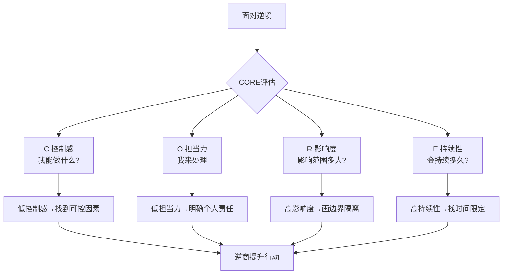

# ◇ 02 核心内容A：CORE四维度与逆商类型 ◆

逆商不是抽象的概念，它由四个可测量的维度组成。理解这四个维度，是提升逆商的第一步。

---

## 01 CORE四维度详解

### ● C（Control 控制感）

控制感是你面对逆境时，觉得自己能影响局面的程度。控制感高的人相信"我能做点什么来改变现状"。控制感低的人觉得"我做什么都没用"。

**提升方法**：在每次遇到逆境时，先问自己"我能控制什么"。把注意力集中在你能控制的因素上，忽略你不能控制的。

### ● O（Ownership 担当力）

担当力是你愿意为改善局面承担责任的程度。担当力高的人说"这是我的事，我来处理"。担当力低的人说"这不怪我"或"让别人来处理吧"。

**提升方法**：区分"责任"和"过错"。你可能对逆境的发生没有过错，但你有责任去改善它。担当力与自责无关，与主动性有关。

### ● R（Reach 影响度）

影响度是你让逆境影响生活其他方面的程度。影响度高的人让一个工作中的挫折影响到家庭、健康和社交。影响度低的人能把逆境"隔离"在特定范围内。

**提升方法**：当逆境发生时，有意识地"画边界"。问自己"这件事的影响范围有多大"，然后刻意阻止它蔓延到无关领域。

### ● E（Endurance 持续性）

持续性是你认为逆境会持续多久的程度。持续性高的人觉得"这件事永远好不了了"。持续性低的人觉得"这只是暂时的"。

**提升方法**：寻找逆境中的"时间限定词"。用事实告诉自己"这种情况有明确的结束时间"或"过去类似的情况最终都过去了"。

---

## 02 三种逆商类型深度解析

### ◆ 放弃者（Quitter）

特征：遇到逆境就放弃。他们的核心信念是"我做不了"、"没用的"、"就这样吧"。

行为模式：快速撤退、转移注意力、寻找借口。他们的人生被逆境推着走。

内心独白："算了，反正我也做不到。"

### ◆ 扎营者（Camper）

特征：遇到逆境就降低目标。他们的核心信念是"这样就可以了"、"至少我还有一些"、"不要贪心"。

行为模式：在舒适区边缘扎营，减少挑战，降低期望。他们的人生是妥协的。

内心独白："差不多就行了，何必那么拼。"

### ◆ 攀登者（Climber）

特征：遇到逆境就调整策略继续前进。他们的核心信念是"我一定能找到办法"、"这只是暂时的"、"我能从中学到什么"。

行为模式：分析局势、调整策略、持续行动。他们的人生是主动选择的。

内心独白："这个方法不行，那我换个方法试试。"

---

## 03 逆商类型对比表

| 维度 | 放弃者 | 扎营者 | 攀登者 |
|------|-------|-------|-------|
| 面对挑战 | 退缩 | 降低目标 | 调整策略继续 |
| 控制感 | 极低 | 中等 | 高 |
| 担当力 | 推卸 | 部分承担 | 全力承担 |
| 影响度 | 全面影响 | 部分影响 | 隔离影响 |
| 持续性 | 认为永久 | 认为较长 | 认为暂时 |
| 核心信念 | "我做不了" | "这样够了" | "我能找到办法" |
| 人生状态 | 被动 | 妥协 | 主动 |

---

## 04 场景示例

**场景一：项目被领导否决**

放弃者反应："算了，反正我的想法从来不会被采纳。"
扎营者反应："那我把方案改简单一点，至少能过。"
攀登者反应："领导否决的具体原因是什么？我需要补充哪些数据？下次汇报怎么改进？"

**场景二：面试被拒绝**

放弃者反应："我就是不适合这个行业，换个方向吧。"
扎营者反应："找个要求低一点的公司算了。"
攀登者反应："这次面试暴露了我哪些不足？我需要补充什么技能？下次面试如何准备得更好？"

---

## 05 行动清单

□ 回顾最近三次逆境，用CORE四维度评估自己的反应

□ 确定你在每个CORE维度上的得分（1-10分）

□ 找出最薄弱的维度，制定提升计划

□ 识别你的主要逆商类型：放弃者/扎营者/攀登者

□ 写下三个你希望从扎营者切换到攀登者的场景

□ 今天就开始用LEAD工具处理一个当前的逆境

---

下一节：◆ 03 核心内容B——LEAD工具与逆境应对实战
