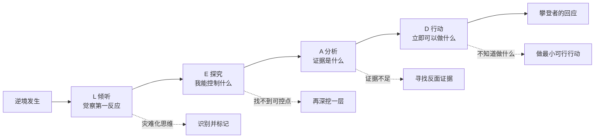

# ◇ 03 核心内容B：LEAD工具与逆境应对实战 ◆

LEAD是逆商提升的核心工具。它提供了一套系统性的四步法，帮助你在面对逆境时做出攀登者的回应。

---

## 01 LEAD四步法详解

### ◆ L（Listen 倾听逆境反应）

第一步是觉察。大多数人在面对逆境时，第一反应是自动化的负面思维。LEAD的第一步是按下暂停键，倾听自己的内心反应。

**关键问题**："我现在在想什么？我的第一反应是什么？"

**攀登者的倾听**："我注意到我在想'这事完蛋了'。这是一个灾难化的想法，但不一定是事实。"

**放弃者的倾听**："这事完蛋了。"（不加分辨地接受负面想法）

### ◆ E（Explore 探究担当力）

第二步是找到你能施加影响的切入点。担当力不是自责，而是主动承担改善局面的责任。

**关键问题**："这件事我能控制的部分是什么？我愿意为此承担什么责任？"

**攀登者的探究**："虽然整个项目失败不是我的错，但我可以控制的是我的汇报方式、我的数据准备、我的改进计划。"

### ◆ A（Analyze 分析证据）

第三步是用事实检验你的焦虑。很多逆境反应的强度远超逆境本身的严重程度。

**关键问题**："最坏的结果真的有那么可怕吗？有什么证据证明情况没那么糟？"

**攀登者的分析**："项目被否决确实令人沮丧，但这不代表我的能力有问题。上次类似的方案修改后也通过了。而且领导给了具体的修改意见，说明他愿意给机会。"

### ◆ D（Do 采取行动）

第四步是基于前面的分析，制定一个具体的、立即可以执行的行动。行动是走出逆境的唯一路径。

**关键问题**："我现在能做的最小的一步是什么？"

**攀登者的行动**："今天下午就约领导15分钟，问清楚他最关心的三个问题，然后针对性地修改方案。"

---

## 02 LEAD工具实战案例

### ◆ 案例一：晋升失败

**逆境**：你申请晋升被拒绝了。

**L 倾听**："我的第一反应是'我永远也升不上去了'。这是一个'永久性'的灾难化思维。"

**E 探究**："我能控制的部分是：我的工作表现、我与领导的沟通、我对晋升标准的理解。我不能控制的部分是：公司的名额限制、其他候选人的情况。"

**A 分析**："被拒绝不代表我能力不行。领导给了具体的反馈，说明我的方向是对的。上次被拒绝的同事后来也晋升了。"

**D 行动**："本周内约领导做一次30分钟的one-on-one，了解具体的改进方向，制定3个月的提升计划。"

### ◆ 案例二：核心项目失败

**逆境**：你负责的核心项目上线后数据远低于预期。

**L 倾听**："我的第一反应是'我的职业生涯完了'。这是一个'全面影响'的灾难化思维。"

**E 探究**："我能控制的是：数据分析、用户反馈收集、方案调整。我不能控制的是：市场大环境的变化。"

**A 分析**："一个项目的失败不代表职业生涯完了。公司里很多成功的人都有过失败的项目。关键是能否从中学到东西。"

**D 行动**："今天就开始整理项目的复盘报告，列出5条关键教训，下周在团队分享。"

---

## 03 常见陷阱

### ◆ 陷阱一：跳过L直接到D

没有倾听自己的反应就直接行动，可能是在用错误的方式做正确的事。先觉察，再行动。

### ◆ 陷阱二：E阶段过度自责

担当力不等于自责。"这是我的责任"和"这是我的错"是两回事。担当力指向未来（我能改善什么），自责指向过去（我做错了什么）。

### ◆ 陷阱三：A阶段寻找支持焦虑的证据

分析证据的目的是检验焦虑是否合理。很多人反过来，专门找证据来证明"情况确实很糟"。

### ◆ 陷阱四：D阶段的行动太大

"重新做整个项目"不是行动，是愿望。好的行动是"今天下午花30分钟整理用户反馈"。越小越好，关键是立即开始。

---

下一节：◆ 04 核心内容C——综合框架与跨书连接
