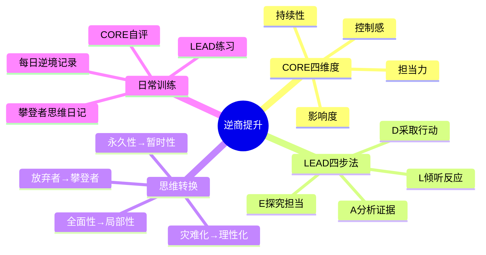
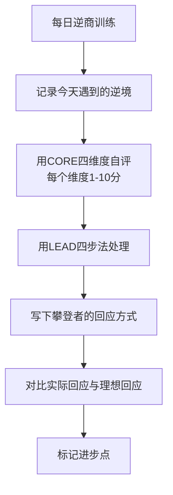
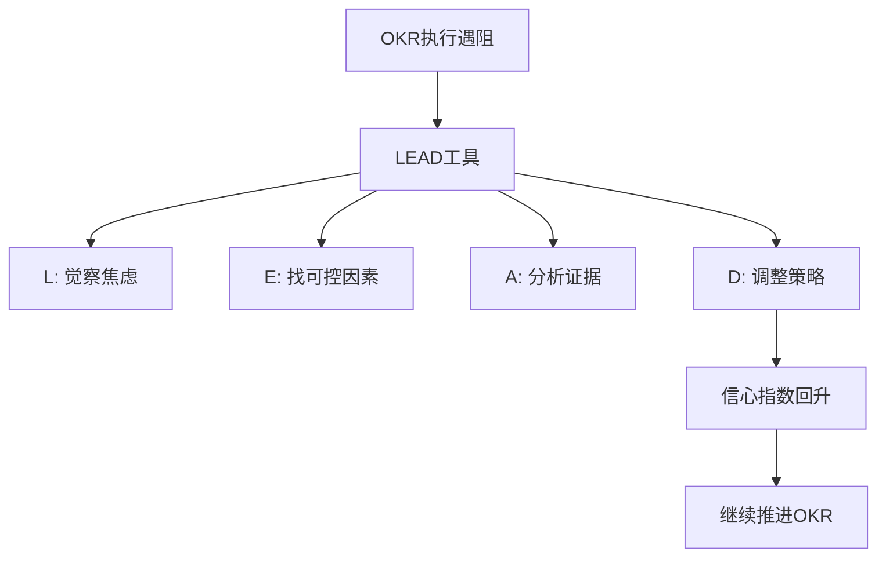

# ◇ 04 核心内容C：逆商的综合框架与跨书连接 ◆

本节将逆商方法论整合为可操作的综合框架，并建立与系列中其他书籍的连接。

---

## 01 逆商提升完整框架

---

## 02 每日逆商训练计划

### ◆ 攀登者思维日记

每天记录一件遇到的小逆境，用LEAD工具处理它。

### ◆ CORE自评量表

每天花2分钟，回顾今天遇到的一次逆境，给四个维度打分：

| 维度 | 评分（1-10） | 提升方向 |
|------|-------------|---------|
| 控制感 | _____ | 我还能多做哪一点？ |
| 担当力 | _____ | 我愿意多承担什么？ |
| 影响度 | _____ | 影响能再缩小一点吗？ |
| 持续性 | _____ | 能更快地走出吗？ |

---

## 03 与系列其他书籍的连接

### ◆ 与《高效演讲》的连接

演讲中的紧张本质上是一种逆境反应。CORE四维度可以直接应用于演讲场景：

控制感：我能控制我的准备和练习
担当力：我有责任把有价值的信息传递给观众
影响度：即使讲不好，也不会影响我的整个人生
持续性：紧张只在开场几分钟

### ◆ 与《金字塔原理》的连接

用LEAD工具分析逆境时，用金字塔原理来组织你的分析。塔尖是"这个逆境没那么可怕"，支撑论点是CORE四个维度的分析，底层证据是具体的事实和数据。

### ◆ 与《远见》的连接

职业发展中的逆境（被拒绝、项目失败、职业瓶颈）是不可避免的。攀登者型职场人会把每一次逆境视为燃料——一次失败的项目也是"有意义的经验"。

### ◆ 与《OKR工作法》的连接

OKR执行中必然会遇到KR进展不顺利的情况。这时候需要逆商来调整心态。

LEAD工具应用：
- L：觉察信心指数下降带来的焦虑
- E：探究哪些因素我能控制
- A：分析最坏的结果是什么
- D：调整策略，制定补救计划

---

## 04 逆商成长路线图

| 阶段 | 特征 | 训练重点 | 时间 |
|------|------|---------|------|
| 无意识放弃者 | 自动退缩，不觉得有问题 | 觉察训练：记录逆境反应 | 30天 |
| 有意识放弃者 | 知道自己在退缩，但不知道怎么改变 | CORE四维度提升 | 90天 |
| 有意识扎营者 | 知道可以降低标准但应该继续 | LEAD工具刻意练习 | 180天 |
| 有意识攀登者 | 能用LEAD工具，但需要刻意 | 日常化LEAD训练 | 1年 |
| 无意识攀登者 | 自动用攀登者思维面对逆境 | 保持并传递给他人 | 持续 |

---

## 05 实战：用逆商处理职业低谷

选择一个你正在经历的职业困境，用以下框架处理：

第一步：用CORE四维度评估你的逆境反应。每个维度1-10分。

第二步：用LEAD四步法写出你的攀登者回应。

第三步：列出一个立即可以执行的行动（越小越好）。

第四步：24小时后回顾，看这个行动是否推动了局面。

---

下一节：◆ 05 结尾与30天挑战计划
