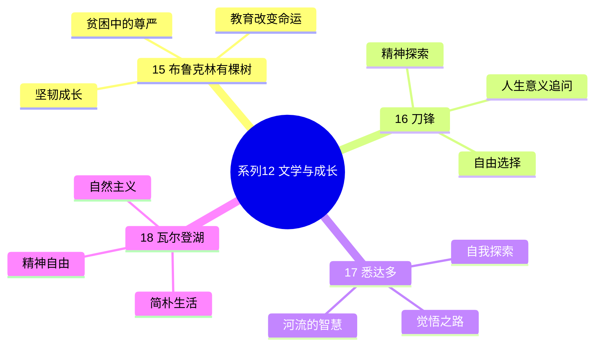
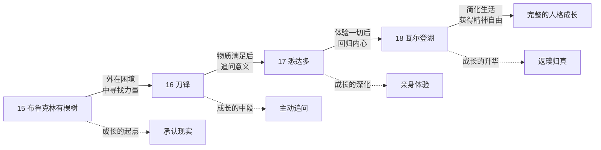
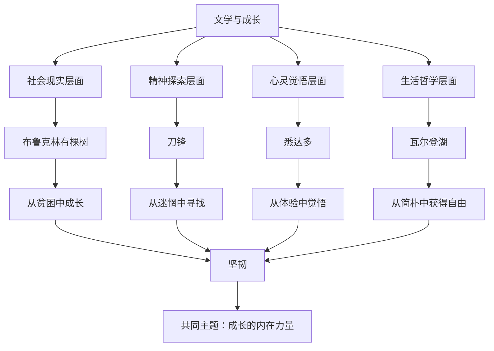
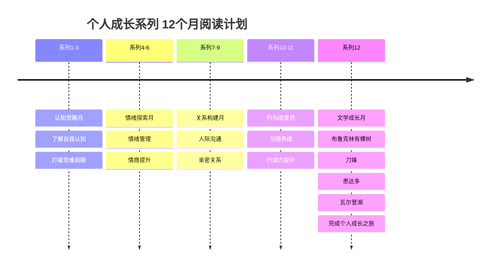

# ○ 系列12 文学与成长 视觉指南

本系列包含四本文学经典，它们从不同维度探讨了个人成长的主题。

## 系列心智图

## 个人成长路径

## 四本书的关系

## 12个月阅读计划时间线

## 阅读顺序建议

**推荐顺序**：布鲁克林有棵树 -> 刀锋 -> 悉达多 -> 瓦尔登湖

**推荐理由**：

1. ◇ 从《布鲁克林有棵树》开始，因为它最贴近生活现实，容易引起共鸣
2. ○ 然后阅读《刀锋》，从社会现实层面转向精神探索层面
3. ● 接着读《悉达多》，深入理解东方哲学中的自我觉悟之道
4. ◆ 最后以《瓦尔登湖》收尾，回归简单生活，获得精神自由

这个顺序体现了一条从"外在"到"内在"、从"复杂"到"简单"的成长路径。
