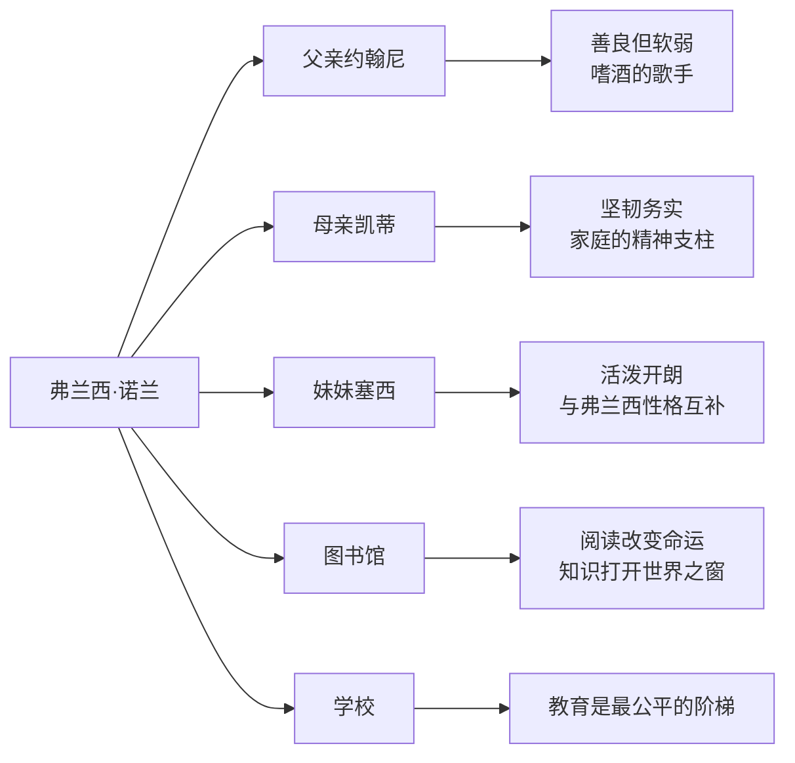

# ○《布鲁克林有棵树》：弗兰西的成长故事

## 贫民窟的童年

弗兰西·诺兰出生在纽约布鲁克林一个贫困的移民家庭。她的父亲约翰尼是个爱尔兰裔的酒馆歌手，母亲凯蒂是德裔移民的女儿。一家几口挤在廉价的公寓里，经常连面包都买不起。

但贫困并没有让这个家庭失去温暖。约翰尼虽然嗜酒，却会在圣诞节为弗兰西唱圣诞颂歌；凯蒂虽然严厉，但把所有的积蓄都花在了孩子的教育上。

## 阅读：逃离现实的窗口

弗兰西从五岁开始读书。每周她都会去图书馆借书，一本接一本地读。对她来说，阅读不仅是获取知识的途径，更是逃离贫困现实的精神庇护所。

书中有一个经典场景：弗兰西每天放学后坐在窗前的破椅子上，捧着一本书读到天黑。她读莎士比亚，读狄更斯，读一切能找到的文学作品。通过阅读，她见识到了布鲁克林之外的世界。

### 关键场景分析

**第一本书的魔力**：弗兰西第一次从图书馆借书回家的场景是整部小说的转折点。当她翻开书页的那一刻，她意识到自己不再被贫困定义——书籍给了她另一个世界。

**"天堂树"的发现**：弗兰西注意到公寓楼旁的水泥地里长出了一棵树。这棵树没有肥沃的土壤，没有充足的阳光，却依然生长。她把自己的命运与这棵树联系在了一起。

## 从贫穷到觉醒

弗兰西的成长不是简单的"从穷变富"。真正的成长是她逐渐认识到：

- ◇ 贫穷不等于低人一等
- ○ 尊严来自内心的选择而非外在的条件
- ● 教育和知识是通往自由的道路

弗兰西在学校里是"异类"——她的衣服破旧，午餐简陋，但她的成绩优异，思想深刻。她学会了不因他人的眼光而自卑，也学会了同情和理解其他处境艰难的人。

## 母亲的教诲

凯蒂是一位典型的"严母"。她不允许孩子因贫穷而自怜，她教导他们要脚踏实地、自力更生。凯蒂把每一分钱都精打细算，但从不吝啬于给孩子买书。

凯蒂的教育哲学很简单：**"你可以穷，但不能没有志气。"**

这种教育方式在今天看来可能有些苛刻，但正是这种坚韧，塑造了弗兰西不屈不挠的性格。

---

**个人成长启示**：我们每个人的成长环境中都有不尽如人意之处。但弗兰西的故事告诉我们——决定你未来的不是你的起点，而是你如何面对起点。
