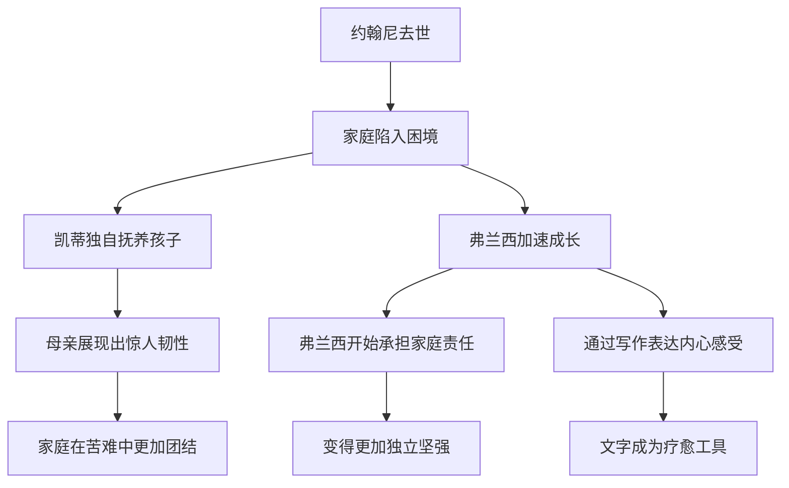

# ●《布鲁克林有棵树》：在苦难中绽放的尊严

## 家庭关系的复杂性

随着故事的发展，弗兰西的家庭面临着越来越多的挑战。父亲约翰尼的酗酒问题日益严重，最终在一次醉酒后去世。这个打击对弗兰西一家来说是毁灭性的，但也成为她们重新审视生活、寻找力量的转折点。

约翰尼的死是小说中最令人心碎的时刻之一。他不是一个完美的父亲，但他对孩子的爱是真诚的。弗兰西对他的感情复杂而深沉——既有怨恨，也有怜悯和怀念。

### 弗兰西与约翰尼的关系演变

| 阶段 | 弗兰西的年龄 | 对父亲的看法 | 核心情感 |
|------|-------------|-------------|---------|
| 童年早期 | 5-8岁 | 父亲是英雄 | 崇拜与依赖 |
| 童年晚期 | 9-12岁 | 开始意识到父亲的问题 | 困惑与失望 |
| 少女时期 | 13-15岁 | 理解父亲的挣扎 | 同情与复杂 |
| 成年初期 | 16岁+ | 接纳完整的父亲形象 | 成熟的爱与告别 |

## 教育的真正意义

弗兰西对教育的理解远超同时代的许多同龄人。她不仅把学校当作学习知识的场所，更把它视为改变命运的唯一途径。

小说中有这样一个场景：弗兰西因为贫穷被同学嘲笑，但她没有退缩，反而更加努力学习。她知道，**"别人可以嘲笑你的衣服，但不能嘲笑你的头脑。"**

### 教育带来的三重转变

**第一重：知识的力量**：通过阅读和学习，弗兰西获得了超越年龄的见识和思考能力。她能够理解复杂的社会问题，能够与成年人进行有深度的对话。

**第二重：自信的建立**：学习成绩的优异让她在学业上找到了自信。这种自信反过来又帮助她在生活中更加从容地面对各种挑战。

**第三重：视野的开阔**：弗兰西意识到世界远比布鲁克林大得多。她开始梦想有一天能够离开这里，去看看更广阔的世界。

## 弗兰西的觉醒与独立

随着故事推进，弗兰西从一个被动的观察者逐渐成长为主动的行动者。她开始：

- ◇ 独立思考社会不公的问题
- ○ 为女性的权利和尊严发声
- ● 用文字记录自己的生活和感受
- ◆ 在面对困境时，不再等待别人来拯救，而是主动寻找出路

## 人生启示

### 苦难不是终点

弗兰西的故事告诉我们，苦难本身并不决定一个人的命运。真正决定命运的是你如何面对苦难。

### 家庭是力量的源泉

尽管弗兰西的家庭充满了问题，但正是这个不完美家庭中的爱，给了她面对世界的勇气。

### 坚持自我，不被定义

弗兰西从未让贫穷定义自己。她始终相信，每个人都有权利追求更好的生活，无论起点多么低微。

---

**个人成长启示**：弗兰西的故事不是关于"逆袭"的童话，而是关于一个普通人如何在逆境中保持尊严和希望的真实记录。这比任何成功学都更加有力量。
