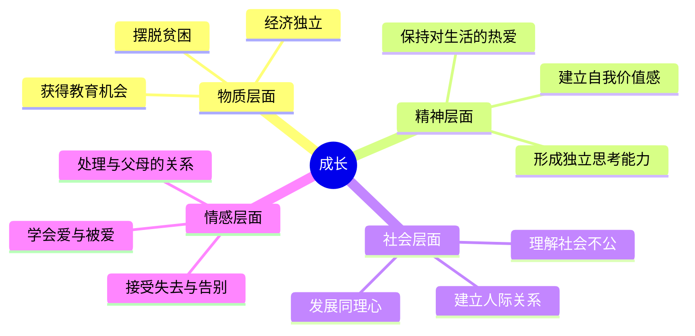
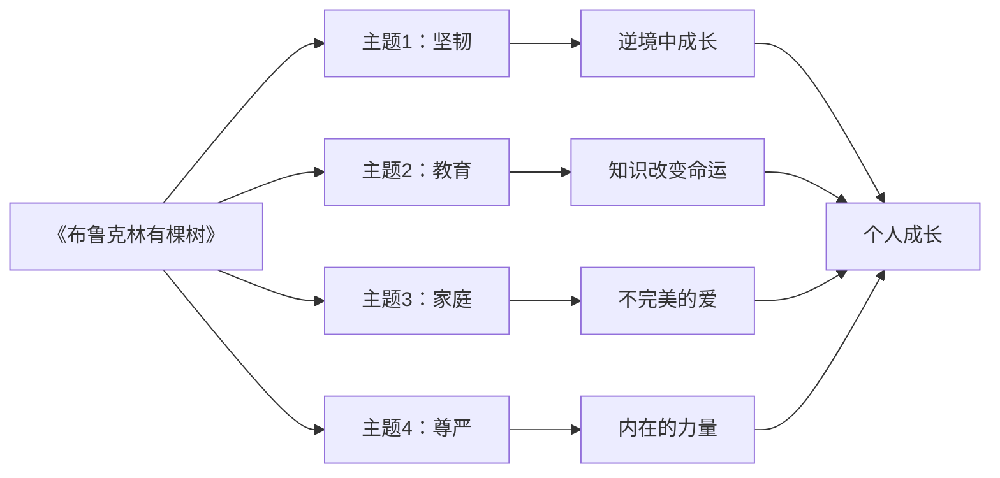

# ◆《布鲁克林有棵树》：文学中的成长主题

## 文学视角下的个人成长

《布鲁克林有棵树》不是一部典型的"成长指南"，它是一部文学小说。但恰恰是文学的深度和复杂性，让它成为理解个人成长的最佳教材之一。

文学小说与自助类书籍的不同在于：它不提供简单的答案，而是呈现生活的复杂性。弗兰西的故事之所以打动人心，正因为它真实——有欢笑，也有泪水；有希望，也有幻灭。

### 成长的多维理解

## 系列文学中的成长主题

在个人成长系列的文学类书籍中，我们可以看到一条清晰的脉络：

### 成长的不同面向

| 书籍 | 成长维度 | 核心挑战 | 成长动力 |
|------|---------|---------|---------|
| 《布鲁克林有棵树》 | 社会阶层跨越 | 贫困与歧视 | 教育与阅读 |
| 《刀锋》 | 精神探索 | 意义危机 | 内在追问 |
| 《悉达多》 | 心灵觉悟 | 世俗与超脱 | 自我体验 |
| 《瓦尔登湖》 | 生活哲学 | 物质与精神 | 回归自然 |

## 文学如何促进个人成长

### 共情能力

阅读文学小说最重要的收获之一是共情能力的提升。当你跟随弗兰西经历她的童年、她的喜悦和痛苦时，你也在扩展自己的情感边界。你开始理解那些与你生活完全不同的人的处境和感受。

### 复杂思维

文学不提供简单的答案，它呈现复杂的人性。弗兰西的父亲既是一个不负责任的酒鬼，也是一个深爱孩子的父亲。这种复杂性教会我们不要用非黑即白的方式看待他人，也帮助我们更好地理解自己和身边人的矛盾与挣扎。

### 反思能力

好的文学作品会促使读者反思自己的生活。读完《布鲁克林有棵树》后，你可能会问自己：

- ◇ 我对自己的起点满意吗？如果不满意，我在做什么来改变它？
- ○ 我是否足够珍惜教育和学习的机会？
- ● 在困境中，我是否还能保持对生活的热爱？
- ◆ 我是否能像凯蒂一样，在有限的条件下给孩子最好的支持？

## 从文学到生活

文学的意义不在于阅读本身，而在于它如何影响你的生活和行动。弗兰西的故事可以被看作一份"成长路线图"：

**第一步：承认现实**——不要逃避自己的处境，诚实地面对困难。

**第二步：寻找资源**——弗兰西找到了书籍和教育，你也应该找到能帮助你成长的资源。

**第三步：坚持行动**——日复一日地努力，即使进展缓慢。

**第四步：保持希望**——相信事情会变得更好，即使眼前看不到光明。

**第五步：回馈他人**——当你成长后，不要忘记帮助那些还在困境中的人。

---

**个人成长启示**：文学之所以重要，是因为它让我们在安全的距离内体验生活的复杂性。通过阅读，我们获得的不仅是故事，更是对人性、社会和自我的深刻理解。
