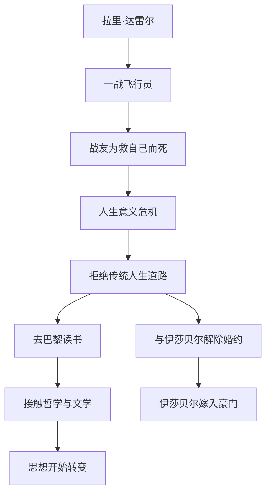

# ○《刀锋》：拉里的精神之旅（上）

## 战争的创伤

拉里·达雷尔原本是一个普通的美国青年。一战爆发后，他加入了空军。在一次战斗中，他的战友为了救他而牺牲。这件事彻底改变了他。

"他为什么要替我死？" 这个问题从此缠绕着拉里。他开始质疑一切：如果生命如此脆弱，那努力赚钱、追求地位还有什么意义？如果死亡随时可能降临，什么才是真正重要的？

## "晃膀子"的选择

战后，拉里回到了美国。身边的朋友们都在忙着找工作、结婚、买房，但拉里选择了另一条路——"晃膀子"（loafing）。他不急着找工作，每天泡在图书馆里，阅读哲学、宗教和文学。

他的未婚妻伊莎贝尔无法理解他的选择。她爱拉里，但她更爱稳定的生活。最终，两人解除了婚约，伊莎贝尔嫁给了富商格雷。

### 关键人物关系

| 角色 | 与拉里的关系 | 人生选择 | 价值观 |
|------|------------|---------|--------|
| 拉里 | 主角 | 精神探索 | 内在自由 |
| 伊莎贝尔 | 前未婚妻 | 嫁给富商 | 物质安稳 |
| 埃利奥特 | 伊莎贝尔的舅舅 | 社交名流 | 社会地位 |
| 索菲 | 拉里的朋友 | 堕落与毁灭 | 绝望中的挣扎 |
| 苏兹 | 在印度的导师 | 修行者 | 精神觉悟 |

## 巴黎的求学生活

拉里搬到了巴黎，开始了他的"游学"生活。他阅读了大量哲学书籍，从柏拉图到斯宾诺莎，从康德到叔本华。他不需要任何学位或证书，他读书的目的只有一个——理解。

在巴黎，拉里遇到了一位名叫艾略特的美国社交名流。艾略特一生追求上流社会的认可，与拉里的精神追求形成了鲜明对比。毛姆通过这两个角色，展示了两种截然不同的人生观。

### 拉里的阅读清单

拉里在巴黎阅读的书籍涵盖了多个领域：

- ◇ 哲学：柏拉图的《理想国》、斯宾诺莎的《伦理学》
- ○ 宗教：印度教经典《奥义书》、佛教典籍
- ● 文学：歌德的《浮士德》、托尔斯泰的作品
- ◆ 科学：物理学和生物学的基础知识

这种广泛的阅读不是为了考试或职业，而是为了寻找人生答案。拉里的求知欲是纯粹的——他想知道"世界是怎么回事，人在其中的位置是什么"。

## 伊莎贝尔的视角

伊莎贝尔是理解拉里的关键人物。她不是反派，她只是选择了与拉里不同的道路。她想要的是安稳、舒适和社会认可。

在伊莎贝尔看来，拉里的选择是不负责任的。她不明白为什么有人可以放弃赚钱的机会，整天"无所事事"地读书。但毛姆巧妙地让读者看到：伊莎贝尔的选择同样有代价——她获得了物质上的满足，却失去了内心的自由。

---

**个人成长启示**：拉里的故事迫使我们面对一个 uncomfortable 的问题：我追求的是别人期待的生活，还是我自己真正想要的生活？这个问题没有标准答案，但值得每个人认真思考。
