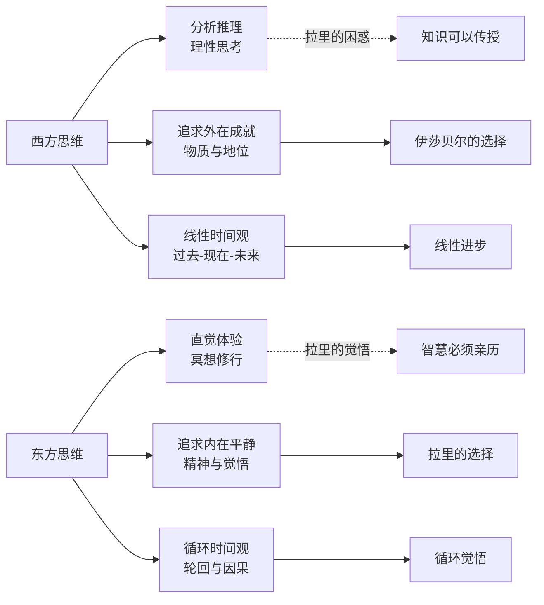
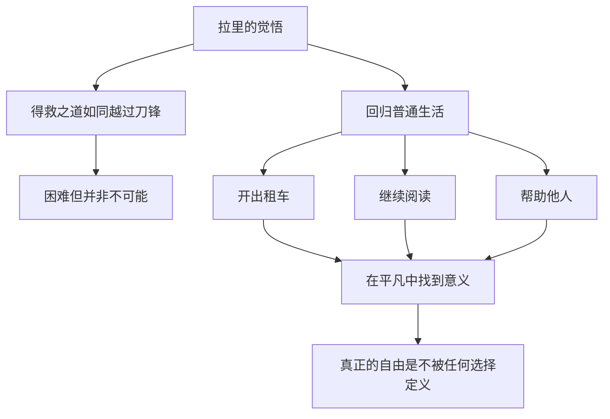

# ●《刀锋》：拉里的精神之旅（下）

## 印度的觉悟之旅

巴黎的读书生活虽然充实，但拉里并没有找到他真正想要的答案。于是，他踏上了前往印度的旅程。

在印度，拉里接触到了一种与西方截然不同的思维方式。西方哲学强调分析和推理，而东方哲学强调体验和直觉。拉里在印度的寺庙中学习冥想，与僧人对话，最终获得了某种"觉悟"。

### 东西方思维的对比

## 拉里的转变

在印度，拉里经历了几个关键的转变：

**从追问到体验**：他不再执着于"人活着为了什么"这个抽象问题，而是开始活在当下，体验每一个瞬间。

**从向外求到向内看**：他意识到答案不在书本中，也不在别人的教导中，而是在自己的内心。

**从拒绝到接纳**：他不再抗拒世俗生活，而是以一种超然的态度回到其中。

## 最终的选择

拉里的最终选择出人意料——他回到了美国，过起了普通人的生活。他开出租车，有时间就阅读，偶尔帮助身边的人。他没有成为哲学家，也没有成为修行者，他只是一个"普通人"。

但这正是他觉悟的体现。真正的觉悟不是脱离世俗，而是在世俗中保持内心的自由。

### 人生选择的对照表

| 维度 | 拉里 | 伊莎贝尔 | 埃利奥特 |
|------|------|---------|---------|
| 追求目标 | 精神自由 | 物质安稳 | 社会地位 |
| 生活方式 | 简朴 | 奢华 | 社交 |
| 对财富的态度 | 不排斥但不执着 | 视为幸福的前提 | 视为地位的符号 |
| 最终结局 | 内心平静 | 物质满足但空虚 | 至死追求社交认可 |
| 核心代价 | 放弃物质享受 | 放弃内心自由 | 从未真正活过自己 |

## 人生启示

### 每个人都有自己的"刀锋"

毛姆用"越过刀锋"来比喻觉悟之路。这条路的困难不在于外在的障碍，而在于内心的执念。放下执念，才能获得真正的自由。

### 没有唯一正确的人生选择

伊莎贝尔的选择不是"错的"，拉里的选择也不是"对的"。重要的是，你的选择是否忠于自己的内心。

### 觉悟不是终点，而是起点

拉里在印度获得了觉悟，但这并不是故事的结束。真正的考验是他如何将觉悟融入日常生活。这也提醒我们：精神探索不是为了"达到某个境界"，而是为了更好地生活。

---

**个人成长启示**：拉里的故事告诉我们，人生意义不是被"找到"的，而是被"活出来"的。你的答案不在别人的话语中，而在你自己的体验里。
