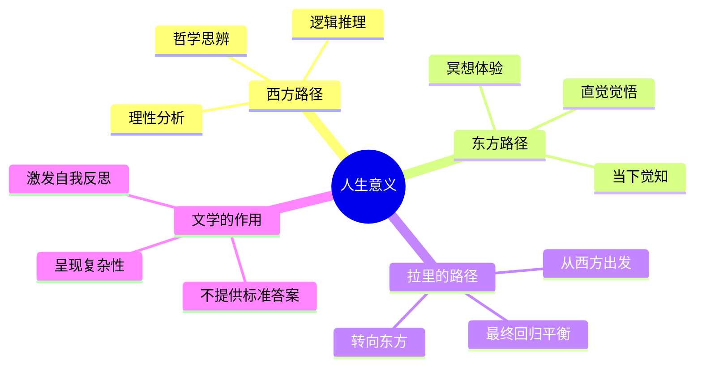
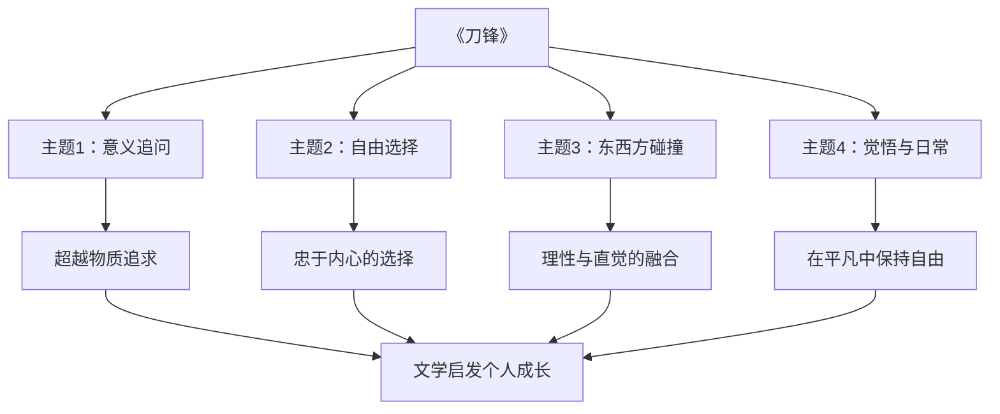

# ◆《刀锋》：文学中的意义追问

## 意义追寻的文学传统

《刀锋》继承了西方文学中关于人生意义的悠久传统。从陀思妥耶夫斯基的《卡拉马佐夫兄弟》到加缪的《局外人》，文学始终是人类追问"活着为了什么"的重要载体。

但《刀锋》的独特之处在于：它引入了东方哲学的视角。拉里的觉悟不是通过西方理性推理获得的，而是通过东方的冥想和体验。这种跨文化的融合让小说具有了更广阔的视野。

### 文学中的意义追问路径

## 系列文学中的意义追问

在个人成长系列的文学类书籍中，《刀锋》代表了一个独特的维度：

### 四本书的不同追问方式

| 书籍 | 追问方式 | 答案方向 | 成长关键词 |
|------|---------|---------|-----------|
| 《布鲁克林有棵树》 | 在困境中寻找 | 坚韧与希望 | 生存 |
| 《刀锋》 | 对意义的追问 | 内在自由 | 选择 |
| 《悉达多》 | 通过亲身体验 | 觉悟与统一 | 体验 |
| 《瓦尔登湖》 | 回归简单生活 | 自然与自由 | 简化 |

## 文学如何帮助我们思考人生意义

### 呈现多元选择

文学不提供标准答案，它展示的是不同选择的可能性。在《刀锋》中，毛姆展示了拉里、伊莎贝尔、埃利奥特三个人截然不同的人生选择。他没有说谁对谁错，而是让读者自己去思考和判断。

这种"不提供答案"的态度恰恰是文学最有价值的地方——它迫使你独立思考，而不是简单地接受一个现成的答案。

### 创造安全距离

通过阅读别人的故事，我们可以在安全的距离内思考自己的人生。你不需要像拉里一样"晃膀子"，但你可以从他的选择中获得启发。文学提供了一种"代入而不陷入"的方式。

### 激发深度对话

读完《刀锋》后，你可能会和朋友讨论："如果是你，你会选择拉里的路还是伊莎贝尔的路？" 这种讨论本身就是成长的过程——通过与他人的对话，你更清楚地认识自己。

## 从文学到行动的桥梁

文学的意义不仅在于阅读时的感动，更在于它如何影响你的后续行动。以下是将《刀锋》的启发转化为行动的建议：

**第一：给自己"停下来"的权利**——不需要辞职去旅行，但可以在日常中留出思考的空间。

**第二：追问而非接受**——对别人给你的人生建议保持独立思考。

**第三：体验而非空想**——不要仅仅在脑子里想"人生意义"，而是通过实际体验去寻找答案。

**第四：接纳复杂性**——人生没有唯一正确的答案，学会在不确定的状态下保持平静。

---

**个人成长启示**：《刀锋》教会我们最重要的一课是——人生意义不是被"找到"的，而是被"活出来"的。你不需要成为拉里，但你可以从他身上学到忠于自己的勇气。
