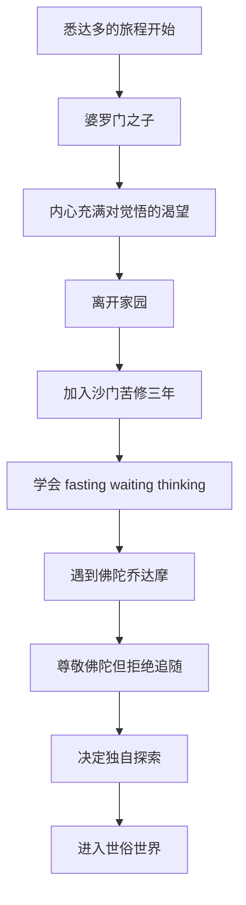
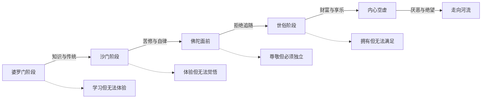

# ○《悉达多》：从婆罗门到摆渡人（上）

## 离开家园

悉达多出生在一个婆罗门家庭——印度种姓制度中的最高等级。他拥有令人羡慕的一切：英俊的外貌、聪慧的头脑、受人尊敬的家庭背景。但他内心有一个无法被满足的渴望——对觉悟的追求。

"他心中有一团火。" 这团火驱使他离开了父亲，离开了舒适的生活，加入了一群苦行僧（沙门）。

## 苦修与佛陀

悉达多在沙门中度过了三年。他学会了禁食、等待和思考。他几乎做到了身体的极致——长时间不进食，忍受酷暑和严寒。但他发现，苦修并没有带他走向觉悟。

就在此时，他听说了佛陀乔达摩。他去见佛陀，被佛陀的宁静和智慧所打动。但他做出了一个出人意料的决定——拒绝追随佛陀。

### 为什么拒绝佛陀？

悉达多对佛陀说了一段意味深长的话：

"您通过探索真理之道，超越了这个世界。您没有找到任何教导——您找到了自己的道。所以，我也不想追随任何人的教导。"

这是一个极其重要的时刻。悉达多意识到：**佛陀之所以成为佛陀，是因为他走了自己的路，而不是因为他追随了别人的教导。** 如果悉达多追随佛陀，那他最多只能成为"另一个佛陀的追随者"，而不是觉悟者。

## 堕入世俗

离开佛陀后，悉达多进入了世俗世界。他遇到了一位美丽的女子卡玛拉，向她学习爱情。他向一位商人学习做生意。他很快变得富有，拥有了华丽的衣服、美食和情欲。

但渐渐地，他发现自己陷入了一个"轮回"——白天做生意赚钱，晚上在卡玛拉那里享乐。这种生活让他感到空虚和厌恶。

### 悉达多的三个阶段（第一部分）

| 阶段 | 经历 | 学到的东西 | 缺失的东西 |
|------|------|-----------|-----------|
| 婆罗门 | 宗教仪式与经典学习 | 知识、纪律、尊敬 | 真正的觉悟 |
| 沙门 | 三年苦修 | 禁食、等待、思考 | 智慧无法通过苦行获得 |
| 世俗 | 财富与享乐 | 爱情、商业、感官快乐 | 内心的平静 |

## 从悉达多看个人成长

悉达多的前三个阶段揭示了一个重要的成长规律：**每一种道路都有它的价值，也都有它的局限。**

婆罗门给了他知识的根基，苦修给了他自律的能力，世俗生活给了他对人性的理解。没有这些经历，他后来无法理解河流的智慧。

这告诉我们：成长不是一个"选对路"的问题，而是一个"走完所有该走的路"的过程。你经历的每一个阶段都在为最终的觉悟做准备。

---

**个人成长启示**：不要因为害怕走弯路而犹豫不前。悉达多的"弯路"——苦修和世俗——恰恰是他最终觉悟的必要条件。你今天的经历，无论好坏，都是你成长路上不可或缺的一部分。
