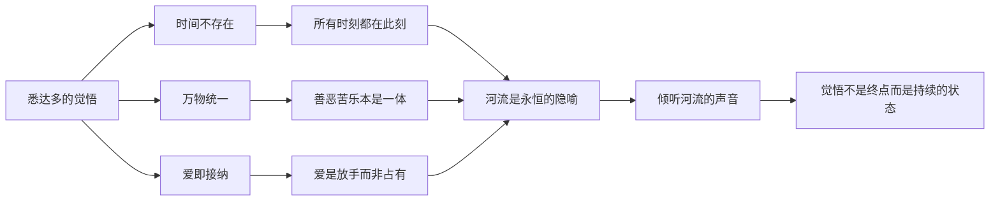

# ●《悉达多》：河流的智慧（下）

## 绝望与重生

在经历了多年的世俗生活后，悉达多感到深深的厌恶和绝望。他离开了城市，来到一条河边，想要结束自己的生命。

但就在他准备跳入河中时，他听到了一个声音——"Om"（唵）。这个声音让他重新找到了活下去的理由。

在河边，他遇到了一位摆渡人——瓦苏德瓦。瓦苏德瓦教会了悉达多倾听河流的声音。河流告诉他：**时间是不存在的，过去、现在和未来同时存在；万物是统一的，一切对立面最终都会合而为一。**

### 摆渡人的角色

瓦苏德瓦是小说中最重要的导师角色。他不是通过"教导"来帮助悉达多，而是通过"倾听"和"陪伴"。他不说话，他只是让悉达多自己去听河流的声音。

这正是黑塞想传达的核心理念：**真正的导师不会给你答案，而是引导你自己去发现答案。**

```mermaid
graph TD
    A[悉达多在河边绝望] --> B[听到"Om"的声音]
    B --> C[遇到摆渡人瓦苏德瓦]
    C --> D[学会倾听河流]
    D --> E[领悟时间不存在]
    D --> F[领悟万物统一]
    E --> G["过去现在未来同在"]
    F --> H["一切对立终将和解"]
    G --> I[获得觉悟]
    H --> I
    I --> J[成为新的摆渡人]
    J --> K[等待儿子到来]
```

## 与儿子的关系

悉达多觉悟后，他遇到了自己的儿子。他和卡玛拉生了一个孩子，但卡玛拉在朝圣途中去世，孩子被送到了他身边。

悉达多深爱儿子，但儿子不适应河边的简朴生活，最终选择了逃离。悉达多经历了巨大的痛苦——这种痛苦是他之前任何阶段都没有经历过的。

### 父子关系的对比

| 维度 | 悉达多与父亲 | 悉达多与儿子 |
|------|-------------|-------------|
| 悉达多的角色 | 想要离开的儿子 | 想要挽留的父亲 |
| 对方的态度 | 不愿放手 | 不愿留下 |
| 核心冲突 | 追求觉悟 vs 家庭责任 | 父亲的爱 vs 儿子的自由 |
| 最终结果 | 离开父亲 | 放走儿子 |
| 学到的教训 | 每个人必须走自己的路 | 爱不是占有，而是放手 |



## 最终的觉悟

悉达多的觉悟可以用一句话来概括：**他学会了爱这个世界本来的样子，而不是它"应该"的样子。**

他不再试图改变世界，不再试图找到某个"正确的"生活方式。他接纳了世界的不完美，接纳了自己的过去，接纳了所有经历过的人和事。

河流教会了他最后一个道理：**每个人都必须自己找到觉悟的路，但这条路本身就是一个循环——你最终会回到起点，但此时的你已不再是当初的你。**

## 人生启示

### 觉悟不是逃避

悉达多没有选择永远隐居在河边。他曾经沉沦于世俗，最终又回到了世俗——但这次是以觉悟者的身份。真正的觉悟不是逃离世界，而是在世界中保持清醒。

### 爱不是占有

悉达多对儿子的爱是他最深刻的体验之一。他学会了真正的爱不是占有，而是允许对方走自己的路。这对所有为人父母的人来说都是重要的一课。

### 循环与成长

悉达多的一生是一个循环：从婆罗门到沙门，从佛陀到世俗，从绝望到觉悟，从拥有到放手。但每一次循环都不是简单的重复，而是螺旋上升。

---

**个人成长启示**：悉达多的故事告诉我们——成长是一个不断循环、不断深化的过程。你不需要害怕重复经历类似的困境，因为每一次经历都会带来更深的理解。
