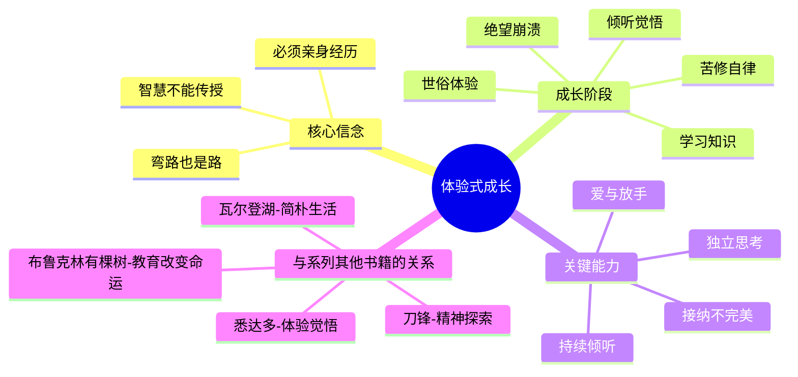
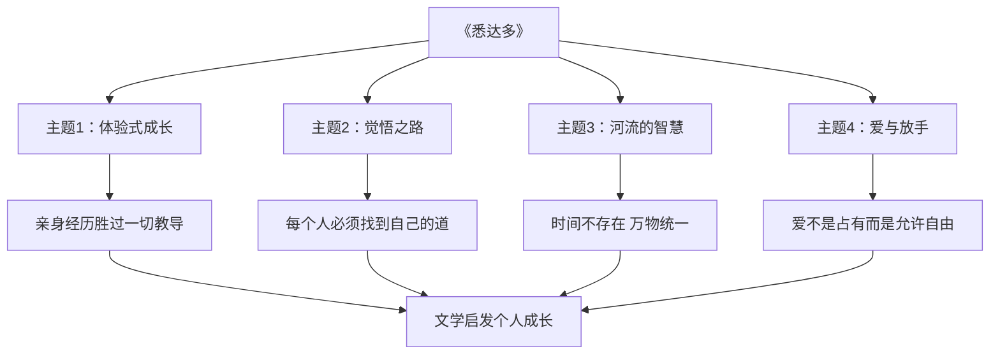

# ◆《悉达多》：体验式成长的文学典范

## 文学中的体验式成长

《悉达多》最独特的贡献是它提出了一种"体验式成长"的模式。这种模式认为：真正的成长不是通过学习知识和遵守规则来实现的，而是通过亲身经历——包括犯错、沉沦、绝望和重生——来完成的。

这与传统的"教育式成长"形成了鲜明对比。传统的成长模式认为：找到一个好导师，学习正确的知识，遵循正确的道路，就能获得成功。但悉达多的经历告诉我们：**即使是最完美的导师（佛陀），也无法代替你走你的路。**

### 体验式成长的核心特征

## 系列文学中的觉悟之路

在个人成长系列的文学类书籍中，《悉达多》代表了最深的精神探索维度：

### 四本书的成长深度

| 书籍 | 成长层面 | 核心动力 | 觉悟程度 |
|------|---------|---------|---------|
| 《布鲁克林有棵树》 | 社会生存 | 坚韧与教育 | 在困境中保持希望 |
| 《刀锋》 | 精神追问 | 内在探索 | 在世俗中保持自由 |
| 《悉达多》 | 心灵觉悟 | 亲身体验 | 接纳世界的本来面目 |
| 《瓦尔登湖》 | 生活实践 | 回归自然 | 在简单中获得自由 |

## 文学如何促进体验式成长

### 安全地经历"弯路"

在阅读悉达多的故事时，我们也在安全地经历他的弯路。我们看到苦修的局限、世俗的空虚、绝望的痛苦——而这一切都不需要我们自己去付出真实的代价。这就是文学的独特价值。

### 理解而非评判

文学教会我们用"理解"代替"评判"。当我们看到悉达多沉溺于享乐时，我们不会简单地评判他"堕落"，而是理解这是他觉悟之路上的必经阶段。这种理解能力同样适用于我们对身边人的态度。

### 从故事到行动

将《悉达多》的启发转化为日常行动：

**第一：重视体验而非知识**——想学什么，直接去做，而不是仅仅阅读。

**第二：接纳自己的弯路**——不要因为犯错或走偏而自责，这些经历都是成长的必要组成部分。

**第三：学会倾听**——花时间去倾听自然的声音、他人的声音和自己内心的声音。

**第四：学会放手**——对身边的人和事，学会用接纳代替控制。

---

**个人成长启示**：《悉达多》最深刻的启示是——每个人的人生都是独一无二的觉悟之路。你不需要模仿任何人，你只需要诚实地走你自己的路，包括所有的弯路。
