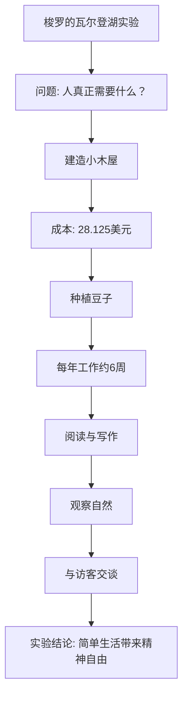
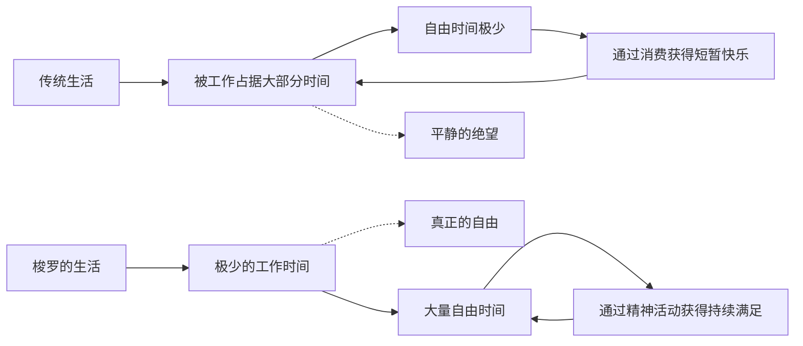

# ○《瓦尔登湖》：湖畔生活的实验（上）

## 为什么去瓦尔登湖？

1845年7月4日，二十八岁的梭罗搬进了自己在瓦尔登湖畔亲手搭建的小木屋。他的选择并非一时冲动，而是经过深思熟虑的结果。

梭罗的老师兼朋友爱默生在康科德拥有一片瓦尔登湖畔的土地。梭罗向爱默生借了这片地，开始了他的实验。他想回答一个问题：**人真正需要多少东西才能活得有尊严？**

## 经济篇：对物质主义的批判

《瓦尔登湖》的第一章是"经济篇"，也是全书最著名的一章。梭罗在这一章中对当时美国社会的物质主义进行了深刻的批判。

他指出，人们为了购买不必要的东西，不得不工作更多的时间。而工作时间越长，自由时间就越少。结果就是：**我们越是追求财富，就越是被财富所奴役。**

### 梭罗的生活成本计算

| 项目 | 费用 | 备注 |
|------|------|------|
| 建房材料 | 28.125美元 | 主要是回收利用的材料 |
| 食物（每月） | 约2美元 | 主要是自己种植 |
| 年度总支出 | 约8美元 | 极低的生活成本 |
| 年度工作时间 | 约6周 | 只需很少的工作就能维持生活 |

梭罗的计算证明了一个惊人的事实：**维持基本生活所需的成本远远低于人们的想象。** 大部分人的支出都花在了"非必需品"上。

## 日常生活的节奏

在瓦尔登湖畔，梭罗的生活节奏与自然同步：

- ◇ 清晨：散步、观察自然、阅读
- ○ 上午：种豆、建房、做杂活
- ● 下午：写作、阅读、游泳
- ◆ 晚上：与偶尔来访的朋友交谈、独处思考

这种生活节奏的核心是"自主"——梭罗的时间完全由自己支配，而不是被雇主或社会期望所控制。

## 从瓦尔登湖看个人成长

梭罗的实验给了我们一个重要的启示：**成长有时候意味着做减法，而不是加法。**

我们习惯了通过"获得"来成长——获得知识、财富、地位、人脉。但梭罗告诉我们，有时候最重要的成长是学会"放下"——放下不必要的欲望、放下别人的期待、放下对物质的执念。

---

**个人成长启示**：梭罗的实验不是要求每个人都搬到湖边，而是提醒我们审视自己的生活：你真正需要的是什么？你有多少时间是被物质欲望所占据的？如果你能减少支出，是否就能增加自由？
