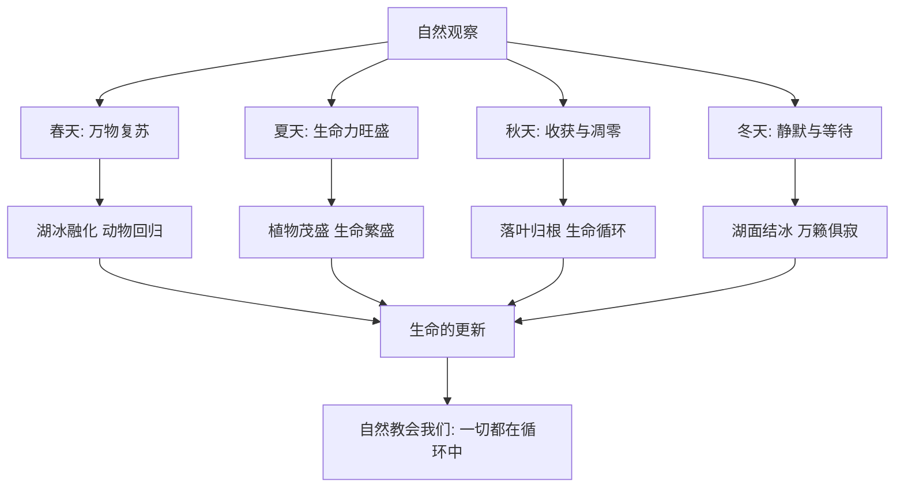
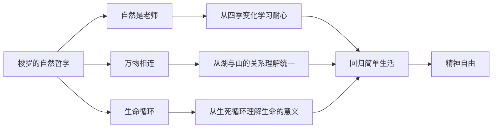

# ●《瓦尔登湖》：自然的教科书（下）

## 四季的观察

《瓦尔登湖》最优美的部分是对自然的描写。梭罗以极其细腻的笔触记录了瓦尔登湖的四季变化——春天的生机、夏天的繁茂、秋天的宁静、冬天的肃穆。

他不仅是一个观察者，更是一个"学生"——他把自然当作最好的老师，从中学到了关于时间、生命和宇宙的深刻道理。

### 梭罗的自然观察笔记

## 瓦尔登湖的测量

梭罗对瓦尔登湖做了一件有趣的事——他测量了湖的深度。他发现瓦尔登湖的形状与周围的山的形状正好相反：山凸起的地方，湖就凹陷。

这个发现让他领悟到一个深刻的道理：**世界是一个整体，一切事物都在某种深层的秩序中相互关联。**

### 两种生活态度的对比

| 维度 | 梭罗的态度 | 现代人的态度 |
|------|-----------|-------------|
| 对物质的看法 | 越少越好 | 越多越好 |
| 对时间的看法 | 时间是最好的财富 | 时间就是金钱 |
| 对工作的看法 | 工作是为了自由 | 自由是为了工作 |
| 对自然的态度 | 自然是老师 | 自然是资源 |
| 对幸福的态度 | 幸福来自简单 | 幸福来自拥有 |
| 对社交的态度 | 独处是必需的 | 社交是必需的 |

## 孤独与独处

梭罗在瓦尔登湖畔并不孤独。他写道："我从未找到像孤独那样好的伴侣。"

他区分了"孤独"（loneliness）和"独处"（solitude）。孤独是一种负面的情感状态，而独处是一种积极的选择。独处是与自我对话的方式，是获得内心平静的途径。

### 独处的价值

梭罗认为，独处有三个重要的价值：

**第一：自我认识**。当你独自一人时，你不得不面对真实的自己——你的想法、恐惧和欲望。

**第二：创造力**。许多伟大的思想和艺术作品都是在独处中产生的。

**第三：精神自由**。当你习惯了独处，你就不再依赖外部的认可来确认自己的价值。

## 人生启示

### 简单不是匮乏

梭罗的简单生活不是苦行僧式的自我剥夺，而是一种"有意识的选择"。他选择放弃不必要的东西，是为了获得更多的自由时间去做他真正在意的事——阅读、写作、观察自然。

### 自然是最好的老师

梭罗从自然中学到的东西比从任何一本书中学到的都多。他教会我们用"初学者的心态"来看待自然——每一朵花、每一片叶子、每一只鸟都值得我们去关注和理解。

### 自由来自自律

梭罗看似"自由"的生活方式，实际上需要极大的自律。他需要自己种地、建房、做饭——这些都需要自律和坚持。真正的自由不是随心所欲，而是有能力选择自己想要的生活方式。

---

**个人成长启示**：《瓦尔登湖》最深刻的启示是——你不需要等到"退休"才开始享受生活。你可以在任何时候选择简化自己的生活，把时间花在真正重要的事物上。
