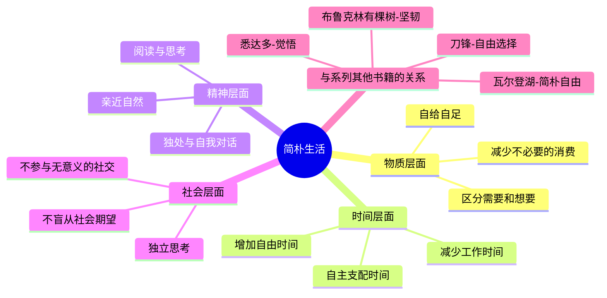
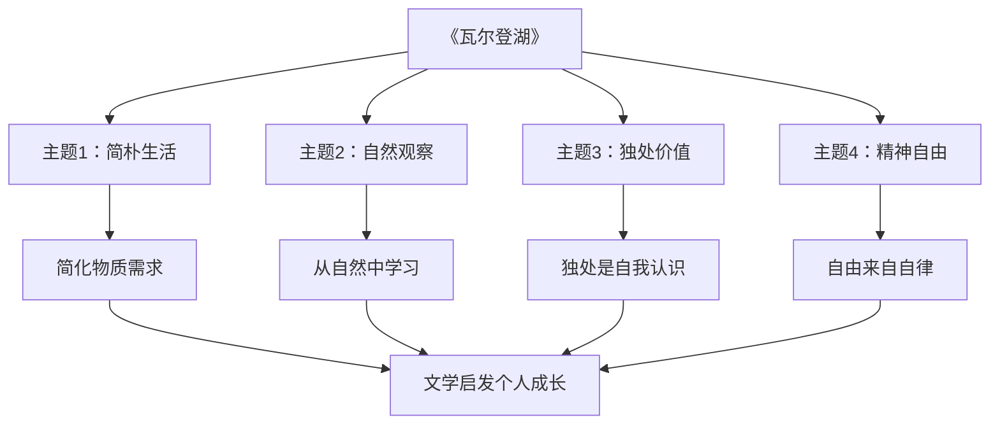

# ◆《瓦尔登湖》：简朴生活的哲学

## 简朴作为一种生活哲学

《瓦尔登湖》之所以成为经典，不仅因为它描写了一段优美的湖畔生活，更因为它提出了一种至今仍然适用的生活哲学：**简朴不是手段，而是目的本身。**

在现代社会，我们被消费主义包围。广告告诉我们：你不够好，除非你拥有这个产品。梭罗在150年前就看到了这一点——"大多数人都生活在平静的绝望中"，因为他们被困在"赚取-消费-再赚取"的循环中，无法停下来思考：我真正需要的是什么？

### 简朴生活的多维度理解

## 系列文学中的简朴哲学

在个人成长系列的文学类书籍中，《瓦尔登湖》代表了一条独特的成长路径——通过"做减法"来获得成长：

### 四本书的成长方式

| 书籍 | 成长方式 | 核心行动 | 自由来源 |
|------|---------|---------|---------|
| 《布鲁克林有棵树》 | 坚韧成长 | 通过教育和阅读 | 从困境中突围 |
| 《刀锋》 | 精神探索 | 追问人生意义 | 内心的独立选择 |
| 《悉达多》 | 亲身体验 | 走过所有弯路 | 觉悟与接纳 |
| 《瓦尔登湖》 | 简朴生活 | 做减法 | 从物质中解放 |

## 文学如何促进简朴生活

### 从阅读到行动

《瓦尔登湖》与自助类书籍最大的区别在于：它不是"教你怎么做"的指南，而是"展示一种可能性"的记录。梭罗没有告诉读者"你必须搬到湖边"，他只是展示了"一个人可以选择这样生活"。

这种"展示"比"教导"更有力量——它不会让你感到被强迫，而是激发你自己的思考。

### 文学中的自然力量

梭罗对自然的描写是文学史上最优美的篇章之一。但这些描写不仅仅是"美文"——它们有一个明确的目的：让读者重新认识自然的价值。

在现代社会，我们大部分时间都在室内度过。梭罗提醒我们：自然不是"可有可无的装饰"，而是"生命的基本要素"。

### 从文学到日常的桥梁

将《瓦尔登湖》的启发转化为日常行动：

**第一：做一次"生活审计"**——列出你所有的支出，标注哪些是真正需要的。

**第二：每周留出独处时间**——至少半天，不做任何"生产性"的事。

**第三：重新定义"富有"**——用"可自由支配的时间"而不是"收入"来衡量你的生活。

**第四：亲近自然**——每天花15分钟在户外，观察一棵树、一片天空。

**第五：学会说"不"**——对不必要的社交、不必要的消费、不必要的忙碌说不。

---

**个人成长启示**：《瓦尔登湖》告诉我们——成长有时候不是"获得更多"，而是"学会放下"。当你放下了不必要的负担，你才能发现自己真正想要的是什么。
