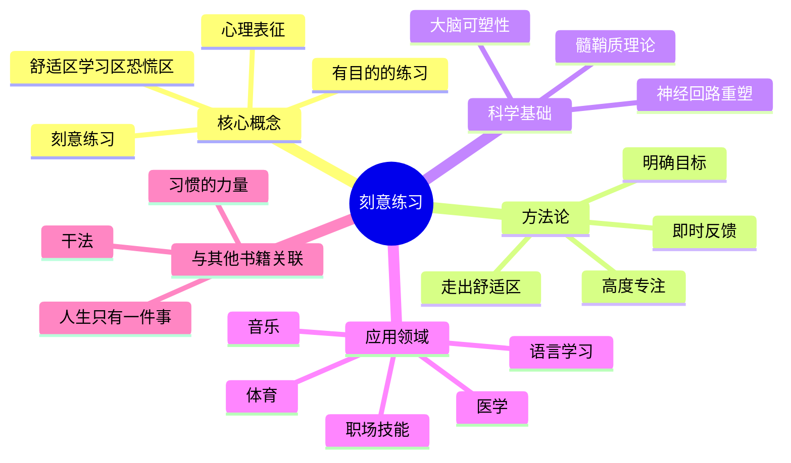
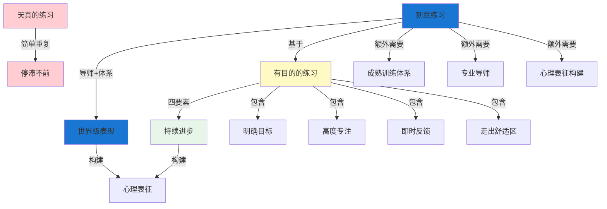
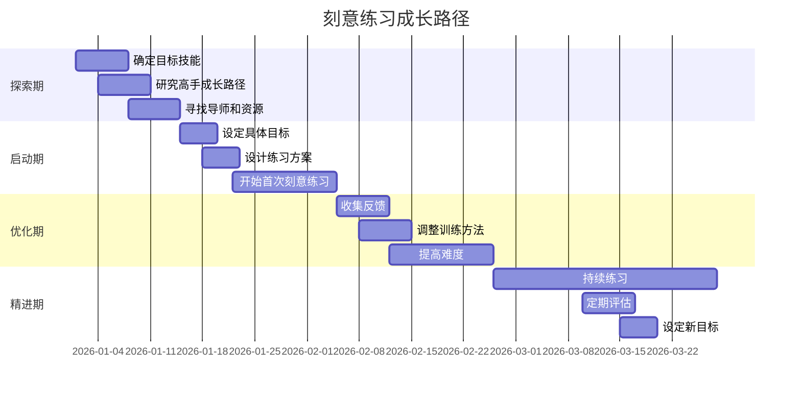
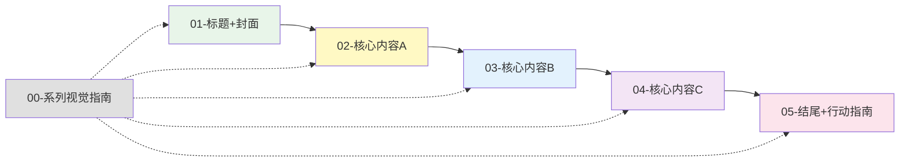
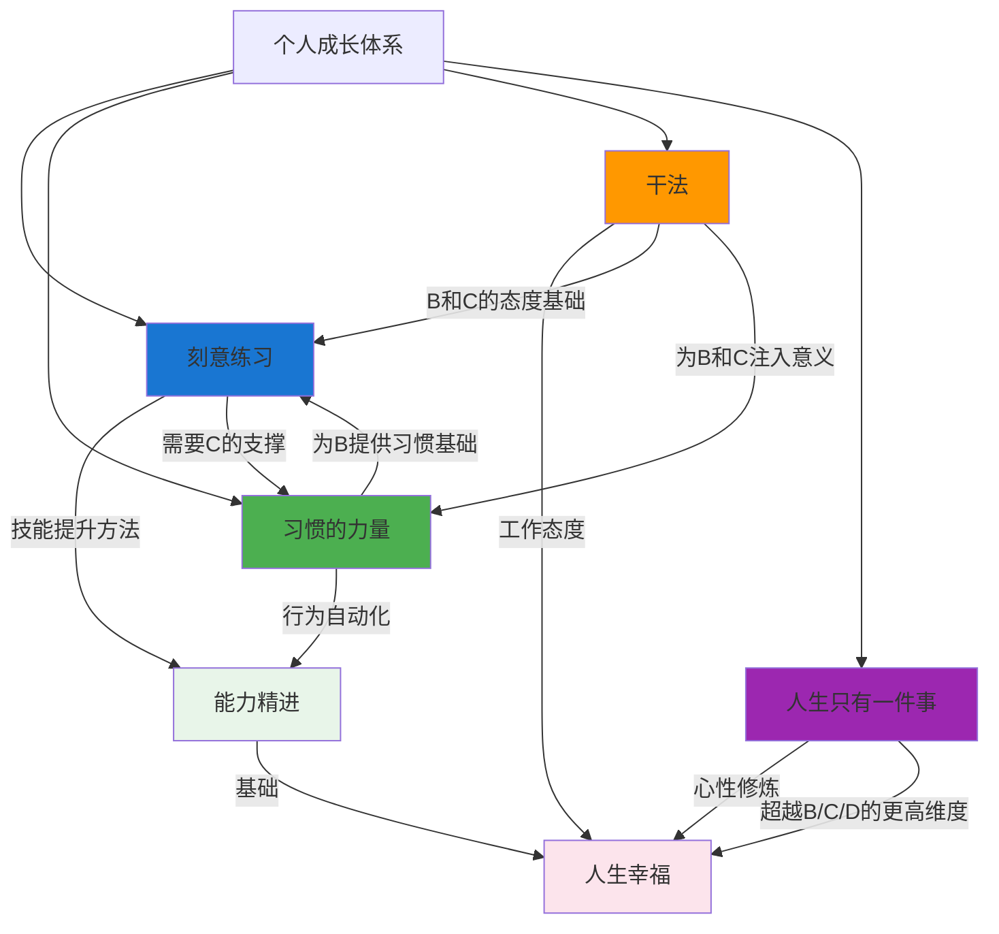

# ◆ 《刻意练习》系列视觉指南

## 系列总览

本系列从多个维度解读《刻意练习》的核心内容，帮助你全面理解并应用这一方法论。

---

## 01 系列知识地图

---

## 02 概念关系图

---

## 03 成长路径时间线

---

## 04 阅读序列建议

**推荐阅读顺序**：
1. 先看 **00-系列视觉指南** 建立全局认知
2. 再读 **01-标题+封面** 了解全书概览
3. 依次阅读 **02→03→04** 深入学习核心内容
4. 最后完成 **05-结尾+行动指南** 制定行动计划

---

## 05 与其他成长方法论的关系图

---

## 关键 takeaway

- ◆ **刻意练习 = 有目的的练习 + 成熟体系 + 导师指导**
- ○ **心理表征的质量决定高手与新手的差距**
- ● **大脑具有极强的可塑性，任何人都可以提升**
- ◇ **关键在于练习的质量，而非数量**

> 本视觉指南可作为系列学习的"导航图"，建议收藏并随时查阅。
