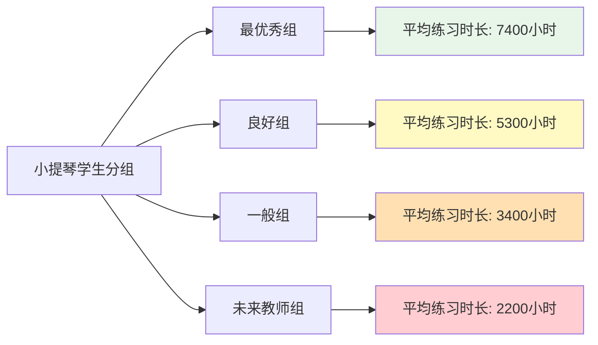
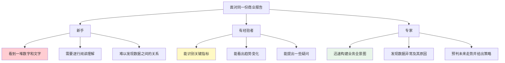

# ◆ 《刻意练习》核心内容（上）—— 破解"天才"迷思

## 引言：莫扎特真的是天才吗？

我们从小就被灌输一个观念：有些人生来就是天才。莫扎特4岁作曲，高斯3岁纠正父亲的账目错误，贝多芬年少成名……

但艾利克森的研究揭示了一个令人震惊的事实：**所谓的"天才"，几乎无一例外地经历了早期的、密集的、有指导的训练。**

莫扎特的父亲本身就是著名的音乐教育家，在莫扎特很小的时候就对他进行了系统的音乐训练。莫扎特早期的作品，很多是在父亲指导下完成的——真正称得上"杰作"的作品，出现在他经过了十多年的训练之后。

---

## 01 天赋 vs. 练习：科学的裁决

### 长期跟踪研究的发现

艾利克森对柏林音乐学院的小提琴学生进行了深入研究，结果发现：

**关键发现**：
- ◇ 最优秀组和良好组之间，唯一的显著差异就是累计练习时间
- ○ 没有任何一个学生是靠"天赋异禀"跳过高强度的练习而达到顶尖水平的
- ● 练习时间和表现水平之间存在强烈的正相关关系

### "天生绝对音感"的真相

绝对音感常被认为是"天赋"的典型代表。但研究表明：

> 在日语母语环境中长大的孩子，获得绝对音感的比例远高于英语母语环境的孩子。原因在于日语是一种"音高语言"——同一个词用不同音调说出会有不同的含义。

这说明：**所谓的天赋，很多时候只是早期训练环境的产物。**

---

## 02 天真的练习 vs. 有目的的练习

### 什么是"天真的练习"？

天真的练习就是简单地"重复做"，相信只要练得够多就自然会变好。

**典型场景**：
- ◇ 一个高尔夫球爱好者每个周末去打100个球，但从来不调整姿势
- ○ 一个司机开了20年车，驾驶技术并没有比开了5年的人更好
- ● 一个打字员每天打字，但速度和准确率多年没有提升

**核心问题**：天真的练习只会让你"自动化"当前的水平，而不是提升水平。一旦技能达到了"够用"的程度，单纯的重复就不再带来进步。

### 什么是有目的的练习？

有目的的练习具有四个核心特征：

| 特征 | 说明 | 反面例子 |
|------|------|----------|
| 明确目标 | 每次练习都有具体的、可衡量的目标 | "我今天要练琴"（太模糊） |
| 高度专注 | 练习时全神贯注，不分心 | 边看电视边练琴 |
| 即时反馈 | 知道自己哪里做得好、哪里需要改进 | 练完了也不知道效果 |
| 走出舒适区 | 不断挑战更高难度 | 永远只弹熟练的曲子 |

### 实战案例对比

**场景：学习英语口语**

| 练习方式 | 做法 | 效果 |
|----------|------|------|
| 天真练习 | 每天看美剧1小时 | 听力有提升，口语进步很小 |
| 有目的练习 | 选一段对话，跟读→录音→对比→纠正发音→再练 | 口语水平持续提升 |

**关键洞察**：有目的的练习的精髓在于——**每次练习都要有意识地瞄准一个具体的改进点**。

---

## 03 心理表征：高手与新手的根本差异

### 什么是心理表征？

心理表征是大脑对某个领域知识的"内部模型"。它让你能够：

- ◇ 快速识别模式（棋手一眼看出棋局态势）
- ○ 预见未来（医生看到症状就想到可能的疾病）
- ● 高效处理信息（程序员扫一眼代码就能发现bug）

### 心理表征的层级差异

**核心要点**：
- ◇ 心理表征不是"天生的"，而是在大量练习中逐步构建的
- ○ 高质量的心理表征让你"看到"别人看不到的东西
- ● 心理表征的质量决定了你处理信息的效率和深度

---

## 行动清单

读完本章后，请完成以下检查：

- [ ] 回顾你目前正在学习的技能，你的练习方式是"天真的练习"还是"有目的的练习"？
- [ ] 为你的练习设定一个明确的、可衡量的本周目标
- [ ] 找一个可以提供反馈的人或工具
- [ ] 识别你当前练习中的"舒适区"，并设计一个"走出舒适区"的具体行动
- [ ] 思考你所在领域中，"高手的心理表征"是什么样的？尝试描述出来

---

> 下一章预告：什么是真正的"刻意练习"？为什么需要有导师？如何将刻意练习应用到不同领域？
