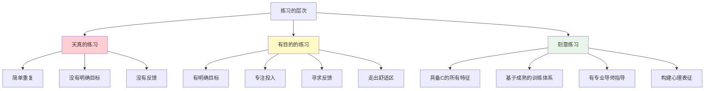

# ◆ 《刻意练习》核心内容（下）—— 从有目的到刻意

## 引言：有目的的练习还不够

上一章我们介绍了"有目的的练习"的四个要素：明确目标、高度专注、即时反馈、走出舒适区。

但艾利克森的研究进一步指出，**有目的的练习虽然有效，但仍然存在天花板**。要达到真正的世界级水平，需要一种更加系统、更加科学的方法——这就是"刻意练习"。

---

## 01 刻意练习 vs. 有目的的练习

### 两者的区别



**刻意练习的独特之处**：
- ◇ 必须在一个**已经发展出成熟训练方法**的领域中进行
- ○ 必须有**了解如何训练**的导师或教练
- ● 训练的每一步都是基于对该领域杰出表现的研究而设计的

### 适用领域对比

| 特征 | 适用刻意练习 | 不适用刻意练习 |
|------|-------------|---------------|
| 领域 | 音乐、体育、棋类、医学等 | 新兴领域、创意写作等 |
| 训练体系 | 成熟的、被验证的方法 | 尚未形成共识 |
| 评价标准 | 客观的、可量化的 | 主观的、多元的 |
| 导师 | 有经验丰富的教练 | 靠自己摸索 |

<div style="background-color: #e3f2fd; padding: 16px; border-left: 4px solid #2196f3; margin: 16px 0;">

**重要提醒**：即使你的领域不适用严格意义上的"刻意练习"，"有目的的练习"的原则仍然完全适用！

</div>

---

## 02 导师的关键作用

### 为什么你需要一位导师？

艾利克森强调，**刻意练习几乎总是需要一位了解如何培养杰出表现的导师**。导师的价值在于：

- ◇ **设计训练计划**：基于对领域内杰出表现的理解，为你量身定制训练路径
- ○ **提供即时反馈**：指出你自己无法发现的问题
- ● **调整心理表征**：帮助你构建正确的心智模型

### 经典案例：帕格尼尼的小提琴训练

帕格尼尼被认为是史上最伟大的小提琴家之一。他的成功秘诀不仅在于天赋，更在于：
- 他有一位极其严格的导师
- 导师为他设计了系统性的技术训练
- 每一个练习都针对特定的技术难点
- 训练强度和质量远超同龄人

### 没有导师怎么办？

<div style="background-color: #f3e5f5; padding: 16px; border-left: 4px solid #9c27b0; margin: 16px 0;">

**好消息**：即使没有专业导师，你也可以通过以下方式逼近刻意练习的效果：

- ◇ 研究该领域顶尖人物的训练方法（通过书籍、访谈、纪录片）
- ○ 寻找同行者，互相提供反馈
- ● 利用技术工具（录音、录像、数据分析软件）自我监控
- ○ 设定更小的子目标，逐步自我迭代

</div>

---

## 03 常见陷阱与误区

### 陷阱一：混淆"练习时间"与"练习质量"

> "我每天练习3小时，为什么没有进步？"

问题可能在于：
- ◇ 这3小时里有多少时间是真正专注的？
- ○ 你是否每次都在挑战新难度？
- ● 你有没有收到反馈并据此调整？

**数据对比**：
- 低质量练习3小时 ≈ 进步0
- 高质量刻意练习1小时 ≈ 显著进步

### 陷阱二：停留在"OK平原"

当你达到"够用"的水平后，很容易进入一个停滞期——心理学称之为"OK平原"。

```mermaid
xychart-beta
    title "技能水平随时间变化"
    x-axis [1月, 2月, 3月, 4月, 5月, 6月, 7月, 8月]
    y-axis "技能水平" 0 --> 100
    line [10, 30, 50, 60, 62, 63, 63, 64]
    line [10, 35, 55, 70, 80, 88, 93, 97]
```

- 上方曲线：刻意练习者，持续进步
- 下方曲线：天真练习者，很快进入"OK平原"

### 陷阱三：过度练习导致倦怠

刻意练习需要高度的专注和精力。**每天2-4小时的刻意练习已经是上限**。超过这个时间，练习质量会急剧下降。

### 陷阱四：忽视基础训练

> "我想直接学高难度的技巧"

这是错误的。所有高手都是从基础开始，通过系统训练逐步提升的。**跳级学习往往导致基础不牢，后劲不足**。

---

## 04 在不同领域应用刻意练习

### 学习外语

| 步骤 | 具体做法 |
|------|----------|
| 明确目标 | "本周掌握50个商务场景词汇，并能用英语做3分钟自我介绍" |
| 专注练习 | 每天30分钟纯英语环境，不看中文 |
| 即时反馈 | 使用语音识别工具检测发音，找母语者纠正 |
| 走出舒适区 | 从简单对话逐步过渡到复杂话题辩论 |

### 提升写作能力

| 步骤 | 具体做法 |
|------|----------|
| 明确目标 | "本周练习写出5个引人入胜的开头段落" |
| 专注练习 | 分析优秀文章的开头，然后模仿创作 |
| 即时反馈 | 请编辑或有经验的写作者点评 |
| 走出舒适区 | 尝试不同风格、不同类型的写作 |

### 职场技能提升

| 步骤 | 具体做法 |
|------|----------|
| 明确目标 | "本月掌握数据分析中的SQL高级查询" |
| 专注练习 | 每天完成3个实际业务场景的查询练习 |
| 即时反馈 | 对比标准答案，分析效率差异 |
| 走出舒适区 | 从单表查询到多表JOIN再到复杂子查询 |

---

## 实践步骤总结

### 刻意练习五步法

1. **◇ 研究杰出表现**：了解你所在领域的"世界级水平"是什么样的
2. **○ 拆解技能**：将大技能拆解为可练习的子技能
3. **● 设计训练**：为每个子技能设计针对性的练习
4. **○ 寻求反馈**：找到可以提供高质量反馈的人或工具
5. **◇ 持续迭代**：根据反馈调整训练，不断挑战更高难度

---

> 下一章预告：如何将刻意练习与其他成长方法论结合使用？"刻意练习"与"习惯的力量"、"干法"有什么深层联系？敬请期待核心内容C！
