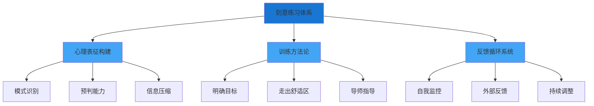
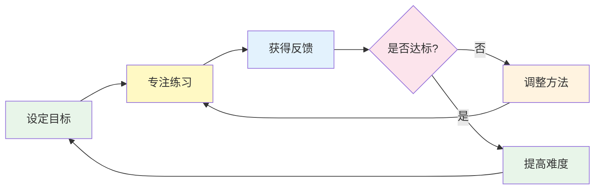
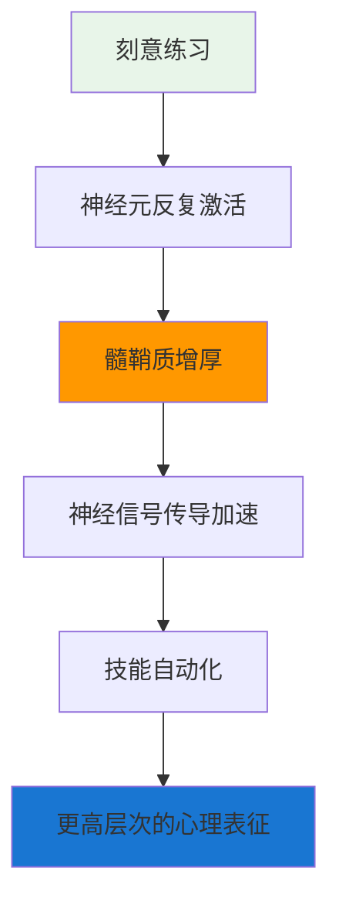
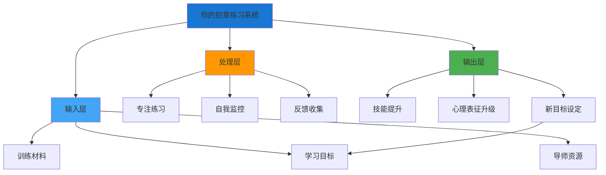

# ◆ 《刻意练习》核心内容（进阶）—— 融会贯通

## 引言：刻意练习的终极目标

经过前两章的学习，我们已经掌握了刻意练习的核心方法论。本章将从更高维度出发，将刻意练习与其他个人成长方法论进行整合，帮助你构建完整的自我精进体系。

---

## 01 刻意练习的完整框架

---

## 02 刻意练习与其他成长书籍的关联

### 与《习惯的力量》的联系

刻意练习需要强大的习惯体系来支撑：

**关键洞察**：
- ◇ 刻意练习本身是高度消耗意志力的行为
- ○ 通过将练习时间"习惯化"，可以减少启动时的意志力消耗
- ● 黄金法则：保留暗示和奖赏，替换惯常行为——将"刷手机"的习惯替换为"练习"

### 与《干法》的联系

稻盛和夫在《干法》中强调"工作本身就是修行"，这与刻意练习的理念高度一致：

| 刻意练习 | 干法 | 共同点 |
|----------|------|--------|
| 走出舒适区 | "极度认真" | 持续挑战自我 |
| 即时反馈 | "现场有神灵" | 重视实践中的感悟 |
| 心理表征构建 | "持续改善" | 不断深化理解 |
| 导师指导 | "向优秀的人学习" | 借助外力提升 |

### 与《人生只有一件事》的联系

金惟纯说"人生只有一件事：活好"。刻意练习告诉我们：

- ◇ "活好"不是天生的能力，而是可以通过刻意练习获得的技能
- ○ 每一天的"小事"都是刻意练习的机会
- ● "反求诸己"本质上就是在建立自我反馈机制

---

## 03 刻意练习的认知科学基础

### 大脑的可塑性

**科学事实**：
- ◇ 伦敦出租车司机的海马体（负责空间记忆）比普通人更大
- ○ 音乐家的运动皮层（负责手指运动）比普通人更发达
- ● 即使是成年人，大脑仍然具有极强的可塑性

### 髓鞘质理论

髓鞘质是包裹在神经纤维外面的一层物质。每次神经回路被激活，髓鞘质就会增厚一点，使信号传导更快、更精准。

**这就是"练习"在大脑中发生的物理变化**。

---

## 04 构建你的个人刻意练习系统

### 系统框架

### 实施步骤

**第一阶段：探索期（1-2周）**
- ◇ 确定你要提升的核心技能
- ○ 研究该领域杰出人物的成长路径
- ● 找到可用的导师资源和训练材料

**第二阶段：启动期（3-4周）**
- ◇ 设定第一个明确的、可衡量的目标
- ○ 每天安排固定的刻意练习时间（建议1-2小时）
- ● 建立反馈机制（录音、录像、教练点评等）

**第三阶段：优化期（5-8周）**
- ◇ 根据反馈调整训练方法
- ○ 逐步提高难度，确保持续在学习区
- ● 记录进步，构建自己的心理表征

**第四阶段：精进期（持续）**
- ◇ 定期回顾和调整训练计划
- ○ 寻找新的挑战和学习机会
- ● 将刻意练习融入日常生活习惯

---

## 05 刻意练习的边界与局限

### 什么不能靠刻意练习获得？

- ◇ **创造力**：刻意练习可以提升技能，但创造力需要更多元化的输入和跨界思维
- ○ **领导力**：虽然可以学习领导技能，但真正的领导力需要在真实情境中磨炼
- ● **幸福感**：技能提升不等于幸福，还需要意义感、人际关系等要素

### 与"1万小时定律"的澄清

马尔科姆·格拉德威尔在《异类》中提出"1万小时定律"，但艾利克森明确表示：

> "1万小时是一个平均值，不是魔法数字。关键在于练习的质量，而不是数量。"

**正确理解**：
- ◇ 有些人可能只需要3000小时就能达到很高水平
- ○ 有些人可能需要25000小时
- ● 决定因素是练习的质量、方法的科学性和反馈的有效性

---

## 融会贯通总结

刻意练习不是一种"技巧"，而是一种**思维方式**和**生活态度**。它告诉我们：

- ◆ 杰出不是天生的，而是可以通过科学方法培养的
- ○ 每个人都有潜力成为更好的自己
- ● 关键在于：找到正确的方法，保持专注，持续反馈，永不满足于现状

> 下一章预告：制定你的30天刻意练习计划！包含实操模板、 worksheets和FAQ，助你立即行动！
