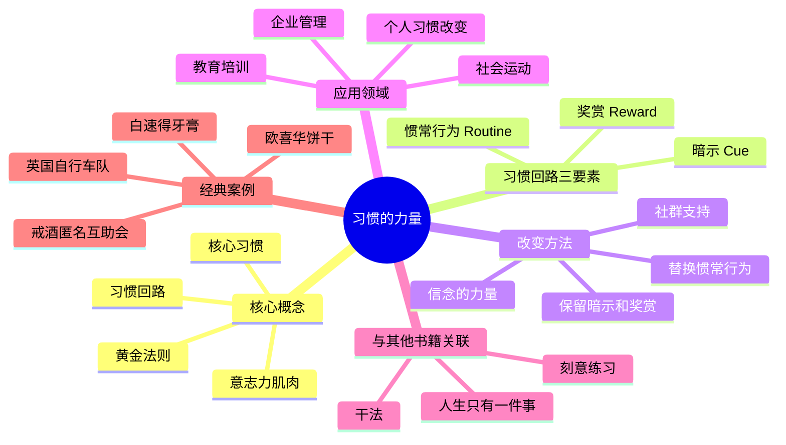
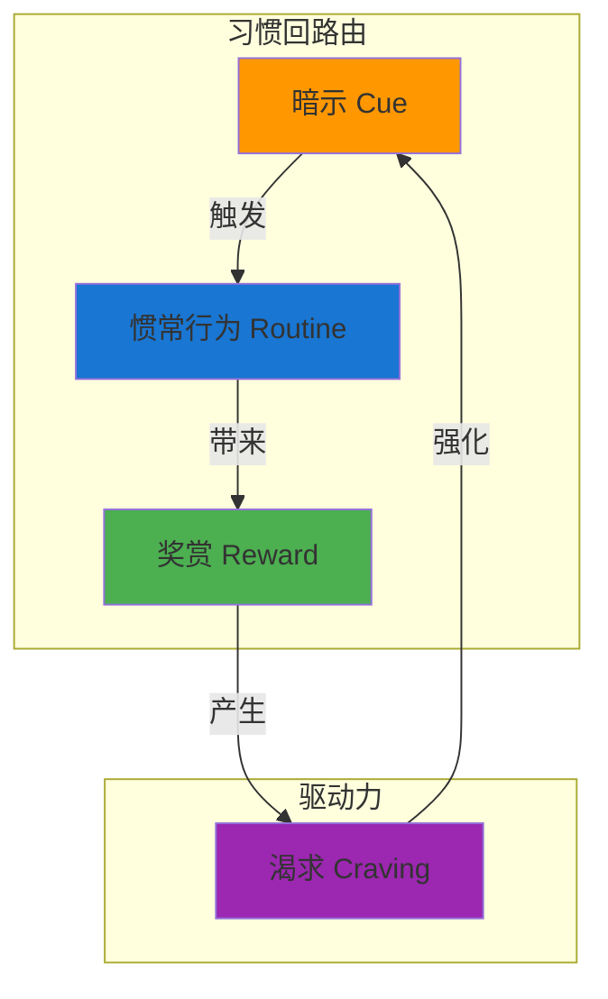
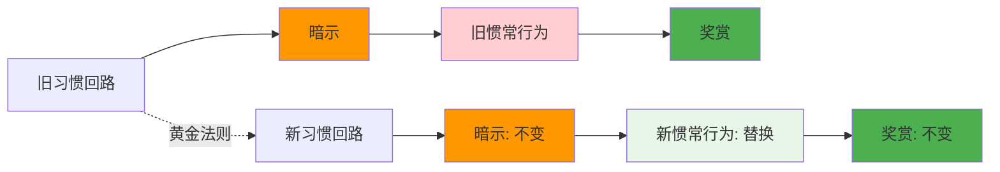
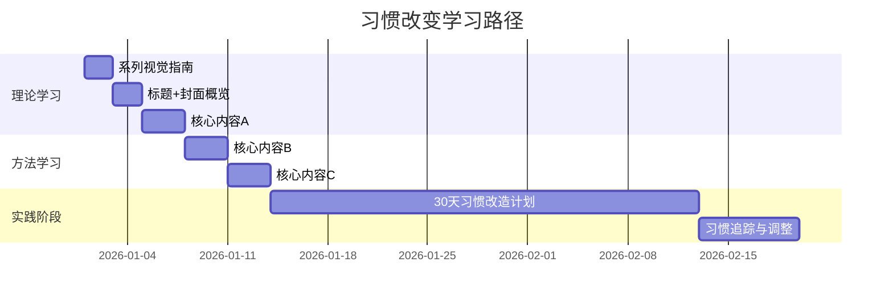
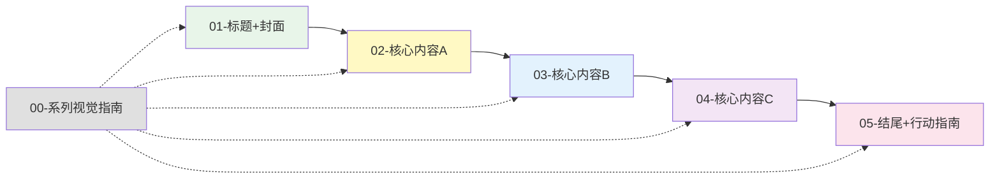
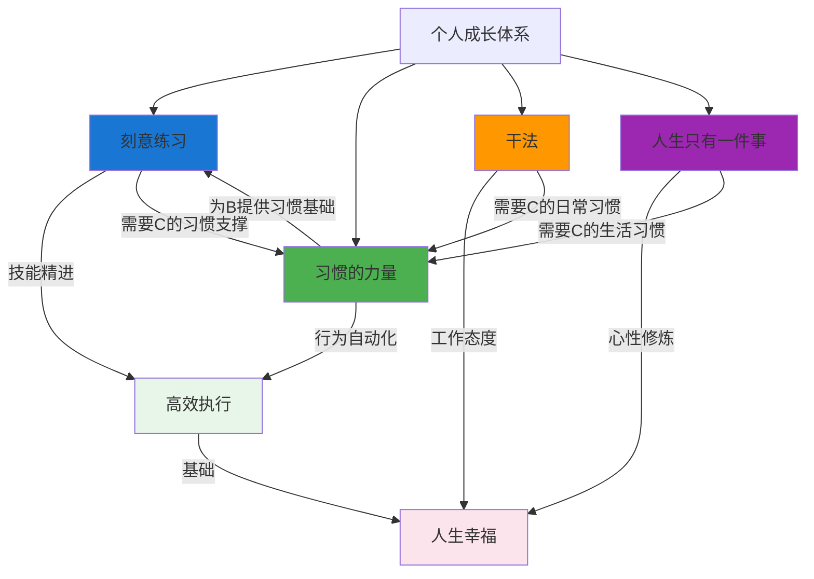

# ◆ 《习惯的力量》系列视觉指南

## 系列总览

本系列从多个维度解读《习惯的力量》的核心内容，帮助你全面理解习惯的形成机制和改变方法。

---

## 01 系列知识地图

---

## 02 习惯回路核心图

---

## 03 习惯改变方法关系图

---

## 04 阅读序列建议与时间线

---

## 05 与其他成长方法论的关系图

---

## 关键 takeaway

- ◆ **习惯回路 = 暗示 + 惯常行为 + 奖赏**
- ○ **黄金法则：保留暗示和奖赏，替换惯常行为**
- ● **核心习惯的改变可以带动连锁反应**
- ◇ **意志力是可以锻炼的肌肉，但也会疲劳**

> 本视觉指南可作为系列学习的"导航图"，建议收藏并随时查阅。
