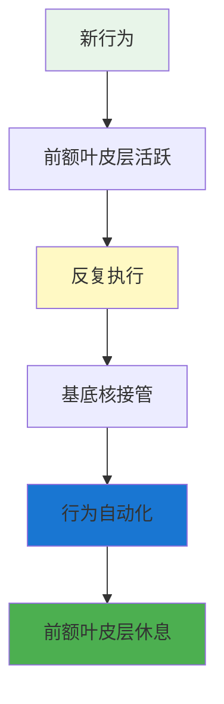
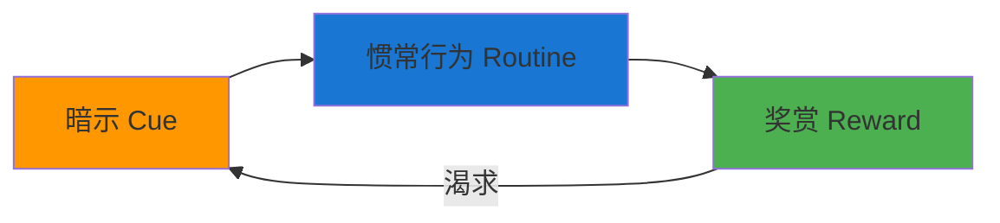

# ◆ 《习惯的力量》核心内容（上）—— 解码习惯回路

## 引言：你的一天，多少是"自动运行"的？

早上起床，刷牙，穿鞋，开车上班，到公司后泡一杯咖啡……

你有没有意识到，这些行为你几乎不需要思考就自动完成了？这就是习惯的力量。

---

## 01 习惯回路的科学原理

### 大脑中的"习惯中枢"

神经科学家发现，当动物（包括人类）反复执行同一个行为时，大脑的**基底核**（basal ganglia）会逐渐接管这个过程，使行为自动化。



**关键发现**：
- ◇ 当习惯形成后，大脑的前额叶皮层（负责思考和决策的区域）会"关机"
- ○ 这就是为什么我们可以在"自动驾驶"模式下做很多事
- ● 但也意味着，当我们处于习惯模式时，我们实际上是在"不思考"地行动

### 习惯回路的三要素详解



**暗示（Cue）**：
- ◇ 大约5%的暗示是你有意识注意到的
- ○ 大多数暗示是自动触发，你甚至没有察觉
- ● 常见的暗示类型：时间、地点、情绪状态、他人、之前的行为

**惯常行为（Routine）**：
- ◇ 可以是身体行为（吃零食）、心理行为（担忧）、情感行为（生气）
- ○ 这是你习惯性"自动运行"的程序
- ● 可以是好的（运动），也可以是坏的（刷手机）

**奖赏（Reward）**：
- ◇ 奖赏帮助大脑判断这个回路是否值得记住
- ○ 奖赏可以是生理的（食物的味道）、心理的（完成任务的满足感）
- ● **关键**：你渴望的不是行为本身，而是行为带来的奖赏

---

## 02 经典案例拆解

### 案例一：欧喜华（Oreo）饼干为什么让人上瘾？

**习惯回路分析**：

| 要素 | 内容 |
|------|------|
| 暗示 | 看到包装、感到无聊、下午3点的疲劳 |
| 惯常行为 | 拿一块饼干 → 扭开 → 舔掉奶油 → 吃掉 |
| 奖赏 | 甜味刺激 + 短暂的愉悦感 |

欧喜华的设计本身就是围绕习惯回路打造的：扭开的动作创造了"仪式感"，强化了习惯的形成。

### 案例二：为什么你总是在同一个时间感到饥饿？

**习惯回路分析**：

| 要素 | 内容 |
|------|------|
| 暗示 | 中午12点的钟表声 / 闻到同事的午餐味 |
| 惯常行为 | 走向餐厅，选择你常吃的食物 |
| 奖赏 | 饱腹感 + 社交放松 |

<div style="background-color: #e3f2fd; padding: 16px; border-left: 4px solid #2196f3; margin: 16px 0;">

**关键洞察**：你可能不是真的饿了，而是你的"暗示-奖赏"回路被触发了。

</div>

### 案例三：Pepsodent（白速得）牙膏如何创造了全球刷牙习惯？

在20世纪初，大多数美国人并不刷牙。Pepsodent的营销策略：

- ◇ **制造暗示**：广告让人们关注"牙垢膜"（牙菌斑），创造了对它的焦虑感
- ○ **提供行为**：用Pepsodent牙膏刷牙
- ● **设计奖赏**：添加了薄荷油和柠檬酸，刷牙后口腔有清凉感——这就是奖赏！

---

## 03 如何识别你的习惯回路

### 练习：绘制你的习惯回路图

选择一个你想理解的习惯，填写下表：

```
┌─────────────────────────────────────────┐
│          我的习惯回路图                    │
├─────────────────────────────────────────┤
│                                         │
│ ◇ 习惯行为：______________________       │
│                                         │
│ ○ 暗示分析：                              │
│   - 什么时候？_______________             │
│   - 在哪里？_________________             │
│   - 和谁在一起？_____________             │
│   - 之前做了什么？___________             │
│   - 什么情绪？_______________             │
│                                         │
│ ● 奖赏分析：                              │
│   - 行为后我得到了什么？______             │
│   - 我真正渴望的是什么？______             │
│                                         │
└─────────────────────────────────────────┘
```

### "奖赏实验"方法

要找出你真正渴望的奖赏，尝试以下实验：

| 实验日 | 替代行为 | 目的 |
|--------|----------|------|
| 第1天 | 散步15分钟 | 测试：我需要的是运动/新鲜空气吗？ |
| 第2天 | 和朋友聊天 | 测试：我需要的是社交连接吗？ |
| 第3天 | 吃一块水果 | 测试：我需要的是食物/血糖吗？ |
| 第4天 | 听一段音乐 | 测试：我需要的是放松/娱乐吗？ |
| 第5天 | 做5分钟冥想 | 测试：我需要的是减压吗？ |

---

## 行动清单

- [ ] 选择一个你想分析的习惯
- [ ] 绘制完整的习惯回路图（暗示→行为→奖赏）
- [ ] 进行至少3天的"奖赏实验"，找出真正的奖赏来源
- [ ] 思考：这个习惯回路中，暗示和奖赏是什么？惯常行为可以如何替换？
- [ ] 列出你每天的5个"自动行为"，它们各自的习惯回路是什么？

---

> 下一章预告：如何用"黄金法则"改变习惯？什么是"核心习惯"？意志力真的是一块肌肉吗？
