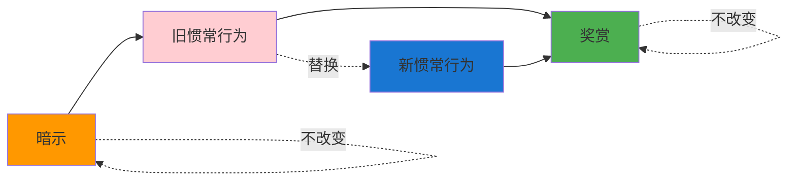
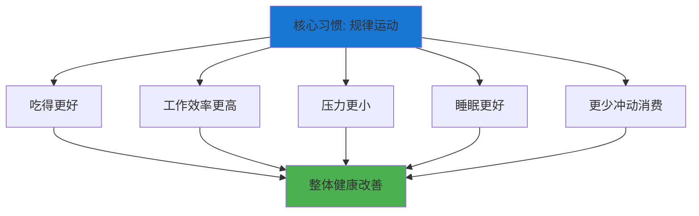
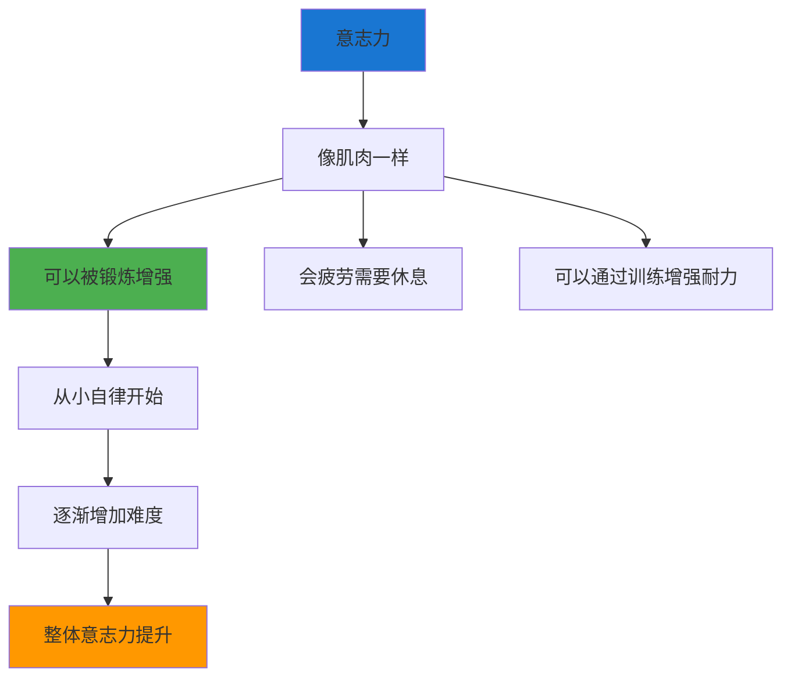

# ◆ 《习惯的力量》核心内容（下）—— 改变习惯的科学

## 引言：为什么新年计划总是失败？

每年1月1日，数百万人写下新年计划。到了2月，超过80%的人已经放弃了。

问题不在于"意志力不足"，而在于**改变习惯的方法不对**。

---

## 01 习惯改变的黄金法则

### 核心原则：保留暗示和奖赏，替换惯常行为

### 经典案例：戒酒匿名互助会（AA）

AA项目没有要求戒酒者"消除对酒精的渴望"，而是：
- ◇ **保留暗示**：压力、焦虑、社交场合
- ○ **替换行为**：去参加会议、找赞助人、祈祷或冥想
- ● **保留奖赏**：放松、社交连接、压力释放

### 实战应用

**场景：想改掉"压力大就吃零食"的习惯**

| 步骤 | 做法 |
|------|------|
| 暗示 | 工作压力大时感到焦虑 |
| 旧行为 | 打开抽屉拿零食吃 |
| 旧奖赏 | 短暂的愉悦感和放松 |
| 新行为 | 站起来做10次深呼吸 + 走一圈 |
| 新奖赏 | 同样获得放松和短暂休息 |

**关键提醒**：仅仅知道黄金法则是不够的。你还需要**信念**和**社群**的支持。

---

## 02 核心习惯：改变一切的杠杆

### 什么是核心习惯？

核心习惯是那些一旦开始改变，就会自动引发其他习惯跟随改变的"关键习惯"。

### 常见核心习惯

| 核心习惯 | 带动的连锁变化 |
|----------|--------------|
| 规律运动 | 饮食改善、效率提升、压力降低 |
| 记录饮食 | 更健康的选择、减少零食摄入 |
| 每天阅读 | 注意力提升、知识积累、减少刷手机 |
| 家庭聚餐 | 孩子成绩提升、家庭关系改善 |
| 早起 | 时间更充裕、晨间效率更高、作息规律 |

### 如何找到你的核心习惯？

**自测问题**：
1. 有没有一个习惯，改变后你觉得其他事情也会跟着变好？
2. 观察生活中状态最好的时期，你在坚持什么？
3. 你最敬佩的人，他们共同的习惯是什么？

---

## 03 意志力肌肉理论

### 意志力是可以锻炼的

艾姆斯·鲍迈斯特的研究表明：**意志力像肌肉一样，可以被锻炼，也会疲劳**。

### 意志力训练方法

- ◇ **从小事开始**：每天记录开支、坐姿端正、用非惯用手刷牙
- ○ **逐步增加难度**：从小习惯过渡到更有挑战的自律行为
- ● **注意意志力疲劳**：一天中做重要决定的时间不要太靠后

### "意志力疲劳"的陷阱

> 研究表明，法官在上午批准假释申请的概率约为65%，到了下午降至接近0%。这不是因为案件本身，而是因为法官的"意志力肌肉"疲劳了。

**应对策略**：
- ◇ 重要的决定安排在早上做
- ○ 避免在饥饿、疲惫时做重大决定
- ● 通过规律运动和充足睡眠补充意志力

---

## 04 常见陷阱与规避方法

### 陷阱一：试图同时改变多个习惯

**问题**：同时改变太多习惯会迅速耗尽意志力。

**解决方案**：一次只聚焦一个核心习惯，让它自动带动其他改变。

### 陷阱二：忽视暗示的力量

**问题**：不消除或回避触发坏习惯的暗示。

**解决方案**：
- ◇ 识别你的核心暗示
- ○ 尽可能避免触发场景（如：不在家里放零食）
- ● 如果无法避免，准备"如果……就……"的预案

### 陷阱三：低估奖赏的重要性

**问题**：新习惯没有提供足够的奖赏，无法持续。

**解决方案**：
- ◇ 为新习惯设计即时奖赏
- ○ 初期可以使用"外在奖励"（如：完成一周运动后看一场电影）
- ● 逐步过渡到"内在奖励"（运动本身的成就感）

### 陷阱四：没有应对"关键瞬间"的计划

**问题**：在高压力、高情绪的时刻，旧习惯会自动回归。

**解决方案**：
- ◇ 提前识别你的"关键瞬间"（如下班后、深夜、争吵后）
- ○ 为这些场景制定具体的应对预案
- ● 写下来，贴在显眼的地方

---

## 05 实践步骤：30天习惯改变计划

### 第1周：识别与理解

- ◇ 选择1个你想改变的习惯
- ○ 绘制完整的习惯回路
- ● 进行"奖赏实验"，找到真正的奖赏

### 第2周：设计与计划

- ◇ 制定新的惯常行为（保留暗示和奖赏）
- ○ 写一个"如果……就……"的执行意图
- ● 找到你的"问责伙伴"

### 第3周：执行与调整

- ◇ 每天执行新习惯，记录感受
- ○ 遇到挫折时，分析哪个环节出了问题
- ● 根据反馈微调计划

### 第4周：巩固与扩展

- ◇ 回顾30天的变化
- ○ 思考这个习惯改变是否带动了其他行为
- ● 如果是，你可能找到了你的"核心习惯"

---

> 下一章预告：如何将"习惯回路"与"刻意练习"、"干法"等成长方法论融合使用？敬请期待核心内容C！
