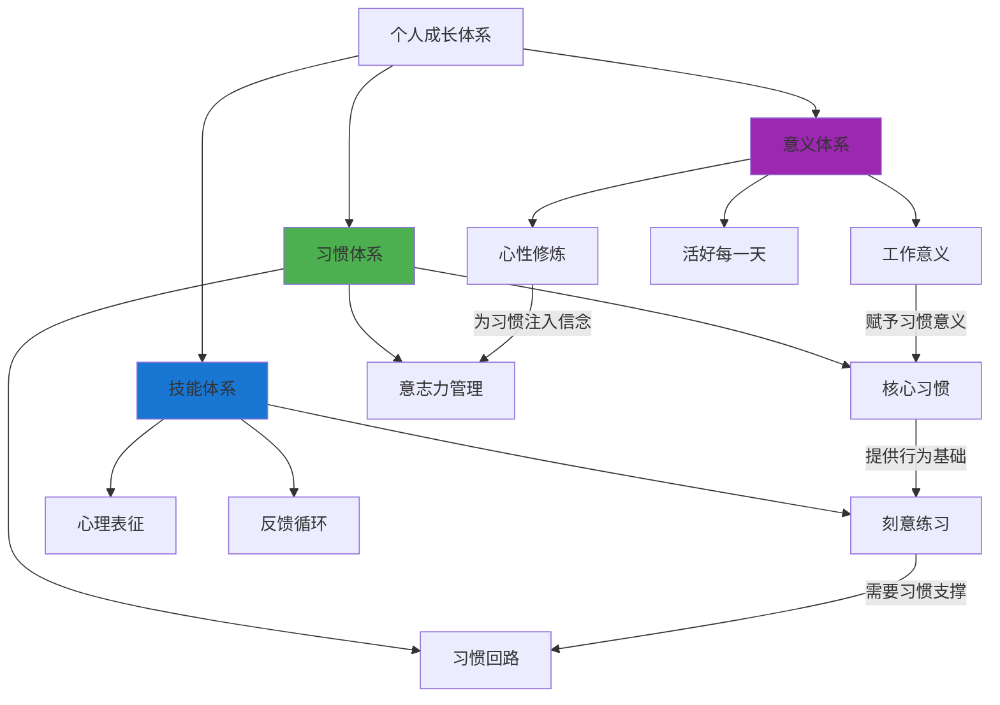
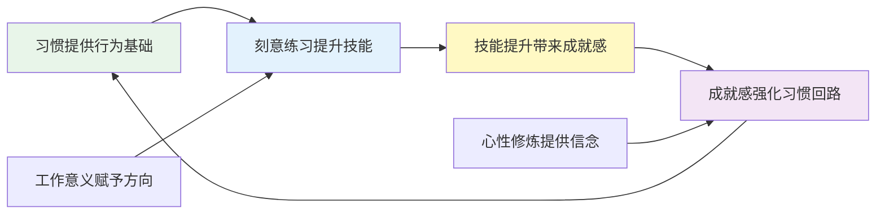
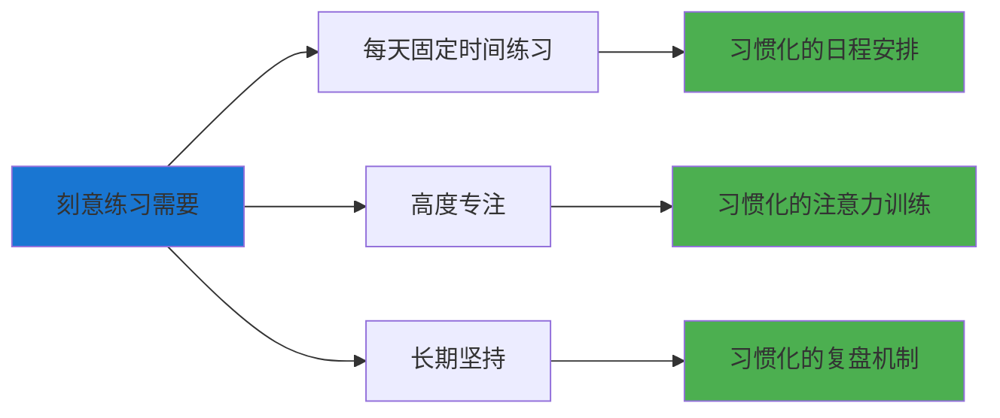
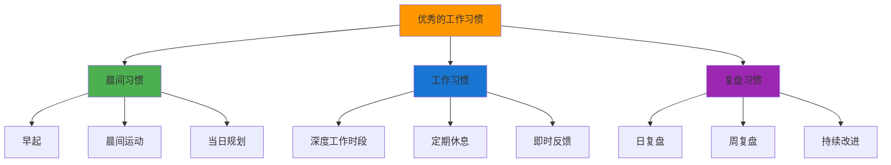
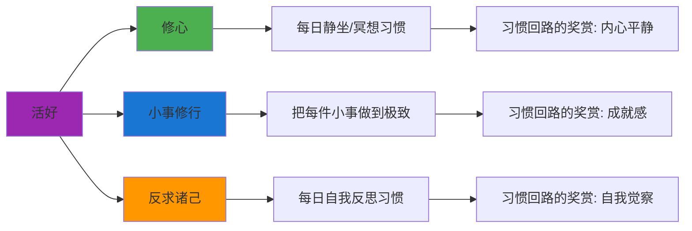
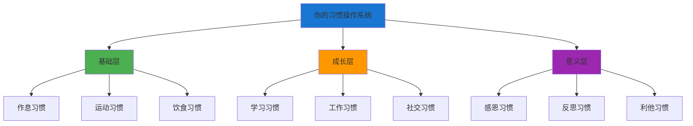

# ◆ 《习惯的力量》核心内容（进阶）—— 融会贯通

## 引言：习惯是人生的底层操作系统

如果说技能是你安装的"应用软件"，那么习惯就是你的"操作系统"。没有好的操作系统，再好的应用软件也跑不起来。

---

## 01 习惯与成长的整合框架

---

## 02 与《刻意练习》的深度融合

### 刻意练习需要习惯的支撑

**关键洞察**：
- ◇ 刻意练习是高度消耗意志力的行为
- ○ 通过习惯化，可以将练习"自动化"，减少意志力消耗
- ● 黄金法则应用：保留"练习时间"的暗示和"进步感"的奖赏，优化练习的具体方式

### 用习惯回路优化刻意练习

| 环节 | 习惯回路设计 |
|------|-------------|
| 暗示 | 固定时间（如每天早上7点）、固定地点（书桌） |
| 惯常行为 | 刻意练习的具体内容（根据当天目标调整） |
| 奖赏 | 练习日志记录进步感、小奖励（一杯好咖啡） |

---

## 03 与《干法》的深度融合

### 稻盛和夫的工作观与习惯

稻盛和夫说："工作本身就是修行。"这与习惯的力量有着深层的连接：

| 干法理念 | 习惯力量对应 | 融合要点 |
|----------|-------------|----------|
| 极度认真 | 核心习惯 | "认真"本身可以成为一种核心习惯 |
| 现场有神灵 | 即时反馈 | 在工作中寻找即时反馈，强化习惯回路 |
| 持续改善 | 习惯迭代 | 持续优化习惯回路中的惯常行为 |
| 燃烧的斗魂 | 信念与渴求 | 信念让习惯回路更加牢固 |

### "工作习惯"的设计框架

---

## 04 与《人生只有一件事》的深度融合

### "活好"与习惯的关系

金惟纯说"人生只有一件事：活好"。而"活好"本质上就是一系列好习惯的集合。

### "反求诸己"的习惯化

"反求诸己"就是遇到问题时，先反思自己，而不是抱怨外部因素。这可以通过以下习惯回路来实现：

| 要素 | 内容 |
|------|------|
| 暗示 | 遇到挫折/冲突/不满 |
| 旧惯常行为 | 抱怨外部、推卸责任 |
| 旧奖赏 | 短暂的自我安慰 |
| 新惯常行为 | 问自己"我能从中学到什么？" |
| 新奖赏 | 成长的满足感 + 更深层的自我理解 |

---

## 05 构建你的个人习惯操作系统

### 三层习惯架构

### 实施优先级

1. **先建立基础层**：没有好的身体和作息，一切都无从谈起
2. **再扩展成长层**：在基础稳固后，专注于技能和能力提升
3. **最后升华意义层**：当基础层和成长层稳定后，追求更高层次的意义

---

## 融会贯通总结

习惯不是孤立的，它是你整个成长体系的"底座"：
- ◆ 没有好的习惯，刻意练习无法持续
- ○ 没有好的习惯，"极度认真"的工作态度无法维持
- ● 没有好的习惯，"活好"只是一句空话

> 下一章预告：制定你的30天习惯改变计划！包含实操模板、worksheets和FAQ，助你立即行动！
