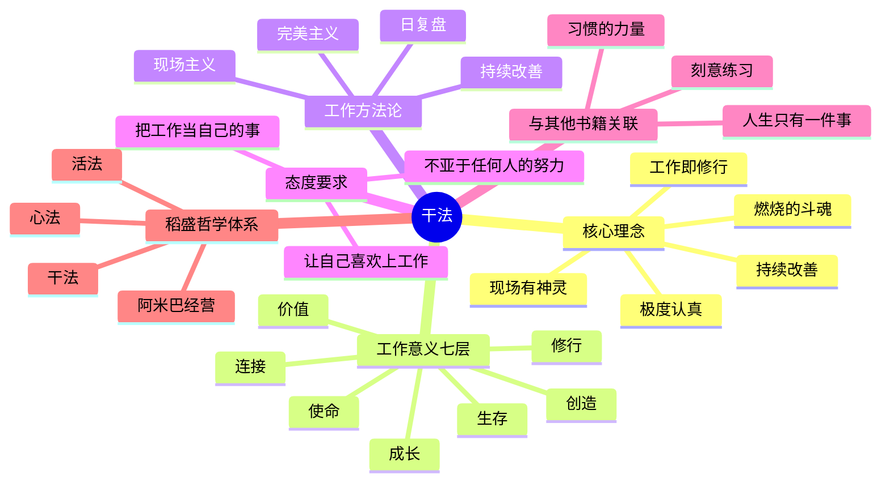
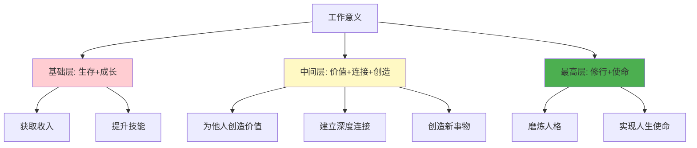
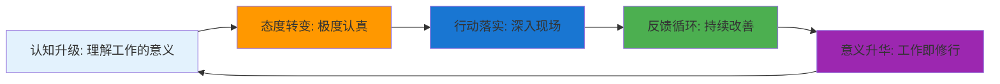
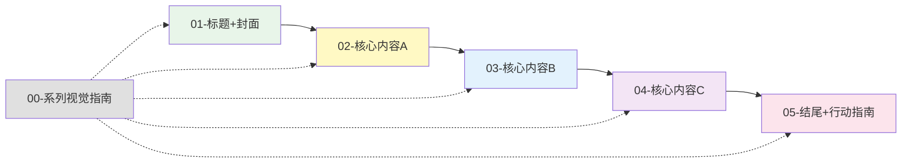
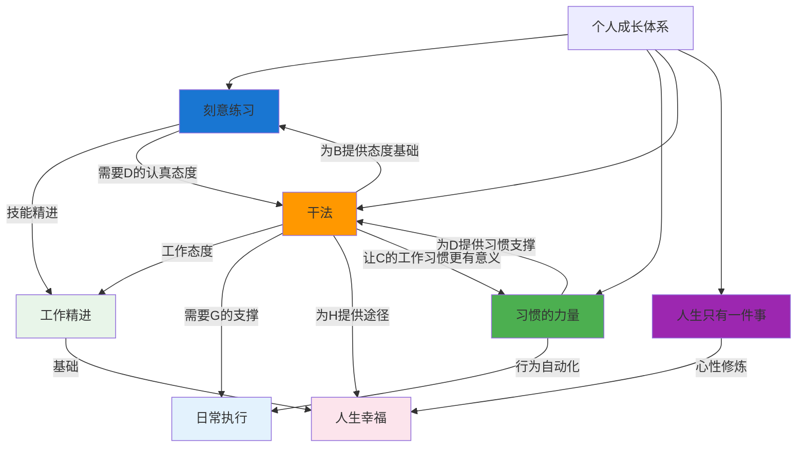

# ◆ 《干法》系列视觉指南

## 系列总览

本系列从多个维度解读稻盛和夫《干法》的核心内容，帮助你全面理解工作哲学并将其应用于实践。

---

## 01 系列知识地图

---

## 02 工作意义层次图

---

## 03 "干法"实践循环图

---

## 04 阅读序列建议

**推荐阅读顺序**：
1. 先看 **00-系列视觉指南** 建立全局认知
2. 再读 **01-标题+封面** 了解全书概览
3. 依次阅读 **02→03→04** 深入学习核心内容
4. 最后完成 **05-结尾+行动指南** 制定行动计划

---

## 05 与其他成长方法论的关系图

---

## 关键 takeaway

- ◆ **工作不只是谋生手段，更是完善人格的修行道场**
- ○ **极度认真 = 全力以赴 + 关注细节 + 追求无可挑剔**
- ● **答案永远在现场，不在办公室**
- ◇ **每天进步1%，一年后是原来的37.8倍**

> 本视觉指南可作为系列学习的"导航图"，建议收藏并随时查阅。
