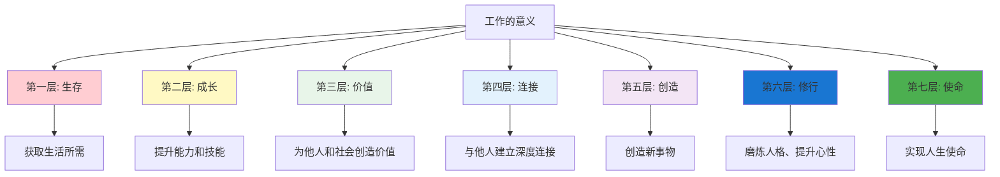
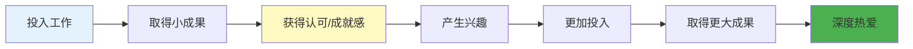
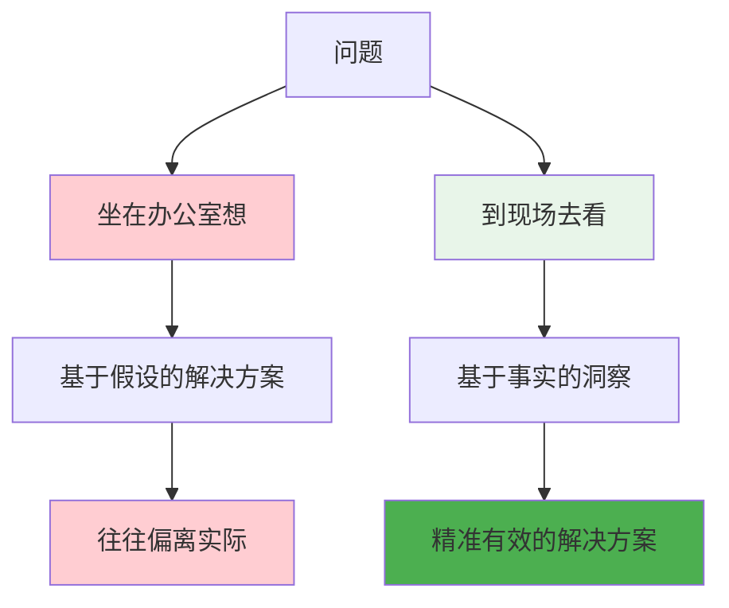

# ◆ 《干法》核心内容（上）—— 工作的意义

## 引言：你为什么工作？

"为了赚钱。""为了生活。""为了养家。"

这些答案没有错，但稻盛和夫告诉我们：**工作远不止于此**。

---

## 01 工作的七层意义

稻盛和夫认为，工作具有多层次的意义：

### 逐层解读

**第一层：生存**
- ◇ 工作最基本的功能是获取收入，维持生存
- ○ 这是工作的基础，但不是全部

**第二层：成长**
- ◇ 通过工作，我们学习新技能、积累新经验
- ○ 每一次挑战都是一次成长的机会

**第三层：价值**
- ◇ 工作让我们为他人、为社会创造价值
- ○ 价值感是幸福感的重要来源

**第四层：连接**
- ◇ 工作让我们与他人建立深度连接
- ○ 同事、客户、合作伙伴——工作让我们不再孤单

**第五层：创造**
- ◇ 工作是创造新事物、新价值的过程
- ○ 创造带来成就感，成就感带来幸福

**第六层：修行**
- ◇ 工作是磨炼人格、提升心性的道场
- ○ 每一次困难都是修炼的机会

**第七层：使命**
- ◇ 当你找到工作与人生使命的连接时
- ○ 工作就不再是"工作"，而是"活出自己的人生"

**核心洞察**：大多数人的痛苦，来自于只看到了工作的第一层意义（生存），而忽略了更高层次的意义。

---

## 02 "让自己喜欢上工作"

### 两种选择

稻盛和夫说：

> "要想度过一个充实的人生，只有两种选择：一种是从事自己喜欢的工作，另一种是让自己喜欢上工作。"

**现实是**：不是每个人都能一开始就从事自己喜欢的工作。但好消息是：**喜欢工作，是一种可以培养的能力**。

### 如何"喜欢上工作"？

**关键步骤**：
- ◇ **先投入**：不要等"找到热情"才开始努力，而是先努力，热情自然会来
- ○ **关注小成果**：即使是微小的进步，也要认可和庆祝
- ● **寻求反馈**：来自客户、同事、上司的正面反馈会强化你对工作的认同
- ○ **找到意义**：思考你的工作对他人、对社会的价值

### 经典案例：稻盛和夫的创业故事

稻盛和夫大学毕业后进入一家濒临倒闭的陶瓷公司。他没有选择离开，而是：

- ◇ 把锅碗瓢盆搬到实验室，吃住都在公司
- ○ 没日没夜地研究新型陶瓷材料
- ● 最终研发出世界领先的材料，为公司和自己赢得了未来

**他的秘诀**：先让自己全身心投入，热爱自然会来。

---

## 03 "付出不亚于任何人的努力"

### 什么是"不亚于任何人的努力"？

这不是说要你"拼命加班"，而是：

- ◇ **专注度**：工作时全神贯注，不分心
- ○ **持续性**：每天都保持高水准的努力，不三天打鱼两天晒网
- ● **极致性**：在每一个环节都追求最好

### 与普通努力的区别

| 维度 | 普通努力 | 不亚于任何人的努力 |
|------|----------|-------------------|
| 时间 | 每天8小时 | 可能超过8小时，但关键是质量 |
| 专注度 | 边工作边看手机 | 全神贯注，心无旁骛 |
| 态度 | "差不多就行" | "还能不能更好？" |
| 持续性 | 热情来得快去得也快 | 每天都在坚持 |
| 思考深度 | 做完就好 | 做完后思考如何做得更好 |

**注意**："不亚于任何人的努力"不等于"过度劳累"。稻盛和夫强调的是"高效、专注、持续"的努力，而不是无意义的加班和消耗。

---

## 04 "现场有神灵"

### 什么是"现场"？

"现场"就是你工作发生的地方：
- ◇ 对制造业来说，是生产线
- ○ 对服务业来说，是客户接触点
- ● 对办公室工作来说，是同事协作的场景
- ◇ 对程序员来说，是代码运行的实际环境

### 为什么"答案在现场"？

### 实践"现场主义"的方法

- ◇ **定期离开办公桌**：到客户那里、到生产线上去
- ○ **用五感去感受**：不只是看数据，还要听、闻、触
- ● **问"为什么"五遍**：连续追问，直到找到根本原因
- ○ **倾听一线员工的声音**：他们最了解问题所在

---

## 行动清单

- [ ] 反思你对工作的态度：你目前处于工作七层意义的哪一层？
- [ ] 写下你的工作为他人/社会创造的价值
- [ ] 尝试"先投入，后热爱"：选一个你不太喜欢的工作任务，全力以赴做一周
- [ ] 本周至少去一次"现场"，用五感去观察和感受
- [ ] 问自己："付出不亚于任何人的努力"在我的工作中意味着什么？

---

> 下一章预告：什么是"极度认真"？如何持续改善？"燃烧的斗魂"到底是什么？
