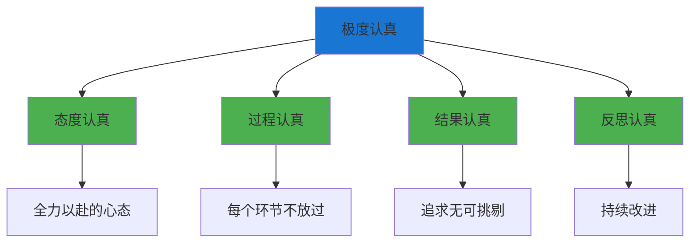
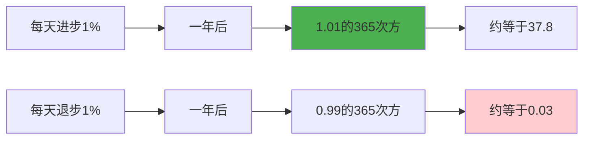
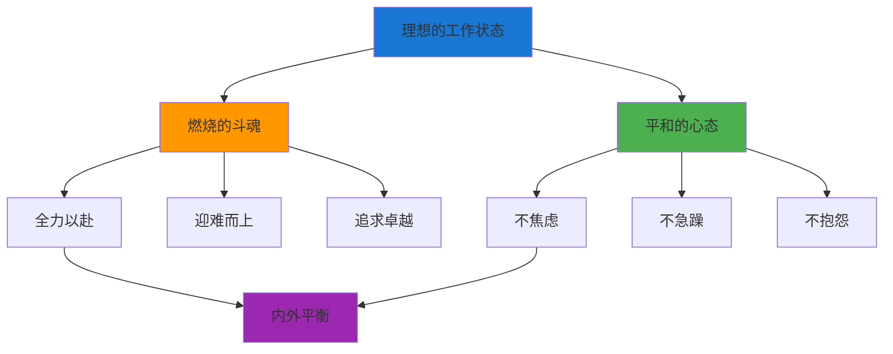

# ◆ 《干法》核心内容（下）—— 工作的方法论

## 引言：知道了"为什么"，接下来是"怎么做"

上一章我们探讨了工作的深层意义。本章将深入稻盛和夫的具体工作方法论，帮助你把"干法"的理念转化为每天的行动。

---

## 01 "极度认真"的四个维度

### 态度认真：把工作当成"自己的事"

稻盛和夫说，要把工作当成"自己的事业"来看待，而不是"公司的任务"。

**对比**：

| "公司的事"心态 | "自己的事"心态 |
|----------------|----------------|
| "差不多就行了" | "一定要做到最好" |
| "出了问题有别人负责" | "我要对结果负责" |
| "做完就交差" | "做完后想想怎么更好" |

### 过程认真：关注每一个细节

稻盛和夫在京瓷推行"完美主义"——不是追求100分，而是追求"无可挑剔"。

> "99%的成功率听起来很高，但如果有1%的失败，对客户来说就是100%的灾难。"

### 结果认真：用结果说话

- ◇ 不是"我努力了"就行，而是要"拿结果说话"
- ○ 结果是对自己努力最好的验证
- ● 好的结果会反过来强化你的信心和热情

---

## 02 持续改善的力量

### "持续就是力量"

稻盛和夫认为，**持续做好每一件平凡的事，就会变成不平凡的人**。

**数据说明一切**：
- ◇ 每天进步1%，一年后是原来的37.8倍
- ○ 每天退步1%，一年后只剩原来的3%

### 持续改善的具体方法

| 方法 | 说明 | 实践建议 |
|------|------|----------|
| 日复盘 | 每天回顾当天的工作 | 睡前10分钟，写下3件做得好的和1件可以改进的 |
| 周总结 | 每周回顾整体进展 | 周末30分钟，审视本周目标和成果 |
| 月回顾 | 每月评估方向是否正确 | 月末1小时，调整下月计划 |
| 年反思 | 每年审视人生方向 | 年末半天，深度思考和规划 |

**关键提醒**：持续改善不需要惊天动地的变化。每天改进一点点，日积月累就是巨大的飞跃。

---

## 03 "燃烧的斗魂"

### 什么是"燃烧的斗魂"？

"燃烧的斗魂"不是暴躁和好斗，而是：
- ◇ 对目标的执着追求
- ○ 面对困难时的不屈不挠
- ● 对卓越的永不满足

### 与"平和心态"的平衡

稻盛和夫同时强调"燃烧的斗魂"和"平和的心态"。这两者并不矛盾：

| 维度 | 燃烧的斗魂 | 平和的心态 |
|------|-----------|-----------|
| 面向 | 对外（目标、挑战） | 对内（自我、情绪） |
| 表现 | 全力以赴、迎难而上 | 不焦虑、不急躁、不抱怨 |
| 核心 | 行动的力量 | 内心的宁静 |

---

## 04 常见陷阱与规避

### 陷阱一：把"极度认真"误解为"过度劳累"

**问题**：有人认为稻盛和夫是在鼓吹"加班文化"和"996"。

**正解**：
- ◇ "极度认真"强调的是效率和专注，不是时长
- ○ 稻盛和夫本人也注重休息和健康
- ● 关键是"单位时间内的产出质量"，而不是"坐在办公室的时间"

### 陷阱二：把"持续改善"误解为"永远不够好"

**问题**：持续改善容易变成"完美主义焦虑"——永远觉得自己不够好。

**正解**：
- ◇ 持续改善是"享受进步的过程"，不是"为不完美而焦虑"
- ○ 每天的小进步值得庆祝
- ● 完美主义不是追求100分，而是追求"无可挑剔的态度"

### 陷阱三：忽视"现场主义"而沉迷数据

**问题**：现代管理中，人们越来越依赖数据和报告，忽视了现场。

**正解**：
- ◇ 数据是工具，现场才是真相
- ○ 定期到一线去，和客户、员工、产品直接接触
- ● 用五感去感受，而不仅仅是看Excel表格

### 陷阱四：把"工作即修行"误解为"工作即一切"

**问题**：有人认为稻盛和夫在鼓吹"工作至上"，忽视家庭和生活的其他方面。

**正解**：
- ◇ "工作即修行"指的是通过工作提升心性，不是说"只有工作"
- ○ 家庭、健康、社交同样重要
- ● 好的工作状态应该让生活更好，而不是更糟

---

## 05 实践步骤：稻盛和夫工作法每日清单

### 晨间（5分钟）
- [ ] 今天的工作目标是什么？
- [ ] 哪个环节需要我特别关注？
- [ ] 用"极度认真"的态度开始今天

### 工作中（持续）
- [ ] 是否在"现场"？有没有脱离实际？
- [ ] 每个细节是否都做到了"无可挑剔"？
- [ ] 遇到困难时，是否保持了"燃烧的斗魂"？

### 晚间（10分钟）
- [ ] 今天有没有比昨天做得更好？
- [ ] 哪个环节还可以改进？
- [ ] 感谢今天帮助过我的人和事

---

> 下一章预告：如何将"干法"与"刻意练习"、"习惯的力量"融合？稻盛和夫的哲学与现代成长方法论有什么深层联系？敬请期待核心内容C！
