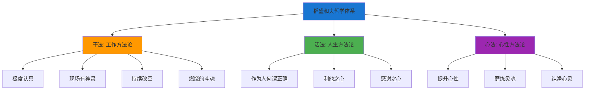
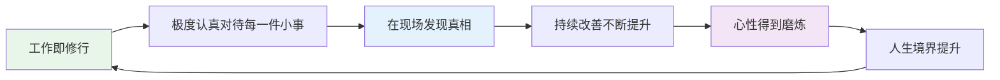
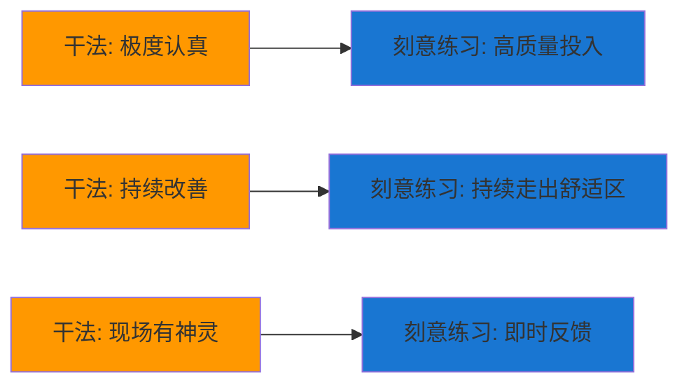
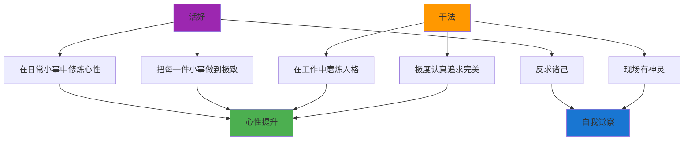

# ◆ 《干法》核心内容（进阶）—— 融会贯通

## 引言：干法不止是工作方法，更是人生哲学

稻盛和夫的"干法"表面上讲的是工作方法，但其底层逻辑是一套完整的人生哲学。本章将把它与系列中的其他书籍进行深度整合。

---

## 01 稻盛和夫的成长方法论全景





---

## 02 与《刻意练习》的深度融合

### 刻意练习的"态度基础"

稻盛和夫的"干法"为刻意练习提供了态度层面的支撑：



**融合要点**：
- ◇ "极度认真"是刻意练习中"高度专注"的态度基础
- ○ "持续改善"与"走出舒适区"是完全一致的理念
- ● "现场有神灵"强调了"反馈必须来自真实场景"

### 对比表

| 维度 | 刻意练习 | 干法 | 融合理解 |
|------|----------|------|----------|
| 目标 | 技能精进 | 心性提升 | 技能精进也是心性提升的途径 |
| 方法 | 明确目标、专注、反馈、挑战 | 极度认真、持续改善 | 极度认真就是最高级别的专注 |
| 态度 | 科学方法 | 修行态度 | 用修行的态度做科学的练习 |
| 反馈 | 教练/工具 | 现场/客户 | 两者都强调来自真实的反馈 |

---

## 03 与《习惯的力量》的深度融合

### 工作习惯的设计

稻盛和夫的"极度认真"需要习惯体系来保障：

```mermaid
graph TD
    A[工作习惯体系] --> B[晨间习惯]
    A --> C[工作习惯]
    A --> D[复盘习惯]
    
    B --> B1[早起: 为深度工作预留时间]
    B --> B2[晨间规划: 明确今日目标]
    
    C --> C1[深度工作: 极度认真的核心时段]
    C --> C2[现场巡视: 保持与实际的连接]
    C --> C3[持续改善: 每天改进一点点]
    
    D --> D1[日复盘: 今天的"极度认真"程度如何？]
    D --> D2[感谢: 今天有什么值得感恩的？]
    
    style A fill:#ff9800
    style B fill:#4caf50
    style C fill:#1976d2
    style D fill:#9c27b0
```

### 用黄金法则改造"工作态度"

| 要素 | 旧习惯 | 新习惯 |
|------|--------|--------|
| 暗示 | 周一早上闹钟响 | 周一早上闹钟响（不变） |
| 旧行为 | 抱怨"又要上班了" | "今天又是精进的一天" |
| 奖赏 | 短暂的自我安慰（负面的） | 一天的充实感和成就感 |

---

## 04 与《人生只有一件事》的深度融合

### "干法"与"活好"

金惟纯说"人生只有一件事：活好"，稻盛和夫说"工作本身就是修行"。两者的内核高度一致：



**共同点**：
- ◇ 都强调"小事"的重要性——在小事中修炼
- ○ 都强调"认真"的态度——不敷衍、不将就
- ● 都指向同一个目标：心性的提升和人生的充实

---

## 05 构建你的"干法"实践体系

### 五步法

**第一步：认知升级**
- ◇ 重新定义工作的意义——不只是赚钱，更是修行
- ○ 找到工作与个人成长的连接点

**第二步：态度转变**
- ● 从"不得不做"到"主动去做"
- ○ 从"差不多就行"到"极度认真"

**第三步：行动落实**
- ◇ 每天至少有一段时间"极度认真"地工作
- ○ 每周至少去一次"现场"
- ● 每天做一个小的改善

**第四步：反馈循环**
- ◇ 每日复盘：今天的工作质量如何？
- ○ 每周回顾：有没有持续改善？
- ● 每月评估：心性和能力是否都在提升？

**第五步：意义升华**
- ◇ 思考：我的工作如何为他人创造价值？
- ○ 思考：我的工作如何帮助我成为更好的人？
- ● 思考：如果这是我的"修行道场"，我应该怎么做？

---

## 融会贯通总结

稻盛和夫的"干法"告诉我们：
- ◆ 工作不是生活的"对立面"，而是生活本身
- ○ "极度认真"不是一种负担，而是一种幸福的方式
- ● 通过工作，我们可以磨炼人格、提升心性、理解人生

> 下一章预告：制定你的30天"干法"实践计划！包含实操模板、worksheets和FAQ，助你立即行动！
