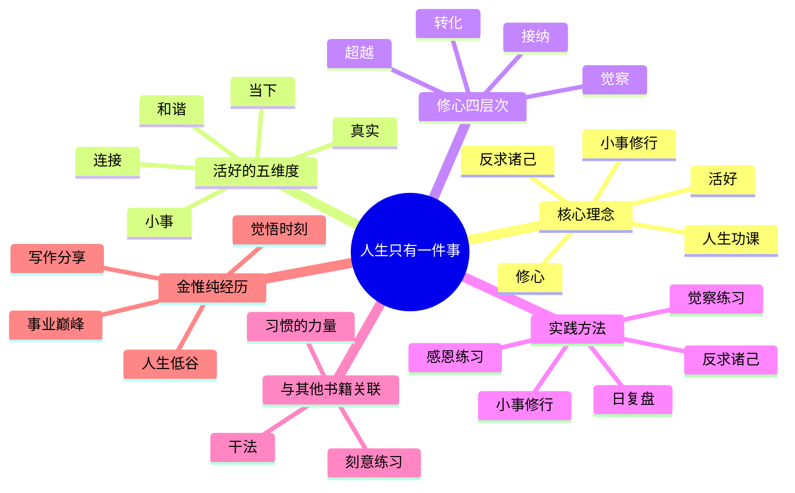
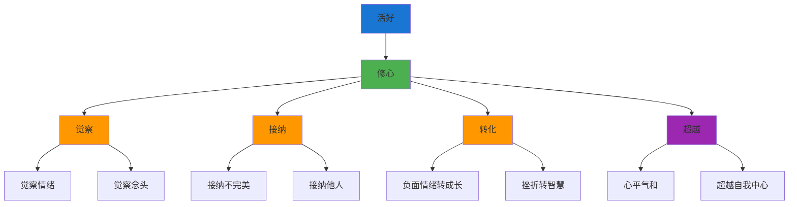
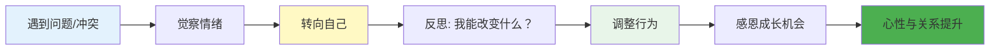
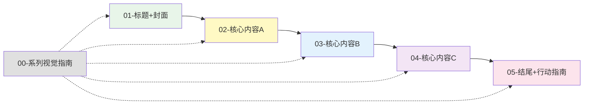
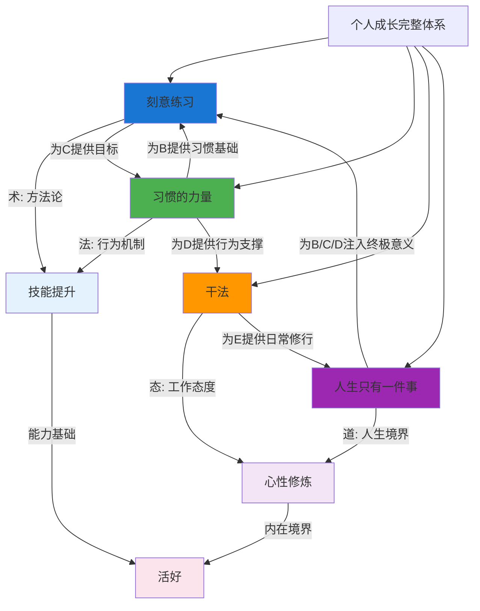
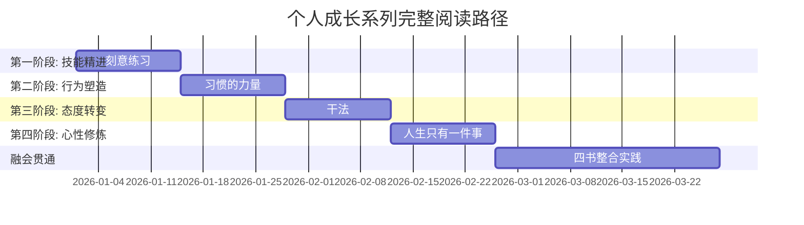

# ◆ 《人生只有一件事》系列视觉指南

## 系列总览

本系列从多个维度解读金惟纯《人生只有一件事》的核心内容，帮助你全面理解"活好"的本质和修心的方法。

---

## 01 系列知识地图

---

## 02 "活好"与修心关系图

---

## 03 "反求诸己"实践流程图

---

## 04 阅读序列建议

**推荐阅读顺序**：
1. 先看 **00-系列视觉指南** 建立全局认知
2. 再读 **01-标题+封面** 了解全书概览
3. 依次阅读 **02→03→04** 深入学习核心内容
4. 最后完成 **05-结尾+行动指南** 制定行动计划

---

## 05 四本书的完整关系图

---

## 系列四本书的阅读顺序建议

---

## 关键 takeaway

- ◆ **"活好"不是成就，而是一种内在状态**
- ○ **修心的四层次：觉察 → 接纳 → 转化 → 超越**
- ● **"反求诸己"是解决一切问题的万能钥匙**
- ◇ **人生就是一场功课，每一件小事都是一道练习题**

> 本视觉指南可作为系列学习的"导航图"，建议收藏并随时查阅。
