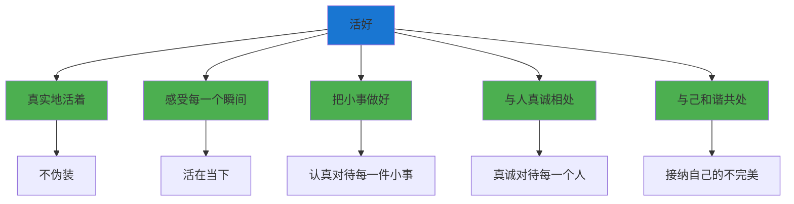
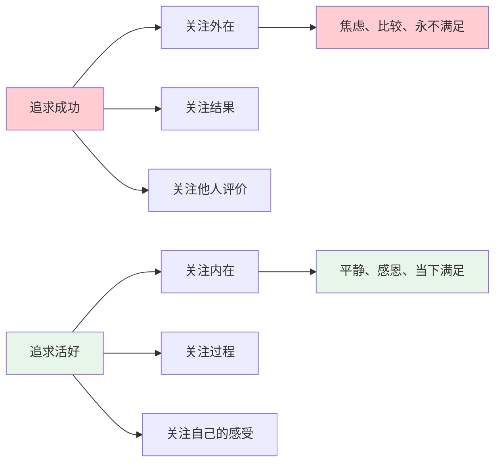

# ◆ 《人生只有一件事》核心内容（上）—— 什么是"活好"？

## 引言：你到底在忙什么？

每天忙着工作、忙着赚钱、忙着照顾家庭、忙着社交……

但你有没有停下来问过自己：**我这么忙，到底是为了什么？**

金惟纯在经历了人生的大起大落后，给出了一个极简的答案：**活好**。

---

## 01 "活好"的真正含义

### 不是活得多"精彩"，而是活得多"真实"

很多人误以为"活好"等于：
- ◇ 赚很多钱
- ○ 拥有很高的社会地位
- ● 做出惊天动地的成就

但金惟纯说，"活好"的本质是：

### "活好"的五个维度

| 维度 | 说明 | 日常体现 |
|------|------|----------|
| 真实 | 不伪装、不做作 | 敢于表达真实的想法和感受 |
| 当下 | 不沉湎过去、不焦虑未来 | 专注于此刻正在做的事 |
| 小事 | 在平凡中发现意义 | 认真做好每一件日常小事 |
| 连接 | 与他人建立真诚的连接 | 倾听、理解、感恩 |
| 和谐 | 与自己和平共处 | 接纳自己的不完美 |

**核心洞察**："活好"不是一种成就，而是一种状态。它不需要你拥有多少，而是需要你能感受到多少。

---

## 02 金惟纯的故事：从巅峰到觉悟

### 事业巅峰

金惟纯曾是台湾最成功的媒体人之一：
- ◇ 创办了台湾最具影响力的商业杂志
- ○ 在媒体行业取得了令人瞩目的成就
- ● 拥有了常人梦寐以求的名利和地位

### 人生低谷

然而，在事业的巅峰期，他经历了：
- ◇ 事业的重大挫折
- ○ 人际关系的破裂
- ● 内心的极度痛苦和迷茫

### 觉悟时刻

在最低谷的时候，他开始反思：

> "我这么努力地追求成功，为什么反而越来越不快乐？"

他逐渐领悟到：
- ◇ 成功不等于幸福
- ○ 外在的成就填补不了内心的空虚
- ● 真正重要的是——"活好"

---

## 03 "活好"与"成功"的区别

### 两种人生追求

### 对比表

| 维度 | 追求成功 | 追求活好 |
|------|----------|----------|
| 关注点 | 外在成就 | 内在感受 |
| 时间视角 | 未来（"等我成功了就……"） | 当下（"此刻就很好"） |
| 比较对象 | 他人 | 昨天的自己 |
| 满足感 | 延迟满足（"等……就幸福了"） | 当下满足 |
| 面对挫折 | 沮丧、自责 | 反思、成长 |
| 人际关系 | 功利性 | 真诚性 |

---

## 04 "小事修行"的力量

### 什么是"小事修行"？

"小事修行"就是把每一件日常小事都当作修心的机会。

### 日常生活即道场

| 日常小事 | 修行方式 | 修的是什么 |
|----------|----------|-----------|
| 洗碗 | 专注于水流、温度、动作 | 专注力 |
| 走路 | 感受脚步、呼吸、周围的声音 | 觉察力 |
| 吃饭 | 细细品味每一口食物 | 感恩心 |
| 与人交谈 | 真正倾听对方 | 同理心 |
| 遇到挫折 | 反求诸己，不抱怨 | 宽容心 |
| 面对赞美 | 不骄不躁 | 平常心 |

**关键洞察**：修行不需要去深山老林。你家就是道场，你的日常生活就是修行。

### 实践"小事修行"的方法

1. **◇ 选择一件日常小事**（如：洗碗）
2. **○ 做这件事时，把全部注意力放在上面**
3. **● 感受每一个动作、每一个瞬间**
4. **○ 走神时，温柔地把注意力拉回来**
5. **◇ 完成后，感受内心的平静**

---

## 行动清单

- [ ] 问自己："我现在的生活，算是'活好'吗？"
- [ ] 列出你今天做的5件"小事"，思考每一件如何成为修行的机会
- [ ] 选择一件日常小事（如吃饭、走路），今天做一次"专注练习"
- [ ] 反思：你目前更多是在"追求成功"还是"追求活好"？
- [ ] 写下一件你一直想做但没做的"小事"，今天就去做

---

> 下一章预告：什么是"反求诸己"？如何在人际关系中实践？"修心"的具体方法是什么？
