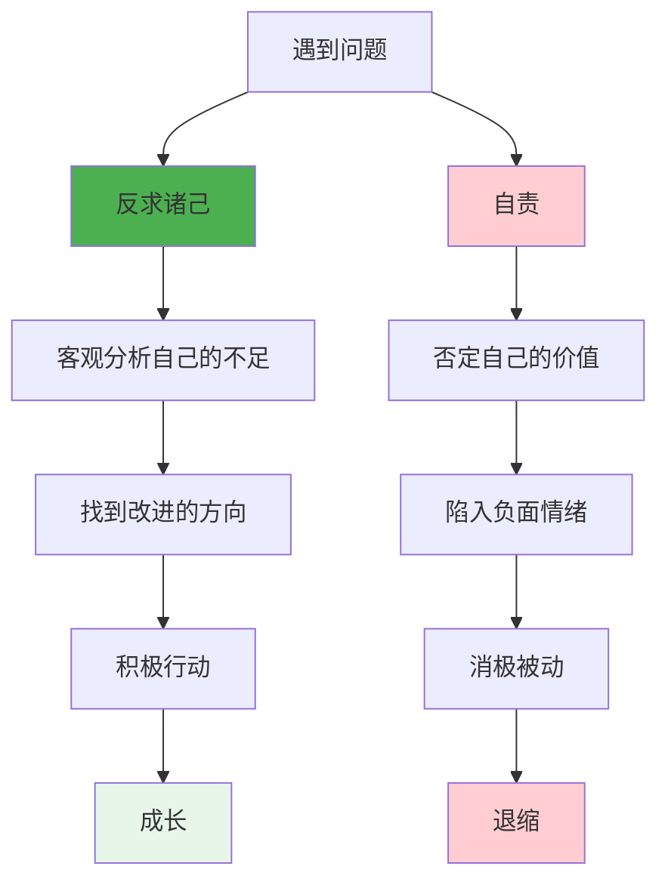
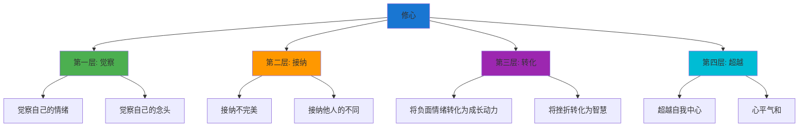
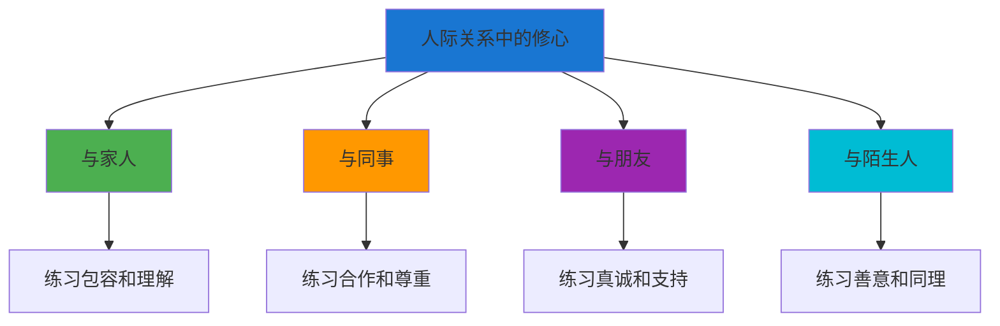

# ◆ 《人生只有一件事》核心内容（下）—— 修心的方法

## 引言：修心，是"活好"的核心功课

"活好"不是一种感觉，而是一种能力——修心的能力。本章将深入探讨"修心"的具体方法和实践路径。

---

## 01 "反求诸己"的深层含义

### 什么是"反求诸己"？

"反求诸己"出自《孟子·离娄上》：

> "行有不得者，皆反求诸己。"

意思是：凡是做不通的、达不到预期效果的，都要反过来从自己身上找原因。

### 与"自责"的区别

**关键区别**：
- ◇ 反求诸己是"建设性的自我反思"——目的是成长
- ○ 自责是"破坏性的自我否定"——结果是消耗
- ● 反求诸己让你更强大，自责让你更脆弱

### "反求诸己"的实践框架

| 步骤 | 做法 | 示例 |
|------|------|------|
| 觉察 | 意识到问题的存在 | "我和同事的关系不好" |
| 转向 | 把注意力从外部转向自己 | "不是他的问题，是我的什么行为导致了这个结果？" |
| 反思 | 诚实地审视自己的行为 | "我是不是太急躁了？我没有倾听他？" |
| 行动 | 调整自己的行为 | "下次先听他说完，再表达我的想法" |
| 感恩 | 感谢问题带来的成长机会 | "感谢这次冲突让我看到了自己的不足" |

**核心提醒**："反求诸己"不等于"一切都是我的错"。它是一种"我能控制什么"的思维方式——专注于自己可以改变的部分，而不是纠结于无法控制的外部因素。

---

## 02 修心的四个层次

### 第一层：觉察

觉察是修心的第一步——**看见自己**。

- ◇ 觉察自己的情绪："我现在在生气"
- ○ 觉察自己的念头："我刚才在想什么？"
- ● 觉察自己的行为模式："我总是在这种情况下做出同样的反应"

**练习方法**：
每天花5分钟，安静地坐着，观察自己的呼吸和念头。不做任何评判，只是观察。

### 第二层：接纳

接纳是修心的第二步——**允许一切如其所是**。

- ◇ 接纳自己的不完美："我就是会有情绪，这很正常"
- ○ 接纳他人的不同："他有他的想法，我不必认同但也不必对抗"
- ● 接纳生活的不确定性："不是所有事都能按照我的计划进行"

### 第三层：转化

转化是修心的第三步——**将负面体验转化为成长**。

- ◇ 将愤怒转化为觉察："我在生气什么？这反映了我内心的什么需求？"
- ○ 将挫折转化为智慧："这次失败教会了我什么？"
- ● 将不满转化为行动："我能做什么来改善现状？"

### 第四层：超越

超越是修心的最高境界——**心平气和，不为外物所动**。

- ◇ 面对赞美，不骄
- ○ 面对批评，不躁
- ● 面对得失，不惊

---

## 03 人际关系中的修心

### 核心原则：一切都是关系的修炼

金惟纯认为，人际关系是修心最好的"道场"。

### 在冲突中修心

**典型场景：与同事发生分歧**

| 常规反应 | 修心反应 |
|----------|----------|
| "他怎么能这样！" | "我为什么会有这么大的反应？" |
| 急于辩解 | 先倾听对方 |
| 争对错 | 寻求理解 |
| 抱怨对方 | 反思自己 |
| 冷战或对抗 | 真诚沟通 |

### "反求诸己"在人际关系中的应用

| 场景 | 反求诸己的问法 |
|------|--------------|
| 与伴侣争吵 | "我哪里没有表达清楚？我有没有真正倾听对方？" |
| 与同事冲突 | "我的沟通方式是否有问题？我有没有理解对方的立场？" |
| 孩子不听话 | "我的教育方式是否合适？我有没有以身作则？" |
| 朋友疏远 | "我是不是忽略了对方的感受？我有没有主动维护这段关系？" |

---

## 04 常见陷阱与规避

### 陷阱一：把"反求诸己"变成"一切都是我的错"

**问题**：过度自责，陷入自我否定。

**正解**：
- ◇ "反求诸己"是找"我能改变的部分"，不是"把所有的错都揽在自己身上"
- ○ 有些问题确实是对方的问题——但这不影响你反思自己能做什么
- ● 重点是"成长"，不是"认错"

### 陷阱二：把"活好"误解为"躺平"

**问题**：认为"活好"就是什么都不做，随波逐流。

**正解**：
- ◇ "活好"是积极的生活态度，不是消极的"躺平"
- ○ "活好"需要持续的努力和修炼
- ● "活好"是在努力的同时，保持内心的平静

### 陷阱三：急于"修心"，反而制造焦虑

**问题**：把修心当成一个"任务"，因为"没修好"而焦虑。

**正解**：
- ◇ 修心是一辈子的事，不需要急于求成
- ○ 关注"进步"而不是"完美"
- ● 允许自己有"修不好"的时候——接纳本身就是修心

---

## 05 实践步骤：修心日常练习

### 晨间（5分钟）
- [ ] 静坐，观察呼吸
- [ ] 设定今天的心性目标（如：保持耐心、多倾听）

### 白天（随时）
- [ ] 遇到情绪波动时，停下来觉察
- [ ] 遇到冲突时，先"反求诸己"
- [ ] 完成每一件小事时，感受其中的意义

### 晚间（10分钟）
- [ ] 回顾今天的心性修炼
- [ ] 记录3件感恩的事
- [ ] 问自己："今天有没有比昨天活得好一点？"

---

> 下一章预告：如何将"活好"与"刻意练习"、"习惯的力量"、"干法"融合？四本书的共同内核是什么？敬请期待核心内容C！
