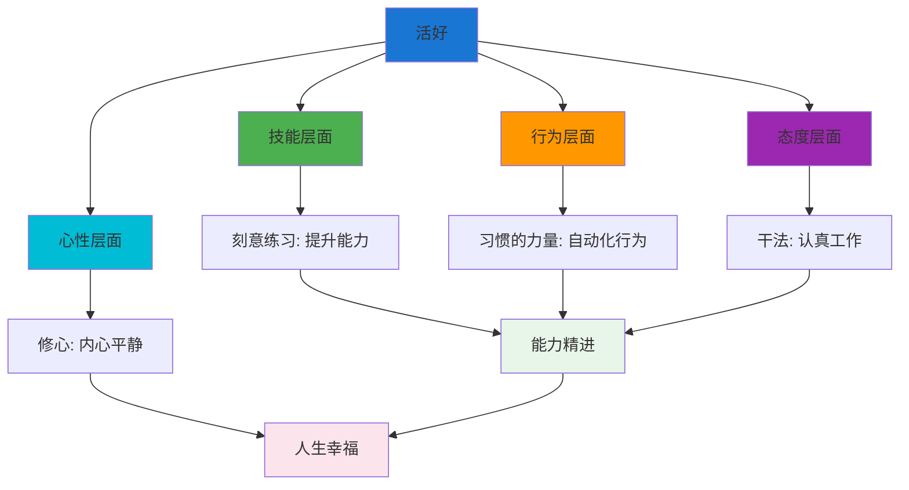
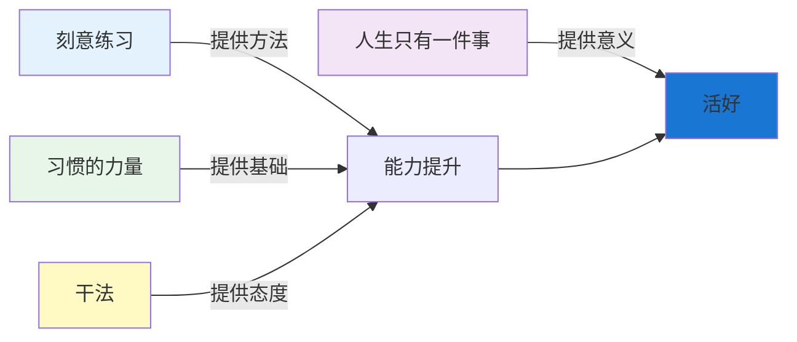
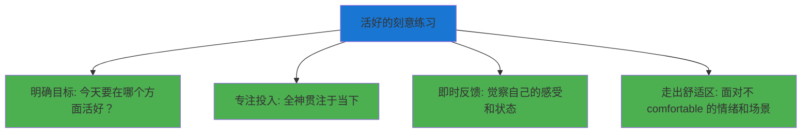
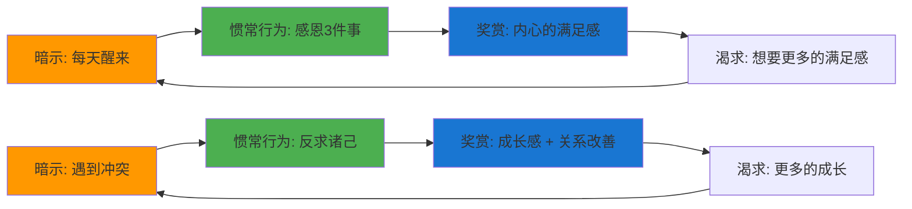
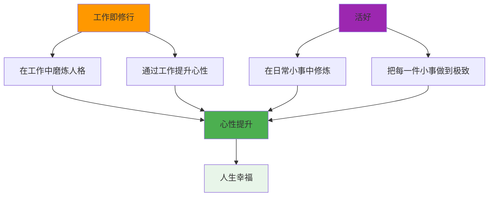
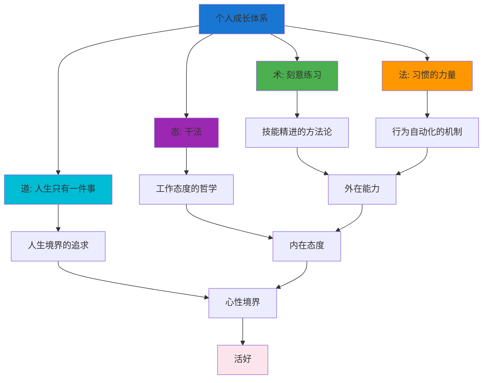

# ◆ 《人生只有一件事》核心内容（进阶）—— 融会贯通

## 引言：四本书，一个核心

《刻意练习》讲技能精进，《习惯的力量》讲行为自动化，《干法》讲工作态度，《人生只有一件事》讲心性修炼。四本书各有侧重，但它们指向同一个核心：**如何通过日常实践，成为更好的自己**。

---

## 01 "活好"的完整体系

---

## 02 与《刻意练习》的深度融合

### "活好"也是一种可以通过刻意练习获得的技能

**实践示例**：

| 刻意练习要素 | 在"活好"中的应用 |
|-------------|-----------------|
| 明确目标 | "今天我练习在冲突中保持冷静" |
| 专注投入 | 觉察当下的情绪和念头，不被带跑 |
| 即时反馈 | 事后反思："我做到了吗？哪里可以更好？" |
| 走出舒适区 | 主动面对那些容易让你失控的场景 |

---

## 03 与《习惯的力量》的深度融合

### "活好"的习惯化

**可以习惯化的"活好"行为**：

| 习惯 | 暗示 | 惯常行为 | 奖赏 |
|------|------|----------|------|
| 感恩 | 每天醒来 | 想3件感恩的事 | 积极的开始 |
| 觉察 | 感到情绪波动 | 停下来，观察呼吸 | 平静感 |
| 反求诸己 | 遇到冲突 | 先反思自己 | 成长感 |
| 小事修行 | 做日常小事 | 专注当下 | 内心的充实 |
| 日复盘 | 睡前 | 回顾今天的心性 | 自我觉察 |

---

## 04 与《干法》的深度融合

### "工作即修行"与"活好"的一致性

稻盛和夫说"工作本身就是修行"，金惟纯说"人生只有一件事：活好"。两者在本质上是统一的：

**共同点**：
- ◇ 都强调"小事"的重要性
- ○ 都强调"认真"的态度
- ● 都指向"心性提升"这个终极目标
- ◇ 都认为"修行不需要离开日常生活"

---

## 05 四本书的统一框架

### "个人成长"的四层架构

**四层架构的解读**：

| 层级 | 书籍 | 核心问题 | 关键方法 |
|------|------|----------|----------|
| 术 | 《刻意练习》 | 如何提升技能？ | 明确目标、专注、反馈、挑战 |
| 法 | 《习惯的力量》 | 如何自动化行为？ | 习惯回路、黄金法则、核心习惯 |
| 态 | 《干法》 | 如何对待工作？ | 极度认真、持续改善、现场有神灵 |
| 道 | 《人生只有一件事》 | 如何活好？ | 修心、小事修行、反求诸己 |

---

## 融会贯通总结

四本书共同指向一个真理：

- ◆ **成长不是一蹴而就的，而是日复一日的精进**
- ○ **能力、行为、态度、心性，缺一不可**
- ● **"活好"不是终点，而是每一步的当下**

> 下一章预告：制定你的30天"活好"实践计划！包含实操模板、worksheets和FAQ，助你立即行动！
