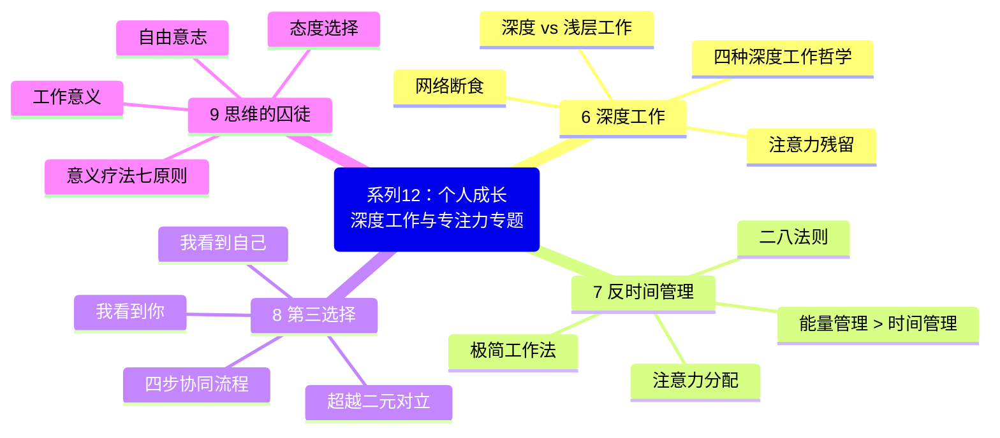
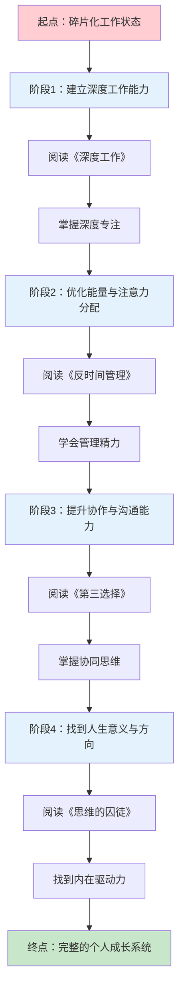
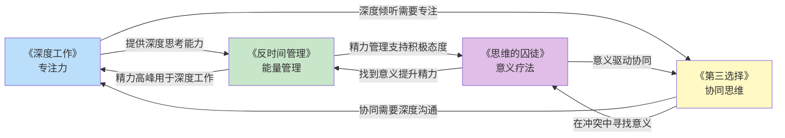
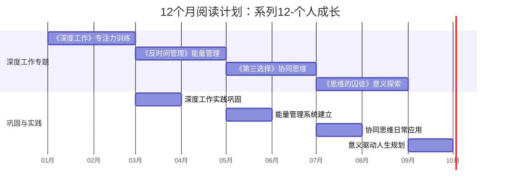

# ○● 系列12-个人成长 视觉指南：深度工作与专注力专题●◆

---

## 一、系列全景思维导图

本专题包含4本核心书籍，围绕"深度工作与专注力"主题，从不同角度帮助你建立高效工作与成长的系统。

---

## 二、个人成长路径

---

## 三、四本书的核心连接关系

### ◆ 核心逻辑链

| 顺序 | 书籍 | 解决的问题 | 核心能力 |
|------|------|-----------|---------|
| 1 | 《深度工作》 | 无法专注 | 深度专注力 |
| 2 | 《反时间管理》 | 精力不足 | 能量管理 |
| 3 | 《第三选择》 | 人际冲突 | 协同思维 |
| 4 | 《思维的囚徒》 | 缺乏动力 | 意义驱动 |

---

## 四、12个月阅读计划时间线

---

## 五、推荐阅读顺序

### ◆ 方案A：循序渐进型（推荐）

适合大多数人，按照能力建设的逻辑顺序阅读：

1. **第1个月**：《深度工作》——先建立专注力
2. **第2个月**：《反时间管理》——在精力最佳时段深度工作
3. **第3个月**：《第三选择》——用深度思考改善人际关系
4. **第4个月**：《思维的囚徒》——找到持续成长的内在动力

### ○ 方案B：问题导向型

根据你当前最迫切的问题选择：

| 你最困扰的问题 | 推荐阅读 | 原因 |
|---------------|---------|------|
| 总是分心，无法专注 | 《深度工作》 | 直接解决专注力问题 |
| 总是疲惫，精力不足 | 《反时间管理》 | 先恢复精力再谈效率 |
| 人际关系紧张 | 《第三选择》 | 学会协同而非对抗 |
| 迷茫，没有方向 | 《思维的囚徒》 | 找到意义才有动力 |

### ◆ 方案C：并行实践型

如果你时间充裕，可以两本并行阅读：

- **组合1**：《深度工作》+《反时间管理》——"专注"与"精力"双管齐下
- **组合2**：《第三选择》+《思维的囚徒》——"外在协同"与"内在意义"同步发展

---

## 六、系列学习成果评估

### ○ 完成本专题后，你将能够：

- [ ] 每天进入至少2小时的深度工作状态
- [ ] 识别并减少注意力残留的负面影响
- [ ] 根据个人精力周期安排工作任务
- [ ] 运用"二八法则"精简工作内容
- [ ] 在冲突中找到"第三选择"而非妥协
- [ ] 在日常工作中发现和创造意义
- [ ] 建立可持续的个人成长系统

---

◆ 视觉指南说明：本文件包含本专题的完整知识框架，建议收藏后反复查看，作为学习和实践的导航地图。

