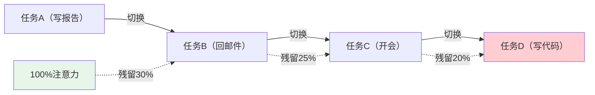
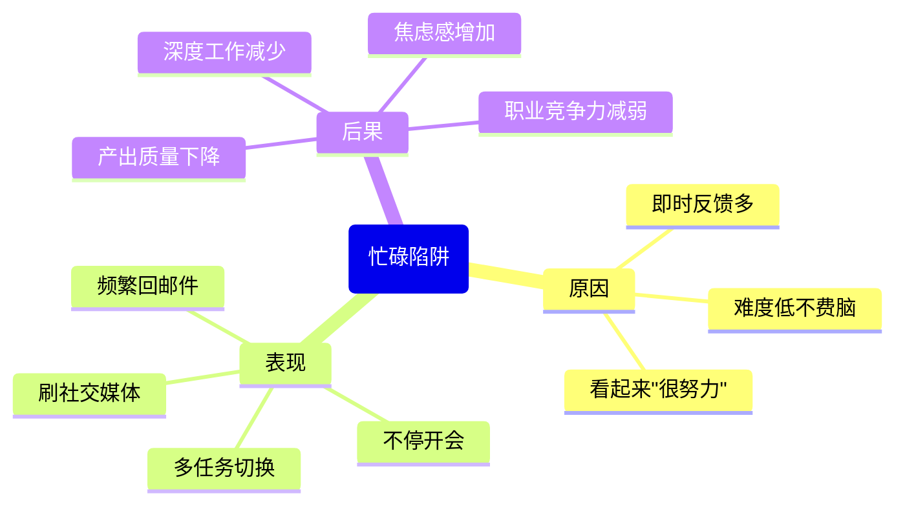

# ○●《深度工作》核心内容A：为什么深度工作如此稀缺○◆

---

## 一、深度工作的经济学价值

Cal Newport在书的前半部分揭示了一个深刻的悖论：**深度工作变得越来越有价值，但同时也变得越来越稀缺。**

### ◆ 稀缺性原理

想象一下，在一个所有人都在刷手机、回邮件、开会议的职场环境中，能够安静坐下来深度思考3小时的人，就像沙漠中的绿洲一样珍贵。

◇ **需求端**：在知识经济时代，能够创造复杂价值的人才供不应求
◇ **供给端**：社交网络和即时通讯工具让深度工作越来越困难
◇ **结果**：掌握深度工作能力的人，将获得巨大的职业溢价

### ○ 三种高价值人才

| 人才类型 | 核心能力 | 为什么稀缺 |
|---------|---------|-----------|
| 高端技术人才 | 掌握复杂系统 | 需要大量深度学习时间 |
| 超级明星 | 行业顶尖水平 | 需要深度打磨专业技能 |
| 资源整合者 | 连接复杂信息 | 需要深度思考才能发现模式 |

---

## 二、注意力的敌人：碎片化陷阱

⚠️ 警告：你以为的"高效"，可能是"注意力残留"在作祟

### ◆ 注意力残留效应

Sophie Leroy教授的研究揭示了一个令人不安的事实：

当你从任务A切换到任务B时，你的注意力并不会干净利利地转移。一部分认知资源仍然"卡"在任务A上，这种现象被称为**注意力残留（Attention Residue）**。

这意味着：**你每切换一次任务，你的有效注意力就下降一次。**

### ○ 场景案例：小张的一天

**场景A：碎片化工作模式**
- 9:00 开始写方案
- 9:15 收到邮件，回复
- 9:30 同事来聊天
- 9:45 刷了一下手机
- 10:00 继续写方案，但思路已经断了
- 结果：一上午只写了方案的开头

**场景B：深度工作模式**
- 9:00 关闭手机和邮件通知
- 9:00-11:30 专注写方案，中间不中断
- 11:30 统一处理邮件和消息
- 结果：一上午完成了方案的主体框架

同样的时间，不同的产出质量，差距可能达到**5-10倍**。

---

## 三、浅层工作的诱惑

### ◆ 为什么我们沉迷浅层工作？

◇ **可见性高**：回复邮件、参加会议，这些行为让你看起来"很忙"
◇ **即时反馈**：每条消息都带来多巴胺刺激，像打游戏一样上瘾
◇ **难度低**：不需要深度思考，大脑本能地选择轻松的路径

### ○ 忙碌陷阱

### ◇ 真实场景：你中招了吗？

请在脑海中检查自己是否有以下行为：

- 每天查看手机超过50次
- 写报告时每15分钟就要看一下消息
- 觉得"忙碌"就是"高效"
- 很难连续2小时不看手机
- 开会时一边听一边回消息

如果以上超过2条，你可能正深陷"浅层工作陷阱"。

---

## 四、深度工作的神经科学基础

### ◆ 髓鞘质（Myelin）理论

当你专注于某项技能时，你的大脑中的神经元会反复放电。这个过程会刺激**髓鞘质**的生长——一种包裹神经纤维的物质，让神经信号传递更快、更准确。

◇ 专注练习 → 髓鞘质增厚 → 神经信号传递更快 → 技能提升
◇ 分心练习 → 髓鞘质增长慢 → 神经信号不稳定 → 技能停滞

这就是为什么：**高质量的专注练习比长时间的低质量练习更有效。**

---

## ◆ 行动清单

| 序号 | 行动 | 完成标准 |
|------|------|---------|
| 1 | 记录今天的任务切换次数 | 写下来，看看有多少次 |
| 2 | 计算自己的"注意力残留"时间 | 每次切换后20分钟内效率最低 |
| 3 | 识别工作中最"浅层"的3件事 | 写下来，思考能否减少 |
| 4 | 找出工作中最需要"深度"的3件事 | 这是你的核心价值所在 |
| 5 | 规划明天的第一个深度工作时段 | 至少45分钟，关闭所有通知 |

---

○ 下一节：《深度工作》核心内容B——四种深度工作哲学与实践方法

