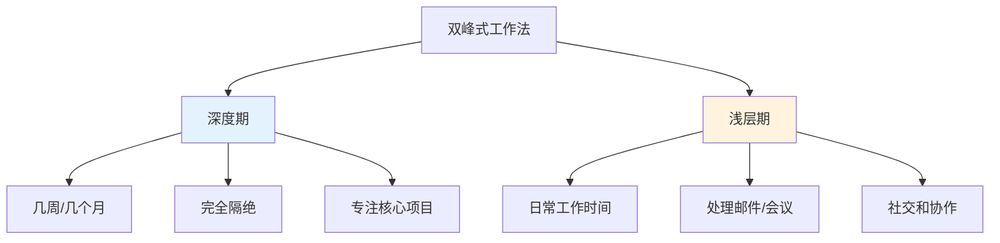
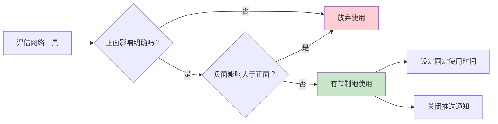

# ●◆《深度工作》核心内容B：四种哲学与实践方法◆○

---

## 一、四种深度工作哲学

Newport提出了四种不同的深度工作策略，你可以根据自己的职业特点选择最适合的一种。

### ◆ 策略对比

| 哲学类型 | 适用人群 | 核心方法 | 优点 | 缺点 |
|---------|---------|---------|------|------|
| 禁欲式 | 科研工作者、作家 | 完全切断社交 | 最大化深度时间 | 社交成本高 |
| 双峰式 | 教师、顾问 | 分为深度期和浅层期 | 平衡深度与社交 | 需要整块时间 |
| 节律式 | 上班族、管理者 | 每天固定时段 | 养成习惯容易 | 单次时长有限 |
| 新闻式 | 记者、创业者 | 随时利用空隙 | 灵活度高 | 自律要求极高 |

### ○ 详细解读

**禁欲式（Monastic Philosophy）**

这是一种极端但有效的策略。代表人物是科幻作家Neal Stephenson，他几乎不使用电子邮件，所有联系通过网站上的表单进行。这种方式适合那些工作性质可以完全独立的人。

**双峰式（Bimodal Philosophy）**

Carl Jung在苏黎世湖边的Bollingen建造了一座石塔，每年有几周时间在那里完全隔绝，进行深度思考和写作。回到城市后，他再正常处理事务。这种方式适合有周期性工作安排的人。



**节律式（Rhythmic Philosophy）**

这是最适合上班族的方法。每天固定时间进行深度工作，比如早上6:00-8:00，或者每天下午2:00-4:00。关键是形成规律，让身体和大脑养成习惯。

**新闻式（Journalistic Philosophy）**

 Walter Isaacson在写传记时，如果有任何空闲时间，就会立即投入到写作中。这种方式需要极强的自律能力和快速进入状态的能力，不适合初学者。

---

## 二、深度工作的实践仪式

### ◆ 建立你的深度工作仪式

Newport强调，深度工作不应该靠"意志力"来维持，而应该通过**仪式和规则**来保障。

```
┌─────────────────────────────────────┐
│       深度工作仪式清单              │
├─────────────────────────────────────┤
│  ◇ 时间：每天 7:00-9:00            │
│  ○ 地点：书房，关门                 │
│  ● 规则：手机静音放另一个房间       │
│  ◆ 工具：纸、笔、电脑（仅文档）     │
│  ◇ 补给：一杯咖啡                  │
│  ○ 时长：2小时（含10分钟休息）      │
│  ● 目标：完成第3章初稿             │
│  ◆ 结束：统一处理邮件和消息        │
└─────────────────────────────────────┘
```

### ○ 场景演练：如何开始你的第一个深度工作日

**第1步：选择一个时间段**
- 推荐早上，因为这时精力最充沛、干扰最少
- 从45分钟开始，不要贪多

**第2步：准备环境**
- 关闭手机或放到另一个房间
- 关闭电脑上的所有非必要程序
- 准备一杯水或咖啡

**第3步：明确目标**
- 写下这次深度工作要完成的具体任务
- 目标要具体，如"完成报告的前两节"，而不是"写报告"

**第4步：执行**
- 开始计时
- 如果想看手机，忍住，在纸上记下来"想看手机"，然后继续
- 如果思路断了，深呼吸，回到任务上

**第5步：复盘**
- 记录今天深度工作的时长和质量
- 观察自己的注意力变化模式

---

## 三、常见陷阱与应对

<div style="background: #ffebee; padding: 16px; border-left: 4px solid #f44336;">
⚠️ 常见陷阱：这些行为会让你"以为"在深度工作，实际上不是
</div>

### ◆ 陷阱1：伪深度工作

在电脑前坐了3小时，但中间每隔10分钟看一下手机。这不是深度工作，这是"伪装的忙碌"。

**应对方法**：使用网站屏蔽工具（如Freedom、Cold Turkey），物理隔绝干扰源。

### ○ 陷阱2：过度规划

花大量时间规划"如何深度工作"，却从来不真正开始。

**应对方法**：从最小的行动开始——今天就开始，不要等到"完美的时机"。

### ◆ 陷阱3：完美主义

觉得"一定要4小时才算深度工作"，结果因为做不到就放弃。

**应对方法**：30分钟的深度工作也好过0分钟。先建立习惯，再追求时长。

### ○ 陷阱4：忽视休息

深度工作消耗大量认知资源，不休息会导致第二天效率更低。

**应对方法**：深度工作后必须有高质量的休息。散步、运动、冥想都是好的选择。

---

## 四、网络使用策略

### ◆ 网络"收益/成本"分析法

Newport并不主张完全不用网络，而是建议你**像商人一样理性使用网络**。

对每一个网络工具（微信、微博、知乎、抖音……），问自己两个问题：

1. 这个工具对我最重要的目标有什么**正面影响**？
2. 这个工具对我最重要的目标有什么**负面影响**？

如果正面影响不明确，或者负面影响大于正面影响，就**选择不用**。



### ◇ 实践练习

列出你每天使用的5个主要网络应用，用"收益/成本"法逐一分析。你很可能会惊讶地发现，其中至少有一半应该被限制使用。

---

## ◆ 行动清单

| 序号 | 行动 | 时间 | 完成标准 |
|------|------|------|---------|
| 1 | 选择适合你的深度工作哲学 | 今天 | 写下来你的选择和理由 |
| 2 | 设计你的深度工作仪式 | 今天 | 完成上面的仪式清单 |
| 3 | 完成第一次45分钟深度工作 | 明天 | 记录感受和产出 |
| 4 | 对5个网络应用做收益/成本分析 | 本周 | 决定哪些要限制使用 |
| 5 | 安装一个网站屏蔽工具 | 本周 | 配置好屏蔽规则 |

---

<div style="background: #e8f5e9; padding: 16px; border-left: 4px solid #4caf50;">
◆ 下一节：《深度工作》核心内容C——高级概念与系列书籍的融合应用
</div>
