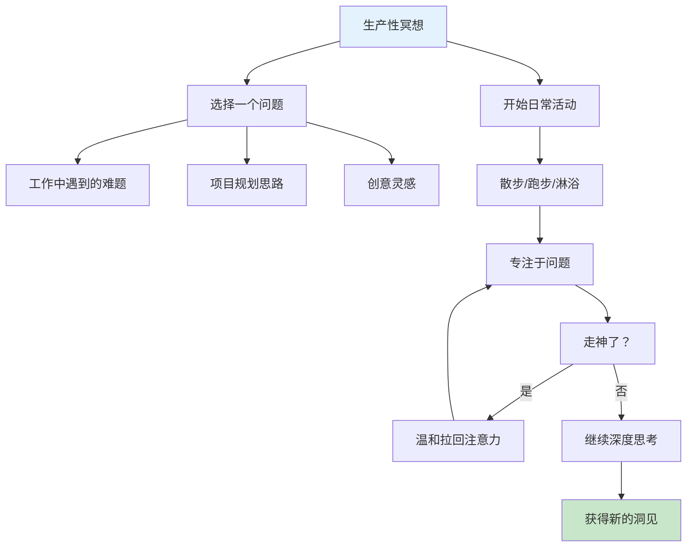
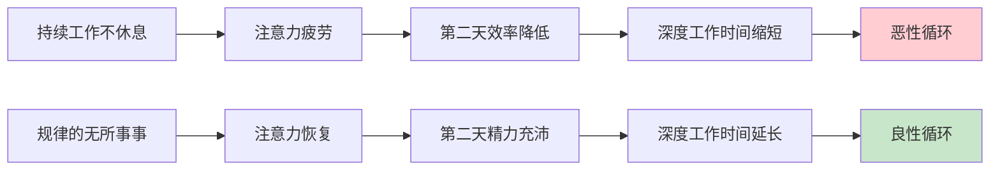
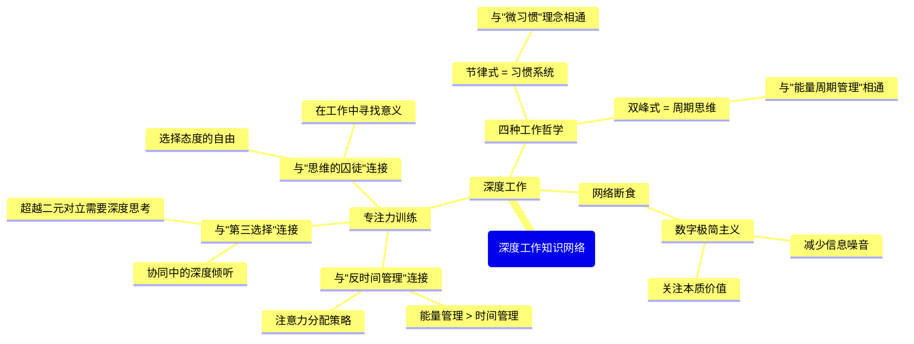
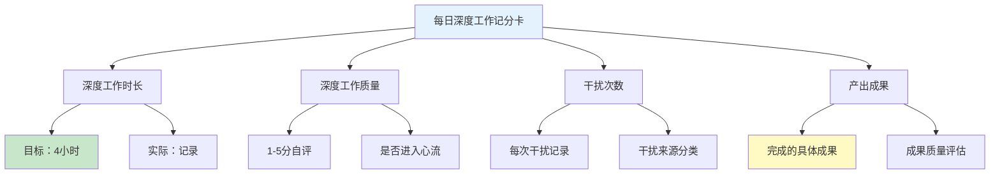

# ◇○《深度工作》核心内容C：高级概念与系统整合○●

---

## 一、"生产性冥想"——训练注意力的秘密武器

### ◆ 什么是生产性冥想？

这是Newport提出的一种独特的注意力训练方法。核心思路是：**利用日常的"非工作时间"来训练深度思考能力。**

具体做法：在你散步、跑步、淋浴或开车的时候，选择一个具体的专业问题来思考。当你发现自己走神了（比如开始想晚餐吃什么），温和地把注意力拉回到那个专业问题上。



### ○ 为什么有效？

◇ 利用"默认模式网络"（DMN）：大脑在放松状态下反而能产生创造性连接
◇ 训练"注意力肌肉"：每次走神后拉回注意力，就像举重一样锻炼专注力
◇ 将思考融入生活：不需要额外的时间，提高了时间利用率

### ◆ 实践指南

**第1次（第1-2周）**：每天散步时思考一个问题，从5分钟开始
**第2次（第3-4周）**：增加到10分钟，尝试在跑步时练习
**第3次（第5-6周）**：尝试在淋浴时练习，这是最容易产生创意的场景
**第4次（第7-8周）**：在任何空闲时间自动进入"生产性冥想"状态

---

## 二、"无所事事"的力量

### ○ 你可能没想到的反直觉洞察

Newport提出了一个大胆的观点：**规律的"无所事事"对深度工作能力至关重要。**



### ◆ 具体方法

◇ **设定"下班时间"**：比如晚上6点后不再工作，让大脑充分休息
◇ **周末彻底休息**：不处理工作邮件，不思考工作问题
◇ **无聊训练**：在排队、等车时，不看手机，允许自己"无聊"

**"无聊训练"的深层逻辑**：如果你一有空隙就掏手机，你的大脑就会形成"一有空隙就需要刺激"的条件反射。这让你在需要专注时也无法忍受"无聊"。通过"无聊训练"，你重新学会与无聊共处，从而提升专注力。

---

## 三、与系列其他书籍的深度连接

### ○ 知识网络图



### ◆ 跨书籍应用框架

| 本书概念 | 在《反时间管理》中的应用 | 在《第三选择》中的应用 | 在《思维的囚徒》中的应用 |
|---------|----------------------|-------------------|-------------------|
| 深度工作 | 在精力高峰期做最重要的事 | 用深度倾听找到第三选择 | 在深度工作中发现意义 |
| 注意力残留 | 减少任务切换以保存能量 | 避免在冲突中被情绪残留影响 | 专注当下，选择积极态度 |
| 网络断食 | 减少信息焦虑，恢复精力 | 远离噪音，倾听内心真实需求 | 在安静中找到人生方向 |
| 无聊训练 | 让大脑有恢复时间 | 在静默中产生协同灵感 | 在独处中与自己对话 |

---

## 四、深度工作的量化评估系统

### ○ 建立你的"深度工作记分卡"



### ◆ 每周复盘模板

| 周次 | 总时长 | 平均质量 | 干扰次数 | 主要成果 | 改进方向 |
|------|--------|---------|---------|---------|---------|
| 第1周 |  |  |  |  |  |
| 第2周 |  |  |  |  |  |
| 第3周 |  |  |  |  |  |
| 第4周 |  |  |  |  |  |

---

## 五、深度工作的终极框架

<div style="background: #f3e5f5; padding: 16px; border-left: 4px solid #9c27b0;">
◆ 深度工作不是技巧，而是一种生活方式的选择
</div>

### ○ 三层深度工作模型

**第一层：行为层**
- 建立仪式和规则
- 使用工具屏蔽干扰
- 设定固定的深度工作时段

**第二层：认知层**
- 理解注意力残留的原理
- 学会管理网络使用
- 训练"深度肌肉"

**第三层：哲学层**
- 重新定义工作的意义
- 选择你想要的生活方式
- 在深度工作中找到满足感

### ◇ 整合行动路线图

```
阶段1（第1-2周）：启动期
  ◇ 选择深度工作哲学
  ○ 建立仪式
  ● 每天45分钟深度工作

阶段2（第3-4周）：巩固期
  ◇ 增加到每天2小时
  ○ 开始"无聊训练"
  ● 评估网络工具

阶段3（第5-8周）：深化期
  ◇ 每天3-4小时深度工作
  ○ 加入"生产性冥想"
  ● 建立每周复盘机制

阶段4（第9-12周）：内化期
  ◇ 深度工作成为自然习惯
  ○ 能够随时进入深度状态
  ● 产出显著的职业成果
```

---

<div style="background: #e8f5e9; padding: 16px; border-left: 4px solid #4caf50;">
● 下一节：《深度工作》结尾篇——30天挑战计划与实践指南
</div>
