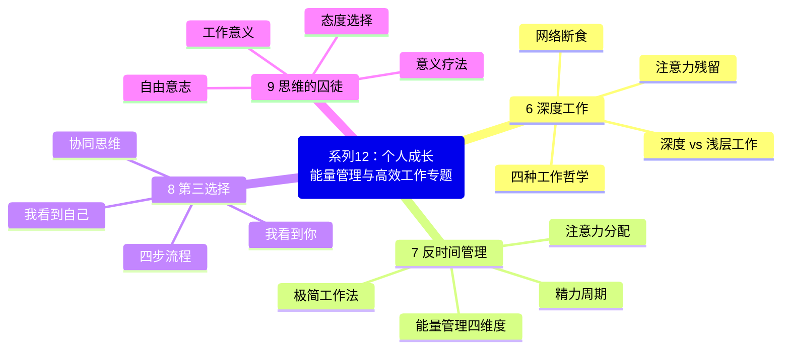
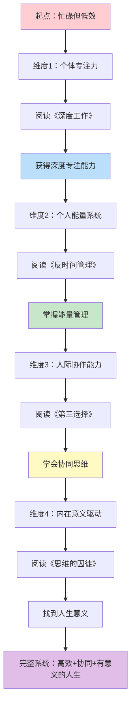
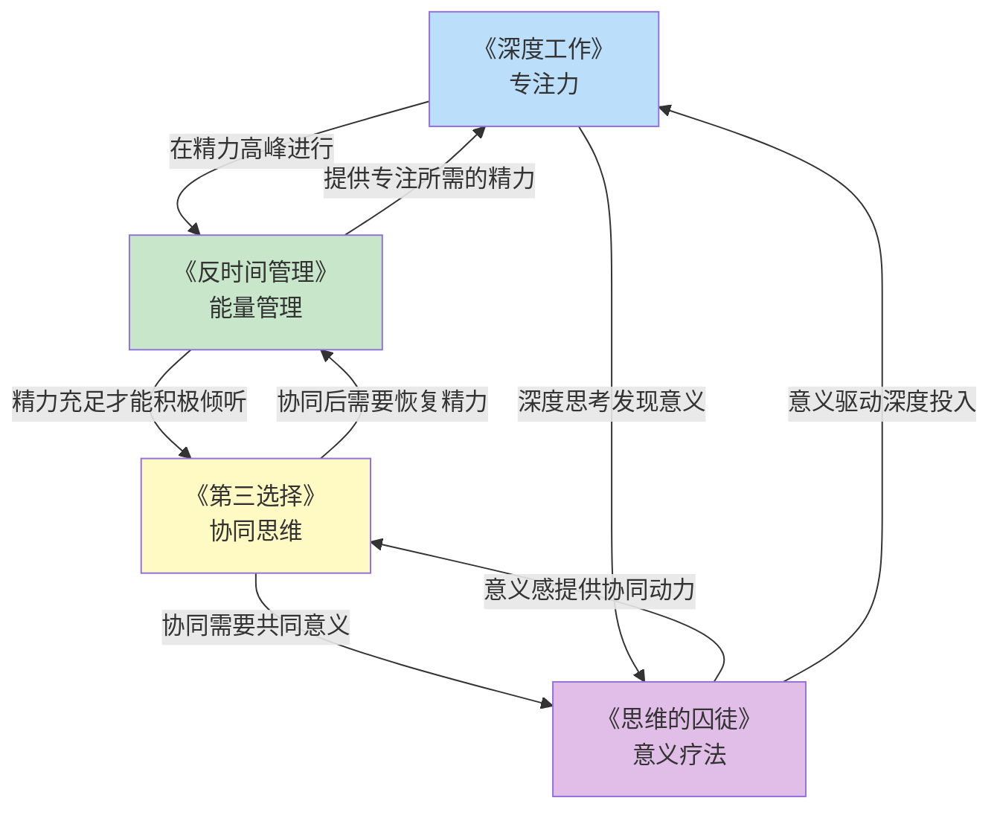
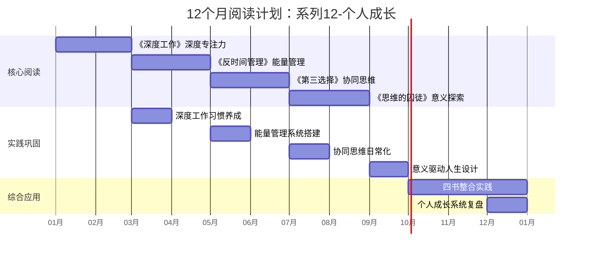

# ○● 系列12-个人成长 视觉指南：能量管理与高效工作专题●◆

---

## 一、系列全景思维导图

本专题包含4本核心书籍，围绕"能量管理与高效工作"主题，从四个维度构建完整的个人效能系统。

---

## 二、个人成长路径：从个体效能到人际协同

---

## 三、四本书的核心连接关系

### ◆ 核心逻辑链

| 顺序 | 书籍 | 解决的问题 | 核心能力 | 关键词 |
|------|------|-----------|---------|-------|
| 1 | 《深度工作》 | 无法专注 | 深度专注力 | 专注 |
| 2 | 《反时间管理》 | 精力不足 | 能量管理 | 能量 |
| 3 | 《第三选择》 | 人际冲突 | 协同思维 | 协同 |
| 4 | 《思维的囚徒》 | 缺乏动力 | 意义驱动 | 意义 |

---

## 四、12个月阅读计划时间线

---

## 五、推荐阅读顺序与组合策略

### ◆ 方案A：循序渐进型（推荐）

按照能力建设的递进逻辑，逐步搭建个人成长系统：

1. **第1-2个月**：《深度工作》——先解决"无法专注"的问题
2. **第3-4个月**：《反时间管理》——在精力最佳时段做深度工作
3. **第5-6个月**：《第三选择》——用好的状态改善人际关系
4. **第7-8个月**：《思维的囚徒》——找到持续成长的内在动力

### ○ 方案B：痛点优先型

| 你最困扰的问题 | 首先阅读 | 然后阅读 | 原因 |
|---------------|---------|---------|------|
| 总是分心 | 《深度工作》 | 《反时间管理》 | 先专注，再优化精力 |
| 总是疲惫 | 《反时间管理》 | 《深度工作》 | 先恢复精力，再谈效率 |
| 人际关系差 | 《第三选择》 | 《思维的囚徒》 | 先改善关系，再找意义 |
| 迷茫无动力 | 《思维的囚徒》 | 《反时间管理》 | 先找到方向，再管理精力 |

### ◆ 方案C：双轨并行型

| 轨道 | 书籍组合 | 核心逻辑 |
|------|---------|---------|
| 轨道A（个体效能） | 《深度工作》+《反时间管理》 | 专注力 + 精力 = 个体高效 |
| 轨道B（人际与意义） | 《第三选择》+《思维的囚徒》 | 协同 + 意义 = 关系与动力 |

---

## 六、系列学习成果评估

### ○ 完成本专题后，你将能够：

- [ ] 在精力高峰期进入深度工作状态
- [ ] 绘制并运用个人能量地图
- [ ] 用二八法则精简工作内容
- [ ] 在冲突中找到"第三选择"
- [ ] 运用四步协同流程解决人际问题
- [ ] 在日常工作中发现和创造意义
- [ ] 建立"个体效能-人际协同-意义驱动"的完整系统

---

◆ 视觉指南说明：本文件包含本专题的完整知识框架，建议收藏后反复查看，作为学习和实践的导航地图。

