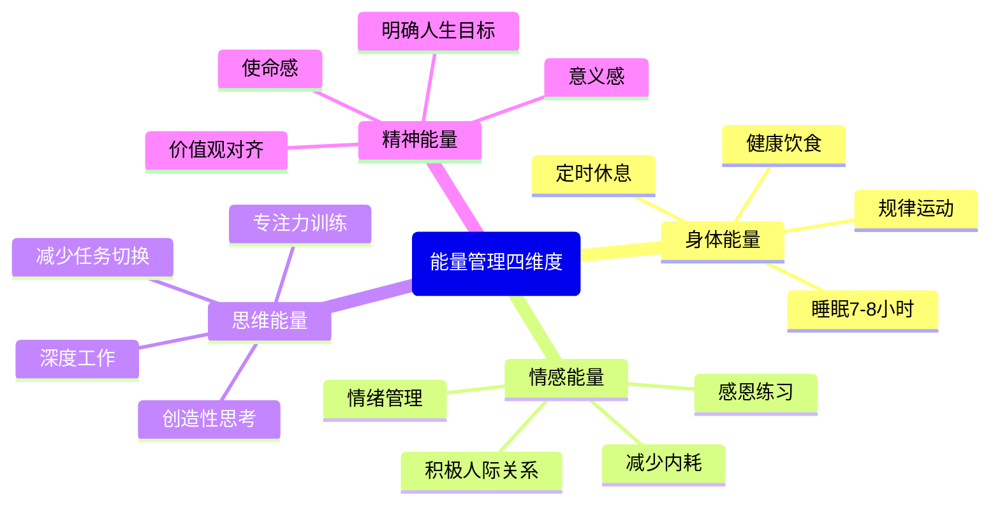
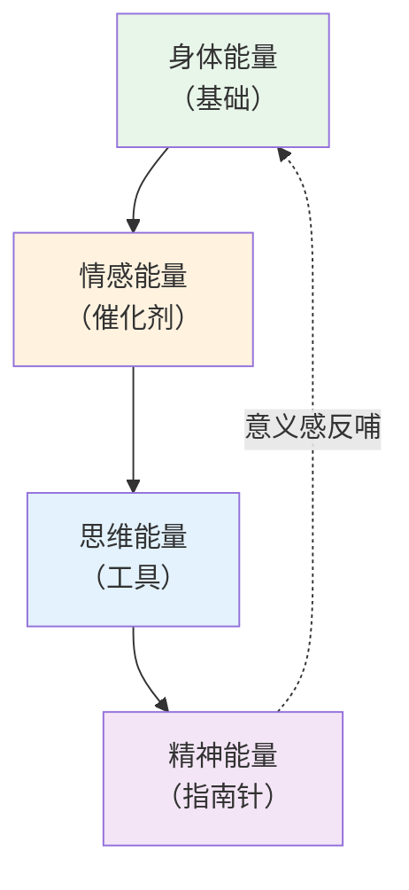

# ○●《反时间管理》核心内容A：从时间管理到能量管理的范式转变●◆

---

## 一、为什么传统时间管理失效了

### ◆ 时间管理的三大谎言

**谎言1："只要规划得够好，就能完成所有事"**

真相是：你的待办清单永远列不完。每完成一项，就有两项新的冒出来。时间管理的本质是一个不可能完成的游戏——你在试图用有限的容器装无限的水。

**谎言2："所有时间段是等价的"**

真相是：早上精力充沛时的1小时，可能抵得上下午疲惫时的3小时。但你却在待办清单上把它们当作等价的时间段来规划。

**谎言3：" multitasking（多任务处理）是高效的"**

真相是：科学研究已经反复证明，多任务处理会降低40%的效率，同时增加50%的错误率。你以为在同时做多件事，实际上是在快速切换，每次切换都付出了注意力残留的代价。

### ○ 数据说话

| 指标 | 传统时间管理 | 能量管理 |
|------|------------|---------|
| 关注点 | 时间分配 | 精力分配 |
| 假设 | 时间可以"管理" | 精力可以"管理" |
| 方法 | 排满日程表 | 找到黄金时段 |
| 结果 | 忙碌但疲惫 | 高效且精力充沛 |
| 可持续性 | 低（容易倦怠） | 高（有恢复机制） |

---

## 二、能量管理的四个维度

Rich Norton将能量分为四个相互关联的维度，这构成了能量管理的完整框架。

### ◆ 四个维度的相互关系

这四个维度不是独立的，而是相互影响的金字塔结构：

◇ **身体能量是基础**：如果你睡眠不足、饮食不规律，其他三个维度的能量都会受到影响
◇ **情感能量是催化剂**：积极的情绪能放大其他三个维度的效果
◇ **思维能量是工具**：它决定了你如何有效利用身体和情感能量
◇ **精神能量是指南针**：它指引你把能量投入到最有意义的方向

---

## 三、找到你的精力黄金时段

### ○ 场景案例：小王的一天

**小王之前（时间管理思维）**：

| 时间 | 安排 | 实际状态 |
|------|------|---------|
| 8:00-9:00 | 回邮件 | 刚起床，脑子还不转 |
| 9:00-10:00 | 开例会 | 精力开始上升，但在开会 |
| 10:00-12:00 | 写报告 | 精力高峰期，但被3条消息打断 |
| 12:00-13:00 | 午餐+刷手机 | 没有休息 |
| 13:00-15:00 | 继续写报告 | 午后低谷，效率极低 |
| 15:00-17:00 | 各种会议 | 精力稍微恢复，但在开会 |
| 17:00-18:00 | 回邮件 | 该回家了 |

结果：忙碌了一天，报告只写了30%。

**小王之后（能量管理思维）**：

| 时间 | 安排 | 能量策略 |
|------|------|---------|
| 8:00-9:00 | 运动+早餐 | 提升身体能量 |
| 9:00-10:00 | 统一处理邮件 | 利用低精力时段做低价值工作 |
| 10:00-12:00 | 写报告（深度工作） | **黄金时段做最重要的事** |
| 12:00-13:30 | 午餐+散步+小憩 | **能量恢复** |
| 13:30-15:00 | 开会+协作 | 低谷时段做互动性工作 |
| 15:00-16:30 | 第二次深度工作 | 精力回升期 |
| 16:30-17:30 | 整理+规划明天 | 收尾工作 |

结果：报告完成了80%，而且质量更高。

---

## 四、绘制你的"能量地图"

### ◆ 实践练习

连续5天，每小时给自己的精力打分（1-10分），记录如下：

| 时间 | Day 1 | Day 2 | Day 3 | Day 4 | Day 5 | 平均 |
|------|-------|-------|-------|-------|-------|------|
| 7:00 |  |  |  |  |  |  |
| 8:00 |  |  |  |  |  |  |
| 9:00 |  |  |  |  |  |  |
| 10:00 |  |  |  |  |  |  |
| 11:00 |  |  |  |  |  |  |
| 12:00 |  |  |  |  |  |  |
| 13:00 |  |  |  |  |  |  |
| 14:00 |  |  |  |  |  |  |
| 15:00 |  |  |  |  |  |  |
| 16:00 |  |  |  |  |  |  |
| 17:00 |  |  |  |  |  |  |
| 18:00 |  |  |  |  |  |  |

完成后，观察你的规律：
- 哪个时段精力最高？这是你的**黄金时段**
- 哪个时段精力最低？这是你的**低谷时段**
- 你的精力模式是"晨型"还是"夜型"？

---

## ◆ 行动清单

| 序号 | 行动 | 时间 | 完成标准 |
|------|------|------|---------|
| 1 | 反思过去一周的工作模式 | 今天 | 写下3个低效时刻 |
| 2 | 开始记录"能量地图" | 明天起 | 连续记录5天 |
| 3 | 识别你的黄金时段 | 第6天 | 确定每天2小时 |
| 4 | 将最重要的事安排在黄金时段 | 第7天起 | 执行一周 |
| 5 | 对比效率变化 | 第14天 | 记录产出差异 |

---

○ 下一节：《反时间管理》核心内容B——极简工作法与注意力分配策略

