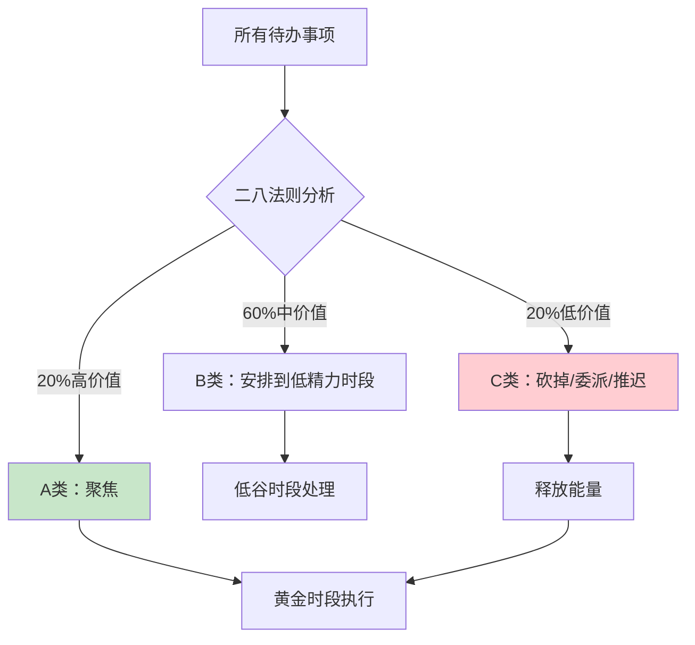

# ●◆《反时间管理》核心内容B：极简工作法与注意力分配◆○

---

## 一、极简工作法：做更少，做更好

### ◆ 核心理念

极简工作法的核心不是"做得少"，而是**"做得精"**。它要求你对工作进行无情的筛选，把有限的能量投入到能产生最大价值的少数关键事项上。

Rich Norton提出了一个简单但颠覆性的公式：

```
成果 = 能量 × 聚焦度
```

注意，这个公式里没有"时间"。因为如果你的能量低、聚焦度差，再多的时间也是浪费。

### ○ 极简工作三步法

**第一步：列出所有工作**
把你本周/本月要做的所有事情都写下来。不要遗漏，包括会议、邮件、项目、社交……

**第二步：二八法则分类**
对每一项工作问两个问题：
1. 这件事能直接或间接推动我最重要的目标吗？
2. 如果我不做这件事，后果是什么？

根据答案分为三类：
- **A类（高价值）**：不做会有严重后果，且能推动核心目标
- **B类（中价值）**：需要做，但不紧急，可以安排到低精力时段
- **C类（低价值）**：可以委派、推迟或干脆不做

**第三步：砍掉C类，聚焦A类**
- 至少砍掉30%的C类事项
- 把节省下来的能量全部投入A类
- B类安排到精力低谷时段处理



---

## 二、注意力分配的战略思维

### ◆ 注意力是你的"认知预算"

想象你每天有一定量的"注意力预算"。每次你看手机、回邮件、开会，都在消耗这个预算。如果预算被低价值的事情消耗光了，当你真正需要做深度工作时，就没有"钱"了。

### ○ 注意力分配矩阵

| | 高能量时段 | 低能量时段 |
|---------|-----------|-----------|
| **高价值任务** | 深度工作（最佳） | 创造性脑暴（次优） |
| **低价值任务** | 浪费！（最糟） | 机械性工作（合理） |

### ◆ 常见错误配置

**错误1：用黄金时段回邮件**

邮件回复是低价值任务（通常），但大多数人一上班就打开邮箱。这意味着你用一天中精力最好的时间段，做了最不需要精力的事。

**错误2：用低谷时段做深度工作**

下午2-3点通常是精力低谷。如果这时你安排写报告或做方案，效率可能只有上午的1/3。

**错误3：全天均匀分配注意力**

认为"每个任务都花同样的精力"是公平的。但实际上，不同任务的注意力需求完全不同。

---

## 三、"说不"的艺术

### ○ 为什么你不会拒绝

◇ **讨好倾向**：害怕拒绝会让别人不高兴
◇ **恐惧错失**：担心错过机会
◇ **过度承诺**：高估自己能做的事情
◇ **缺乏标准**：不清楚自己的核心目标是什么

### ◆ 说"不"的框架

**框架1：目标对齐法**
"这个任务能推动我最重要的目标吗？如果不能，礼貌拒绝。"

**框架2：机会成本法**
"如果我做了这件事，我就不能做那件事。哪个更重要？"

**框架3：延迟回应法**
"让我考虑一下，明天回复你。"——给自己冷静思考的时间。

**框架4：替代方案法**
"我现在无法承担这个任务，但我可以推荐……"

### ◇ 场景练习

| 场景 | 错误回应 | 正确回应 |
|------|---------|---------|
| 同事请你帮忙做一个报告 | "好的，我今晚加班做" | "我这周在赶一个重点项目，可能帮不上。你可以找小李，他在这方面很有经验。" |
| 领导临时加一个会议 | "好的" | "我下午在赶一个截止日期。这个会议的内容我可以会后看纪要吗？" |
| 朋友邀请参加一个社交活动 | "好吧，反正也没什么事" | "谢谢邀请！我这周需要恢复精力，下次一定。" |

---

## 四、能量恢复仪式

### ○ 你可能忽视的关键

Rich Norton强调：**没有恢复，就没有持续的产出。** 能量管理不只是"怎么花"，更重要的是"怎么赚"。

### ◆ 四类能量恢复方法

| 能量类型 | 恢复方法 | 时长 | 效果 |
|---------|---------|------|------|
| 身体能量 | 小憩20分钟 | 20分钟 | 立即恢复警觉性 |
| 身体能量 | 散步15分钟 | 15分钟 | 促进血液循环 |
| 情感能量 | 感恩日记 | 5分钟 | 提升积极情绪 |
| 情感能量 | 和喜欢的人聊天 | 10分钟 | 释放压力 |
| 思维能量 | 冥想 | 10分钟 | 清空认知负担 |
| 思维能量 | 听音乐 | 10分钟 | 放松大脑 |
| 精神能量 | 回顾目标 | 5分钟 | 重新对齐方向 |
| 精神能量 | 阅读励志内容 | 15分钟 | 激发内在动力 |

---

## 五、常见陷阱与应对

<div style="background: #ffebee; padding: 16px; border-left: 4px solid #f44336;">
⚠️ 常见陷阱：这些行为会让你"以为"在做能量管理，实际上不是
</div>

### ◆ 陷阱1：把"偷懒"当"极简"

砍掉了所有工作，但没有把节省的能量投入到高价值事项上。这是逃避，不是极简。

**应对**：极简的目的是**聚焦**，不是**放弃**。砍掉低价值工作后，必须有明确的高价值目标。

### ○ 陷阱2：过度追求完美

对每一件A类工作都追求100分，导致能量过度消耗。

**应对**：用二八法则——80分的产出可能只需要50%的精力，而追求100分需要额外的300%精力。问自己："这个任务值得我追求100分吗？"

### ◆ 陷阱3：忽视身体能量

只关注工作策略，但每天只睡5小时、从不运动。

**应对**：身体能量是一切的基础。没有好的身体状态，任何策略都是空中楼阁。

---

## ◆ 行动清单

| 序号 | 行动 | 时间 | 完成标准 |
|------|------|------|---------|
| 1 | 列出本周所有待办事项 | 今天 | 不少于20项 |
| 2 | 用二八法则分类为A/B/C | 今天 | 标注每项的类别 |
| 3 | 砍掉/委派至少30%的C类 | 明天 | 确认已移除 |
| 4 | 将A类安排到黄金时段 | 本周 | 修改日程表 |
| 5 | 每天使用至少2种能量恢复方法 | 每天 | 坚持一周 |
| 6 | 练习"说不"至少3次 | 本周 | 记录每次的情境和感受 |

---

<div style="background: #e8f5e9; padding: 16px; border-left: 4px solid #4caf50;">
◆ 下一节：《反时间管理》核心内容C——高级策略与系列书籍的融合应用
</div>
