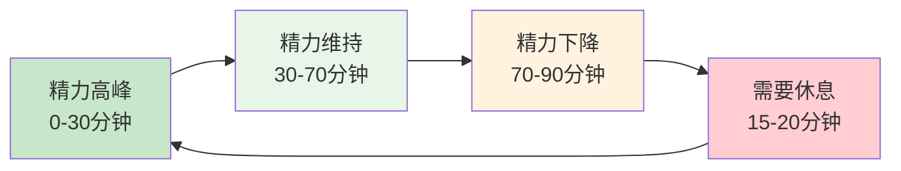
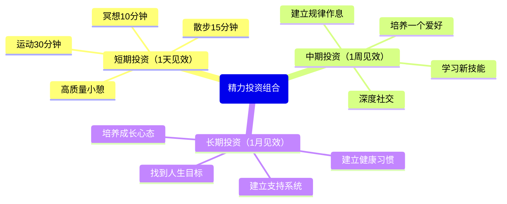
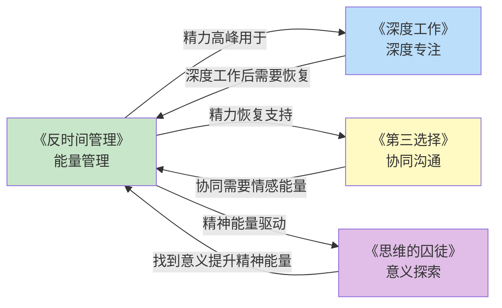
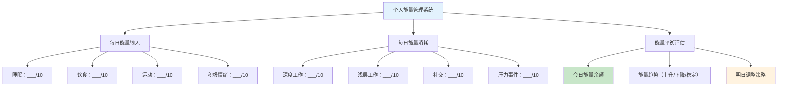

# ◇○《反时间管理》核心内容C：高级策略与系统整合○●

---

## 一、精力周期理论：理解你的生物节律

### ◆ 超日节律（Ultradian Rhythms）

人的精力不是线性下降的，而是按照**90-120分钟的周期**波动的。这个周期被称为"超日节律"。

每个周期内：
- **前60-80分钟**：精力上升并维持在高水平
- **后10-20分钟**：精力开始下降，出现疲劳信号

如果你忽视这些信号，强行继续工作，就会进入"透支模式"，需要更长的时间才能恢复。



### ○ 如何利用超日节律

◇ **工作90分钟，休息15分钟**——这是最符合自然节律的节奏
◇ **休息不是浪费时间**——它让你在下个周期中恢复高效
◇ **休息时做"非工作"的事**——散步、伸展、喝水，而不是刷手机

---

## 二、"精力投资"思维

### ◆ 从"消费"到"投资"的转变

大多数人把精力当作"消费品"——花出去就没有了。但Rich Norton提出了一个更高级的视角：**精力是可以"投资"的。**

有些活动虽然消耗精力，但它们能让你在未来获得更多的精力回报。这就是"精力投资"。

| 活动类型 | 精力效果 | 例子 |
|---------|---------|------|
| 精力消费 | 消耗后无法恢复 | 刷社交媒体、无意义社交 |
| 精力恢复 | 消耗后能恢复到原来水平 | 睡觉、吃饭、休息 |
| 精力投资 | 消耗后能获得**更多**精力 | 运动、学习、深度对话 |

### ○ 精力投资组合



### ◆ 场景案例：小李的精力投资决策

**消费型选择**：下班后刷2小时短视频
- 消耗：2小时时间 + 中等精力
- 回报：短暂的多巴胺快感，之后更加空虚

**投资型选择**：下班后运动30分钟 + 阅读30分钟
- 消耗：1小时时间 + 初始精力
- 回报：身体能量提升 + 思维能量提升 + 睡眠质量提高

---

## 三、与系列其他书籍的深度连接

### ○ 跨书籍知识网络



### ◆ 跨书籍应用框架

| 本书概念 | 在《深度工作》中的应用 | 在《第三选择》中的应用 | 在《思维的囚徒》中的应用 |
|---------|-------------------|-------------------|-------------------|
| 黄金时段 | 在精力最好时深度工作 | 在精力好时处理人际关系 | 在精力好时反思人生方向 |
| 精力恢复 | 深度工作后必须恢复 | 冲突后需要情感恢复 | 意义探索需要内心安静 |
| 极简工作 | 减少浅层工作 | 减少无效社交 | 减少无意义的忙碌 |
| 二八法则 | 80%产出来自20%深度时间 | 80%关系质量来自20%关键关系 | 80%意义感来自20%核心价值 |

---

## 四、个人能量管理系统框架

### ○ 建立你的"能量仪表盘"



### ◆ 每日能量日志模板

```
┌─────────────────────────────────────┐
│       能量日志 - ____月____日       │
├─────────────────────────────────────┤
│ ◇ 昨日睡眠：      小时，质量___/10  │
│ ○ 今日精力峰值：       到           │
│ ● 今日精力谷值：       到           │
│ ◆ 最重要的一件事：                   │
│                                    │
│ ◇ 今天做了哪些"精力投资"？           │
│ ○ 今天做了哪些"精力消费"？           │
│ ● 今天的能量余额：正/负              │
│ ◆ 明天的调整：                       │
└─────────────────────────────────────┘
```

---

## 五、整合行动路线图

<div style="background: #f3e5f5; padding: 16px; border-left: 4px solid #9c27b0;">
◆ 终极目标：建立你的"能量驱动型"工作方式
</div>

### ○ 三阶段实施路径

```
阶段1（第1-2周）：认知期
  ◇ 记录能量地图
  ○ 识别黄金时段和低谷时段
  ● 列出所有工作并做二八分类

阶段2（第3-6周）：实践期
  ◇ 将A类工作安排到黄金时段
  ○ 每天执行至少2种能量恢复方法
  ● 练习"说不"，砍掉C类工作
  ◆ 开始"精力投资"（运动、学习）

阶段3（第7-12周）：内化期
  ◇ 能量管理成为自然习惯
  ○ 能够感知和预测自己的精力波动
  ● 建立个人能量管理系统
  ◆ 产出和幸福感同时提升
```

---

<div style="background: #e8f5e9; padding: 16px; border-left: 4px solid #4caf50;">
● 下一节：《反时间管理》结尾篇——30天能量管理挑战计划
</div>
