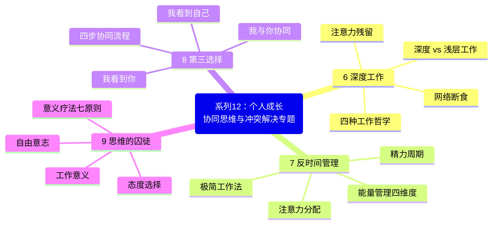
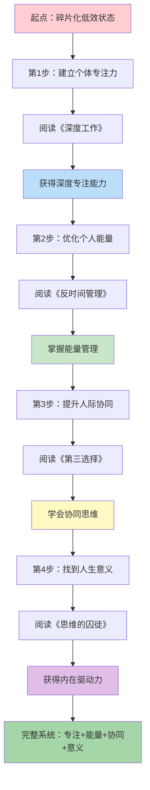
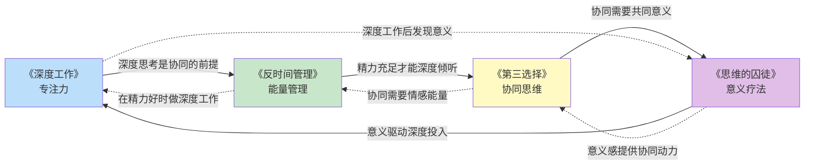
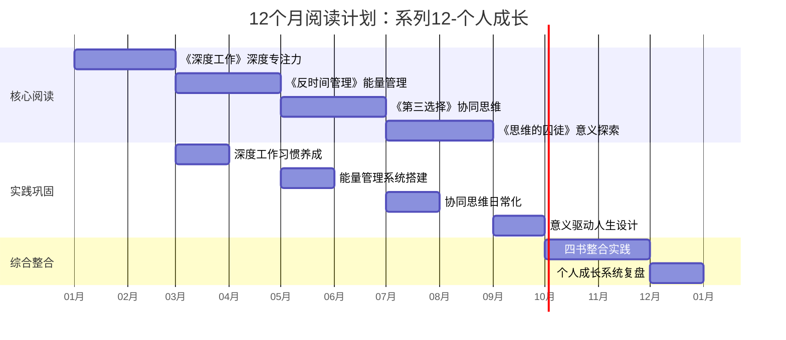

# ○● 系列12-个人成长 视觉指南：协同思维与冲突解决专题●◆

---

## 一、系列全景思维导图

本专题包含4本核心书籍，围绕"协同思维与冲突解决"主题，从个体能力到人际协同再到人生意义，构建完整的个人成长体系。

---

## 二、个人成长路径：从个体到关系再到意义

---

## 三、四本书的核心连接关系

### ◆ 核心逻辑链

| 顺序 | 书籍 | 解决的问题 | 核心能力 | 层级 |
|------|------|-----------|---------|------|
| 1 | 《深度工作》 | 无法专注 | 深度专注力 | 个体内在 |
| 2 | 《反时间管理》 | 精力不足 | 能量管理 | 个体内在 |
| 3 | 《第三选择》 | 人际冲突 | 协同思维 | 人际之间 |
| 4 | 《思维的囚徒》 | 缺乏动力 | 意义驱动 | 超越自我 |

---

## 四、12个月阅读计划时间线

---

## 五、推荐阅读顺序

### ◆ 方案A：循序渐进型（推荐）

按照从内到外、从个体到关系的逻辑逐步推进：

1. **第1-2个月**：《深度工作》——先解决个体专注力问题
2. **第3-4个月**：《反时间管理》——在精力层面优化个人效能
3. **第5-6个月**：《第三选择》——将个体能力提升到人际层面
4. **第7-8个月**：《思维的囚徒》——在意义层面整合所有能力

### ○ 方案B：痛点优先型

| 你最困扰的问题 | 首先阅读 | 核心原因 |
|---------------|---------|---------|
| 人际关系紧张 | 《第三选择》 | 直接解决冲突问题 |
| 总是疲惫 | 《反时间管理》 | 先恢复精力 |
| 无法专注 | 《深度工作》 | 先建立专注力 |
| 迷茫无意义 | 《思维的囚徒》 | 先找到方向 |

### ◆ 方案C：层级递进型

| 层级 | 书籍 | 成长维度 |
|------|------|---------|
| 个体层 | 《深度工作》+《反时间管理》 | 专注力 + 能量 = 个体高效 |
| 关系层 | 《第三选择》 | 从个体高效到人际协同 |
| 超越层 | 《思维的囚徒》 | 从协同到意义驱动的人生 |

---

## 六、系列学习成果评估

### ○ 完成本专题后，你将能够：

- [ ] 每天进入深度工作状态，产出高质量成果
- [ ] 根据个人精力周期安排工作和生活
- [ ] 用二八法则精简工作，把能量集中在关键事项
- [ ] 在冲突中运用四步协同流程找到"第三选择"
- [ ] 使用"复述技术"建立深层沟通
- [ ] 在平凡工作中发现和创造意义
- [ ] 建立从"个体效能"到"人际协同"到"意义驱动"的完整成长系统

---

◆ 视觉指南说明：本文件包含本专题的完整知识框架，建议收藏后反复查看，作为学习和实践的导航地图。

