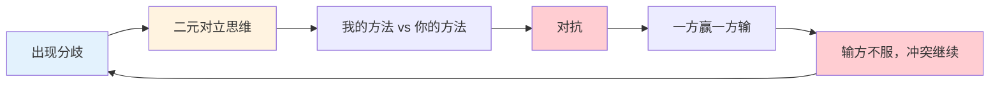
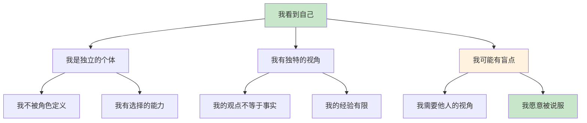
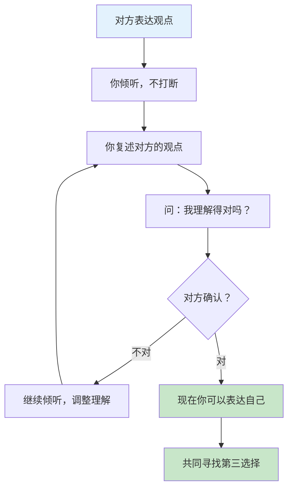

# ○●《第三选择》核心内容A：从对抗到协同的思维革命●◆

---

## 一、为什么我们总是陷入对抗

### ◆ 二元对立的陷阱

人类大脑天生倾向于"非此即彼"的思维模式。进化过程中，这种思维帮助我们快速判断"朋友还是敌人"、"安全还是危险"。但在现代社会，这种思维模式成了冲突的根源。

### ○ 对抗思维的三大表现

**表现1：防御心态**
当对方的观点与你不一致时，你的第一反应是"我要证明我是对的"。这种防御心态让你关闭了倾听的通道。

**表现2：标签化对方**
你把对方简化为一个标签："他就是不听劝"、"她总是针对我"、"他们就是不懂"。标签化让你看不到对方的全貌。

**表现3：零和博弈思维**
你认为"如果我赢了，你就输了"。你把互动看作是一场有限的游戏，而不是可以共同创造价值的机会。

---

## 二、四步协同流程详解

### ◆ 第一步：我看到自己

这是所有协同的起点。如果你不能客观地看待自己，你就无法真正理解别人。

**场景演练**：

你和同事对一个项目方案有分歧。通常你的反应是："我的方案更好，他不懂。"

现在试试"我看到自己"：
- 我承认我的方案有优点，但也有不足
- 我可能没有考虑到他看到的风险
- 我的观点只是众多视角之一

**练习**：在下次冲突中，先在心里说："我可能不是完全正确的。"

### ○ 第二步：我看到你

这一步要求你把对方看作一个完整的人——有情感、有需求、有恐惧、有价值。

**关键转变**：
- 从"他是一个问题"到"他是一个有故事的人"
- 从"他为什么这么不合理"到"他背后有什么需求"
- 从"我要改变他"到"我想理解他"

**场景演练**：

你的伴侣总是加班到很晚。通常你会想："他不在乎这个家。"

现在试试"我看到你"：
- 他可能在工作中承受了很大压力
- 他可能觉得只有这样才能证明自己的价值
- 他可能也在内疚，但不知道如何表达

**练习**：在下次冲突中，试着写一段"对方的独白"——如果对方来描述这个冲突，他会怎么说？

---

## 三、倾听的力量：你听过"被理解"的感受吗？

### ◆ 真正的倾听 vs 假装倾听

| 假装倾听 | 真正倾听 |
|---------|---------|
| 想着自己接下来要说什么 | 全神贯注于对方的话 |
| 在对方说话时准备反驳 | 努力理解对方的感受和需求 |
| 听完后说"但是……" | 听完后复述对方的观点 |
| 目的是"赢" | 目的是"理解" |

### ○ "复述"技术

Covey推荐使用"复述"技术来确保你真的理解了对方的观点：

**步骤**：
1. 对方说完后，你用自己的话复述他的观点
2. 问："我理解得对吗？"
3. 如果对方说"不对"，继续倾听，直到对方说"对，这就是我的意思"
4. 只有当对方确认你理解后，你才能表达自己的观点

**为什么有效？**

当一个人感到"被理解"时，他的防御心态会自然降低。这时，他才愿意听你的观点。这是协同的关键转折点。

---

## 四、场景案例：职场中的第三选择

### ◆ 案例背景

小王和小李是同一团队的两位经理。公司要求他们共同完成一个项目，但两人在方案上有严重分歧：

- 小王主张"快速上线，边做边改"
- 小李主张"充分准备，一次做对"

两人已经争论了两周，项目进度严重滞后。

### ○ 用四步流程解决

**第1步：我看到自己**

小王想："我的方案确实有风险，可能会返工。但我也理解小李的担忧——他之前有过因为仓促上线而导致重大bug的经历。"

**第2步：我看到你**

小王主动找到小李："我知道你之前有过不好的经历，所以你特别在意质量。你的担忧是有道理的。"

**第3步：我找到你**

小王问："我们能不能一起找一个方案，既能保证质量，又不会太慢？"

**第4步：我与你协同**

两人一起头脑风暴，最终找到了第三选择：
- 将项目分为三个里程碑
- 每个里程碑都经过充分测试后再进入下一个
- 第一个里程碑小范围上线，收集反馈
- 后续里程碑根据反馈调整

结果：既保证了质量，又加快了整体进度。双方都很满意。

---

## ◆ 行动清单

| 序号 | 行动 | 完成标准 |
|------|------|---------|
| 1 | 回顾最近一次冲突 | 写下你当时的反应 |
| 2 | 用"我看到自己"重新审视 | 列出你可能的盲点 |
| 3 | 写一段"对方的独白" | 从对方的视角描述冲突 |
| 4 | 找一个人练习"复述"技术 | 让对方确认你理解了 |
| 5 | 在下次冲突中尝试四步流程 | 记录过程和结果 |

---

○ 下一节：《第三选择》核心内容B——协同工具、常见陷阱与实践指南

