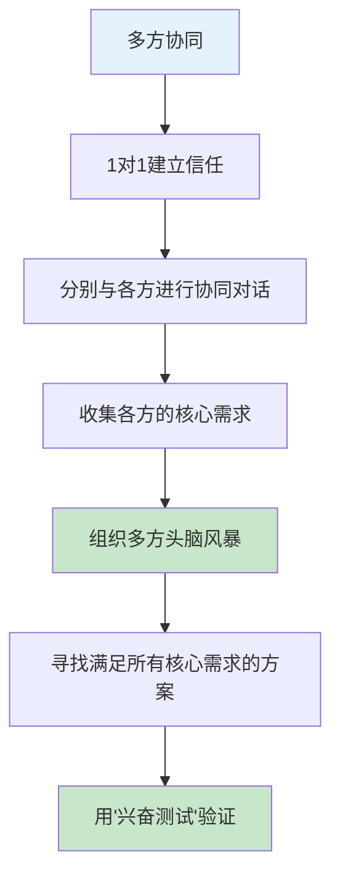
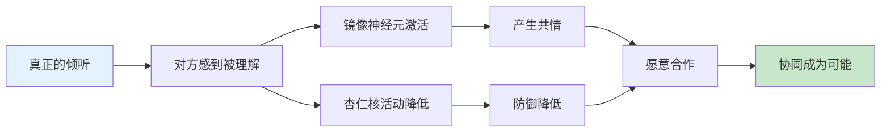
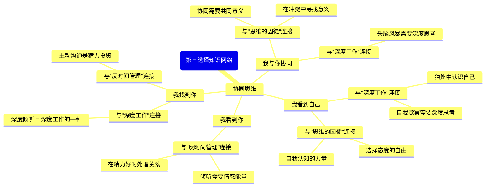

# ◇○《第三选择》核心内容C：高级协同策略与系统整合○●

---

## 一、协同的高级场景

### ◆ 多方协同

当冲突涉及三个或更多方时，协同的复杂度会显著增加。但基本流程不变，只是需要更多的耐心和结构。



**关键技巧**：
- 先与各方分别进行1对1对话，建立信任
- 在多方会议前，让各方知道你已经理解了他们的需求
- 在多方会议中，先让每个人都复述其他人的需求（这能大幅提升协同效果）

### ○ 跨文化协同

不同文化背景的人在协同中面临额外的挑战：

| 文化差异 | 协同中的影响 | 应对策略 |
|---------|------------|---------|
| 直接 vs 间接沟通 | 直接文化的人可能觉得间接文化的人"不坦诚" | 理解对方的沟通风格 |
| 个人主义 vs 集体主义 | 个人主义文化强调"我的观点"，集体主义强调"和谐" | 在尊重文化差异的基础上寻找共同点 |
| 高权力距离 vs 低权力距离 | 高权力距离文化中，下级可能不敢表达真实想法 | 创造安全的表达环境 |

---

## 二、协同的神经科学基础

### ◆ 为什么协同有效？

研究发现，当一个人感到"被理解"时，大脑中的**镜像神经元**会被激活，产生共情反应。同时，**杏仁核**（负责恐惧和防御的区域）的活动会降低。这意味着对方的生理状态从"对抗"转向"合作"。



### ○ "安全空间"的创建

协同需要心理安全。以下行为会破坏安全空间：

◇ 打断对方说话
◇ 在对方说话时看手机
◇ 用否定性语言（"但是"、"不对"）
◇ 身体语言表现出不耐烦

以下行为会增强安全空间：

◇ 保持眼神接触
◇ 身体前倾表示关注
◇ 用肯定性语言（"我理解"、"你说的有道理"）
◇ 给对方充分的表达时间

---

## 三、与系列其他书籍的深度连接

### ◆ 跨书籍知识网络



### ○ 跨书籍应用框架

| 本书概念 | 在《深度工作》中的应用 | 在《反时间管理》中的应用 | 在《思维的囚徒》中的应用 |
|---------|-------------------|-------------------|-------------------|
| 我看到自己 | 深度反思自己的盲点 | 识别能量消耗源 | 选择自己的态度 |
| 我看到你 | 深度倾听需要专注 | 倾听是情感能量投资 | 理解他人的意义追求 |
| 我找到你 | 主动沟通是精力投资 | 在精力好时处理关系 | 在关系中发现意义 |
| 我与你协同 | 头脑风暴需要深度思考 | 协同创造更大价值 | 协同是实现意义的途径 |

---

## 四、协同思维在日常生活中的应用

### ◆ 日常协同清单

| 场景 | 传统做法 | 协同做法 |
|------|---------|---------|
| 伴侣选择餐厅 | 各选各的，最后妥协 | 一起找一家两个人都没去过但都想尝试的 |
| 团队分配任务 | 领导分配 | 团队成员一起讨论，根据兴趣和优势分配 |
| 孩子选兴趣班 | 父母决定 | 父母和孩子一起探索，找到共同认可的方向 |
| 朋友间旅行计划 | 投票决定 | 一起设计一个满足所有人核心需求的行程 |

### ○ 协同思维的日常训练

◇ **每天问自己**："今天我有没有在某个场景中陷入了'非此即彼'的思维？有没有更好的第三选择？"
◇ **每周做一次**："对方的独白"练习——选一个你最近有分歧的人，写下他的视角
◇ **每月挑战一次**：找一个你一直回避的冲突，用四步流程去解决

---

## 五、协同能力发展路线图

<div style="background: #f3e5f5; padding: 16px; border-left: 4px solid #9c27b0;">
◆ 协同能力不是一天建成的，而是一个持续发展的过程
</div>

```
阶段1（第1-2周）：认知觉醒期
  ◇ 识别自己的"对抗模式"
  ○ 练习"我看到自己"
  ● 在冲突中暂停，不急于反驳

阶段2（第3-6周）：技能建设期
  ◇ 练习"我看到你"和复述技术
  ○ 尝试协同开场白
  ● 在低风险场景中练习四步流程

阶段3（第7-12周）：实践应用期
  ◇ 在中等风险场景中应用协同
  ○ 处理家庭或职场中的真实冲突
  ● 体验"我们都兴奋"的协同结果

阶段4（第13周以后）：内化传播期
  ◇ 协同成为自然反应
  ○ 帮助他人进行协同
  ● 在更大场景中应用（团队、社区）
```

---

<div style="background: #e8f5e9; padding: 16px; border-left: 4px solid #4caf50;">
● 下一节：《第三选择》结尾篇——30天协同思维挑战计划
</div>
