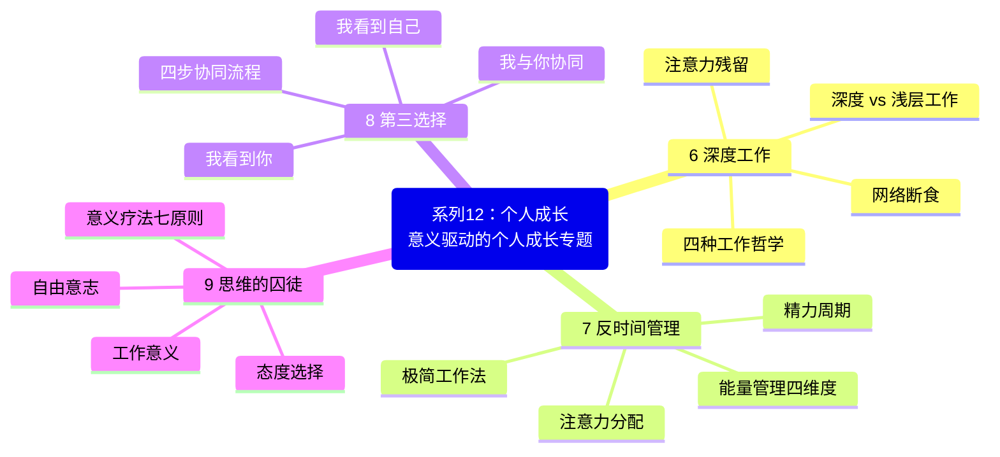
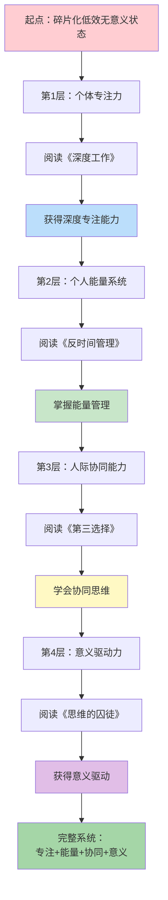
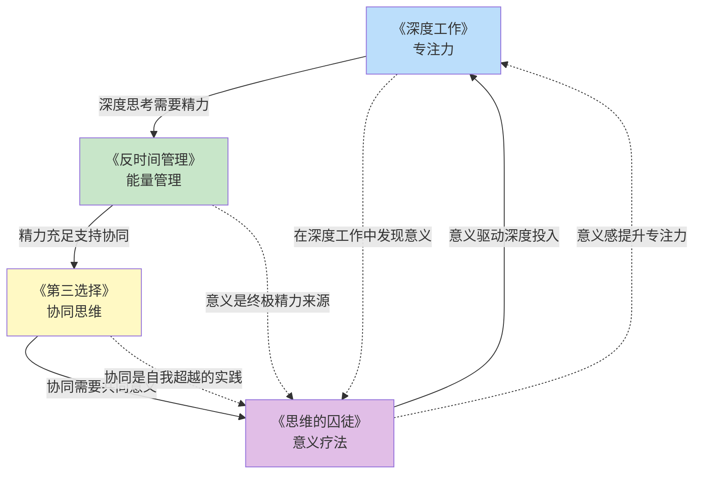
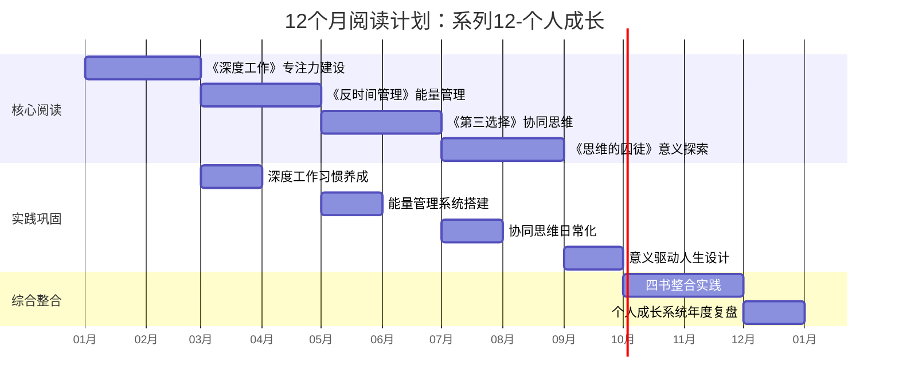

# ○● 系列12-个人成长 视觉指南：意义驱动的个人成长专题●◆

---

## 一、系列全景思维导图

本专题包含4本核心书籍，围绕"意义驱动的个人成长"主题，从专注力到能量、从协同到意义，构建完整的个人成长系统。



---

## 二、个人成长路径：从个体效能到意义驱动的完整旅程



---

## 三、四本书的核心连接关系



### ◆ 核心逻辑链

| 顺序 | 书籍 | 解决的问题 | 核心能力 | 成长维度 |
|------|------|-----------|---------|---------|
| 1 | 《深度工作》 | 无法专注 | 深度专注力 | 注意力 |
| 2 | 《反时间管理》 | 精力不足 | 能量管理 | 精力 |
| 3 | 《第三选择》 | 人际冲突 | 协同思维 | 关系 |
| 4 | 《思维的囚徒》 | 缺乏动力 | 意义驱动 | 意义 |

### ○ 能力依赖关系

```
意义驱动（第4层）
    ↑ 需要
协同思维（第3层）
    ↑ 需要
能量管理（第2层）
    ↑ 需要
深度专注（第1层）
```

没有专注力，能量管理无从谈起；没有能量，协同无法进行；没有协同，意义难以实现。

---

## 四、12个月阅读计划时间线



---

## 五、推荐阅读顺序与学习策略

### ◆ 方案A：循序渐进型（强烈推荐）

按照能力建设的递进逻辑，从个体到关系、从外在到内在：

1. **第1-2个月**：《深度工作》——先解决"无法专注"的问题
2. **第3-4个月**：《反时间管理》——在精力最佳时段深度工作
3. **第5-6个月**：《第三选择》——用好的状态改善人际关系
4. **第7-8个月**：《思维的囚徒》——找到持续成长的内在动力

### ○ 方案B：痛点优先型

| 你最困扰的问题 | 首先阅读 | 为什么 |
|---------------|---------|-------|
| 总是分心 | 《深度工作》 | 专注是基础能力 |
| 总是疲惫 | 《反时间管理》 | 精力是一切的前提 |
| 人际关系差 | 《第三选择》 | 协同改善关系 |
| 迷茫无动力 | 《思维的囚徒》 | 意义提供方向 |

### ◆ 方案C：双轨并行型

| 轨道 | 书籍组合 | 学习目标 |
|------|---------|---------|
| 轨道A（个体效能） | 《深度工作》+《反时间管理》 | 专注力 + 能量 = 个体高效 |
| 轨道B（关系与意义） | 《第三选择》+《思维的囚徒》 | 协同 + 意义 = 关系与动力 |

---

## 六、系列学习成果评估

### ○ 完成本专题后，你将能够：

- [ ] 每天进入至少2小时的深度工作状态
- [ ] 识别并利用个人精力黄金时段
- [ ] 用二八法则精简工作，聚焦高价值事项
- [ ] 在冲突中运用四步协同流程
- [ ] 使用"复述技术"建立深层沟通
- [ ] 在困境中选择积极态度
- [ ] 在日常工作中发现和创造意义
- [ ] 建立从"专注→能量→协同→意义"的完整成长系统

### ◆ 终极成长指标

| 维度 | 起点 | 12个月后 |
|------|------|---------|
| 专注力 | 频繁分心 | 能进入2-4小时深度工作 |
| 精力管理 | 全天疲惫 | 在黄金时段高效产出 |
| 人际关系 | 常有冲突 | 能用协同思维化解分歧 |
| 意义感 | 迷茫空虚 | 在日常中发现和创造意义 |

---

<div style="background: #f3e5f5; padding: 16px; border-left: 4px solid #9c27b0;">
◆ 视觉指南说明：本文件包含本专题的完整知识框架，建议收藏后反复查看，作为学习和实践的导航地图。完成本系列后，你将获得一个从个体到关系、从外在到内在的完整个人成长系统。
</div>
